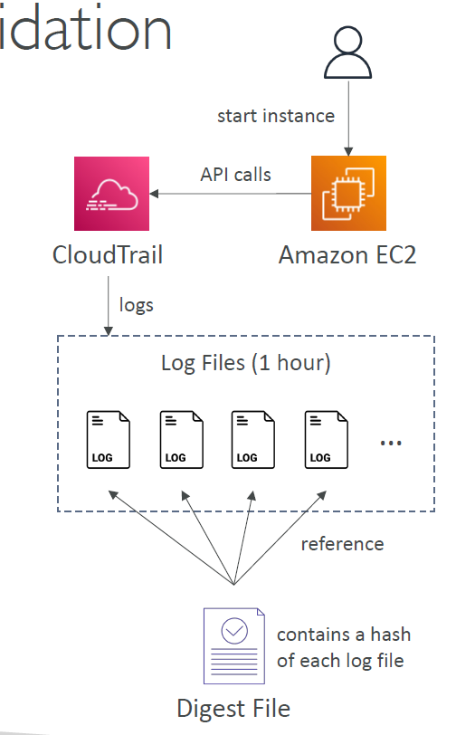

# 🛡️ CloudTrail – Log File Integrity Validation

**AWS CloudTrail** records all API activity across your AWS account. But how do you **prove** those logs haven’t been tampered with?

That's where **Log File Integrity Validation** comes in — a powerful feature that ensures your logs are **authentic and untampered**, which is crucial for security audits, incident response, and compliance.

---

<div align="center">
  
</div>

---

## 🔍 What Is Log File Integrity Validation?

When enabled, CloudTrail generates a **digest file** every hour alongside your log files. This digest file:

- Contains a **SHA-256 hash** of each log file delivered that hour
- Is **digitally signed** using RSA
- Is stored in your CloudTrail **S3 bucket**, under a separate path (`/AWSLogs/<account-id>/CloudTrail-Digest/`)

📦 **Purpose**: It allows you to cryptographically **verify the integrity** of your CloudTrail log files.

---

## 🧾 How It Works

1. **CloudTrail logs API activity** (e.g., EC2 start instance)
2. It writes logs to S3 in 1-hour chunks
3. It generates a **digest file** with:

   - The **hash (SHA-256)** of each log file
   - A **digital signature** of the digest file itself (SHA-256 with RSA)

4. You can **download the digest and log files** to validate using the AWS CLI or SDK

---

### ✅ Verification Use Case

Let’s say someone accessed EC2 and then tried to **delete or edit the logs** to cover their tracks.
You can use the digest to **verify if a log file was deleted or modified**.

```bash
aws cloudtrail validate-logs \
  --trail-arn arn:aws:cloudtrail:us-east-1:123456789012:trail/MyTrail \
  --start-time 2024-06-14T01:00:00Z
```

If the log file or digest has been tampered with, you'll get a **validation failure**.

---

## 🔒 Best Practices for Log Protection

| Layer           | Security Recommendation                                                |
| --------------- | ---------------------------------------------------------------------- |
| **S3 Bucket**   | Enable **versioning**, **MFA Delete**, **encryption (SSE-KMS)**        |
| **IAM**         | Restrict permissions to CloudTrail and the S3 bucket                   |
| **S3 Policy**   | Deny deletes except with MFA; deny `PutObject` from unknown principals |
| **CloudTrail**  | Enable **Integrity Validation** and **multi-region trails**            |
| **Object Lock** | Use **S3 Object Lock** (WORM) for regulatory compliance                |

---

## 🧠 Summary

Log File Integrity Validation is critical for:

- 🧾 **Audit trails** you can legally trust
- 🔍 **Investigations** into suspicious behavior
- ⚖️ **Compliance** with frameworks like HIPAA, PCI-DSS, and SOX
