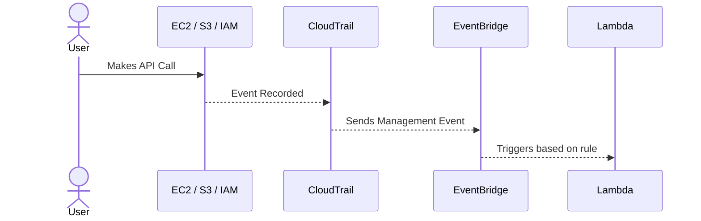
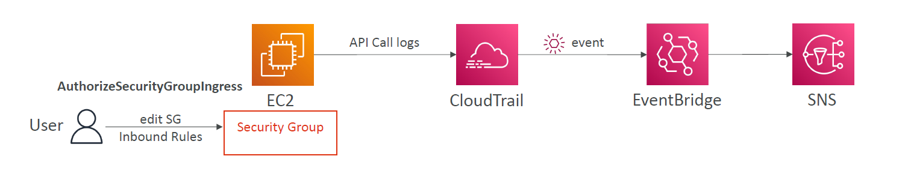
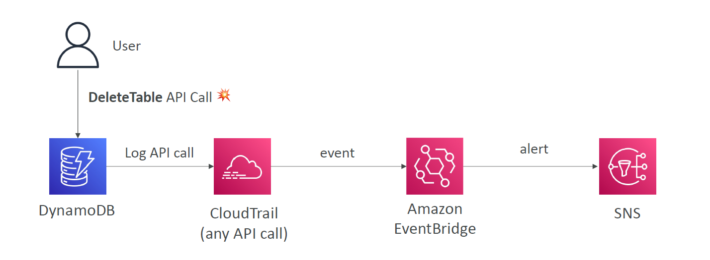
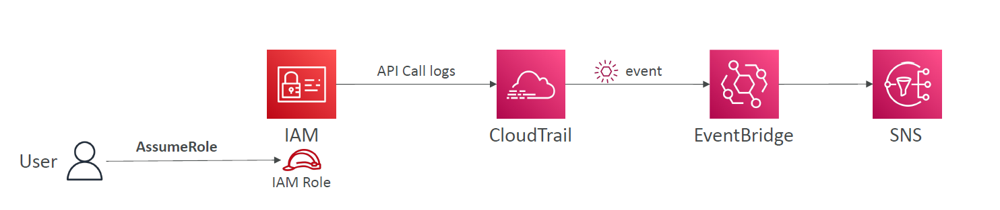

# 📦 **Where Can AWS CloudTrail Send Logs?**

CloudTrail doesn’t directly send logs everywhere — it’s not a broadcast system. Instead, it supports **3 main destinations** directly:

| Destination               | Description                                                          |
| ------------------------- | -------------------------------------------------------------------- |
| 🪣 **Amazon S3**           | ✅ Default option for **archiving logs** long-term                   |
| 📊 **CloudWatch Logs**    | ✅ Near real-time **log streaming and alerting** with metric filters |
| 🔁 **Amazon EventBridge** | ✅ Best for **automated reactions**, connecting to 90+ AWS services  |

> ❌ CloudTrail **cannot directly** send logs to SNS, Lambda, SQS, or Step Functions — those must be triggered via **EventBridge**.

---

## 📁 1. **Amazon S3 (Default Archive)**

- Stores logs in **JSON format**
- Great for **long-term auditing** and **compliance**
- Can analyze with **Amazon Athena** or **Amazon OpenSearch**

### ✅ Good for

- Retaining logs for 7+ years
- Running SQL-like queries using Athena
- Manual investigations

---

## 📊 2. **Amazon CloudWatch Logs**

- Delivers logs to a **log group**
- Allows **metric filters**, **alarms**, and **dashboards**
- Enables **real-time monitoring**

### ✅ Good for

- Alerting on specific patterns (e.g., failed logins)
- Dashboards showing activity trends
- Security event detection

---

## 🔄 3. **Amazon EventBridge – The Automation Brain**

This is the **most powerful integration**, and the most overlooked.

---

## ⚡ **How CloudTrail Works with EventBridge (In Depth)**

CloudTrail emits a **stream of events**, and **EventBridge** listens to it internally — _you don't even need to create a Trail_ for this to work.

### 📬 Types of Events CloudTrail Sends to EventBridge

| Type                     | Emitted to EventBridge?   | Notes                                |
| ------------------------ | ------------------------- | ------------------------------------ |
| ✅ **Management Events** | ✅ Yes (most common)      | `StartInstances`, `CreateUser`, etc. |
| ❌ **Data Events**       | ❌ No (not supported yet) | `GetObject`, `PutObject`, etc.       |
| ✅ **Insight Events**    | ✅ Yes (for anomalies)    | Bursts of unusual write activity     |

---

### 🎯 How It Actually Works

<div align="center">



</div>

---

## 🧠 Why Use EventBridge with CloudTrail?

Because EventBridge acts like **a programmable router**.

| Feature                      | Benefit                                                |
| ---------------------------- | ------------------------------------------------------ |
| 🎯 Rule-based filtering      | Only react to specific API calls (e.g. `DeleteBucket`) |
| 🔄 Real-time                 | Reactions happen within seconds                        |
| 🛠️ Multi-service integration | Trigger **Lambda, Step Functions, SNS, SQS**, etc.     |
| 👁️ Full audit trail          | All based on CloudTrail API events                     |

---

## 🛠️ Real-World Example: Alert on Security Group Changes

<div style="text-align: center;">
    
</div>

---

### 🔐 Goal

Alert when someone modifies security group inbound rules.

### 🧱 Setup

1. ✅ CloudTrail is already recording the event: `AuthorizeSecurityGroupIngress`
2. ✅ EventBridge rule listens to that event.
3. 🔔 Target is SNS, Lambda, or GuardDuty alert.

```json
{
  "source": ["aws.ec2"],
  "detail-type": ["AWS API Call via CloudTrail"],
  "detail": {
    "eventName": ["AuthorizeSecurityGroupIngress"]
  }
}
```

> 🔥 This setup alerts instantly on any new inbound traffic rule added to your VPC.

---

## 🧰 What Can EventBridge Target?

Thanks to EventBridge, CloudTrail can **indirectly trigger** any of the following:

| Target Type             | Example Use Case                            |
| ----------------------- | ------------------------------------------- |
| 🔁 **Lambda**           | Auto-remediate IAM or EC2 misconfigurations |
| 📤 **SNS**              | Alert security teams via email or SMS       |
| 📨 **SQS**              | Queue incidents for later batch analysis    |
| 🧬 **Step Functions**   | Run approval workflows for critical changes |
| 📦 **CodePipeline**     | Trigger builds from API-based change        |
| 📊 **CloudWatch Alarm** | Raise an alarm from an unusual usage spike  |

---

## ✍️ **Real-World Examples**

### Intercept API Calls

<div style="text-align: center;">
  
</div>

## AssumeRole API Call

<div style="text-align: center;">
  
</div>

## ✅ Summary: When to Use What

| Destination        | Best For                                                |
| ------------------ | ------------------------------------------------------- |
| 🪣 S3               | Long-term audit and analysis                            |
| 📊 CloudWatch Logs | Real-time log processing and alerting                   |
| 🔁 EventBridge     | Event-driven automation + integration with AWS services |

> 🧠 If you're building **proactive automation**, **EventBridge is your weapon of choice**.
