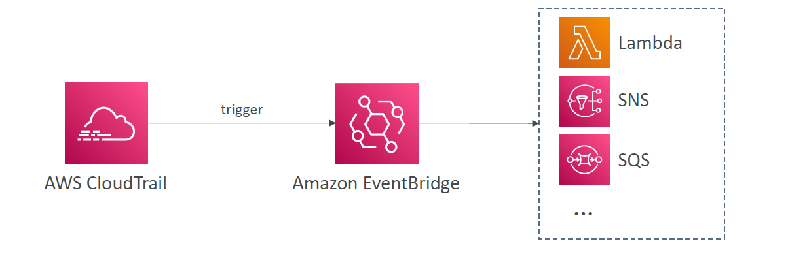

# 🔄 CloudTrail + EventBridge: Reacting to AWS API Calls in Near Real-Time

Amazon **CloudTrail** tracks every API call made in your AWS account, while **EventBridge** lets you act on those calls by routing them to automation targets like **Lambda, SNS, or SQS**.

This integration enables **event-driven automation** for governance, security, compliance, and operations workflows.

---

<div align="center">
  
</div>

---

## 📌 What Happens Under the Hood?

1. **CloudTrail** records an API activity (e.g., user launches an EC2 instance).
2. That API activity is sent to **EventBridge** as an event (within \~15 minutes).
3. **EventBridge** evaluates the event against its rules.
4. If a rule matches, the event is forwarded to one or more targets:

   - ✅ **Lambda** – run automation code
   - ✅ **SNS** – send alert/notification
   - ✅ **SQS** – enqueue for downstream processing

---

## 🕒 Timing & Delivery

| Feature                      | Detail                               |
| ---------------------------- | ------------------------------------ |
| CloudTrail EventBus Delivery | \~15 minutes after the API call      |
| CloudTrail Log File to S3    | Every 5 minutes                      |
| Supported Format             | JSON via CloudTrail API Event Format |

So, while it’s not **real-time**, it’s **fast enough for many operational & security automations**.

---

## ⚙️ Use Cases

| 🧠 Use Case               | Example                                                                |
| ------------------------- | ---------------------------------------------------------------------- |
| 🛡️ Security Alert         | Detect if a root user logs in, trigger SNS alert                       |
| 🔐 Compliance Enforcement | Prevent certain IAM roles from being created automatically             |
| 💸 Cost Optimization      | Detect launching of large EC2 instances, auto-tag or notify via Lambda |
| 📦 Operational Automation | React to bucket creation by running custom Lambda                      |

---

## 🧪 Hands-On: Monitor EC2 Instance Launches

### 🛠 Step 1: Enable CloudTrail

- Go to **CloudTrail Console**
- Create a new trail (if not done)
- Enable **management events**

### 🛠 Step 2: Create EventBridge Rule

- Go to **Amazon EventBridge → Rules**
- Create a new rule with the following pattern:

  ```json
  {
    "source": ["aws.ec2"],
    "detail-type": ["AWS API Call via CloudTrail"],
    "detail": {
      "eventName": ["RunInstances"]
    }
  }
  ```

- Target: **SNS / Lambda / SQS**

---

## 🔐 Tips for Security & Efficiency

- Use **EventBridge filters** to avoid triggering rules for every API call
- Combine with **CloudTrail Insights** to catch anomalies
- Keep CloudTrail logs archived in **S3 + Glacier** for audit
- Protect trails with **digest validation**, **S3 bucket encryption**, and **MFA delete**

---

## ✅ Summary

**CloudTrail + EventBridge** helps you:

- Monitor critical activity
- Automate reactions
- Build event-driven systems
- Strengthen security posture

> You don't just log what happened — you react to it 🔁.
