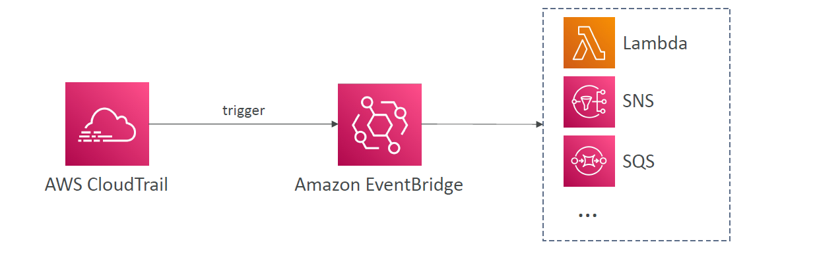
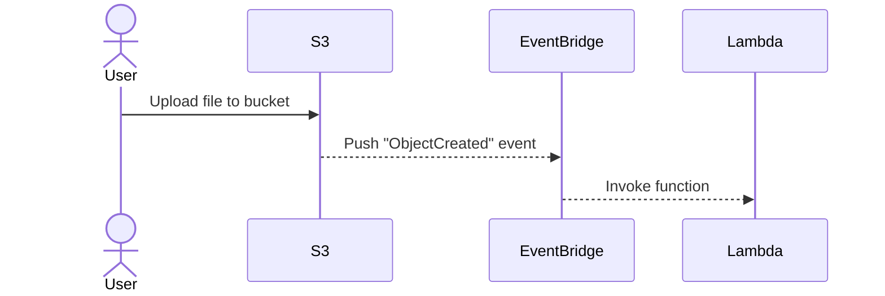
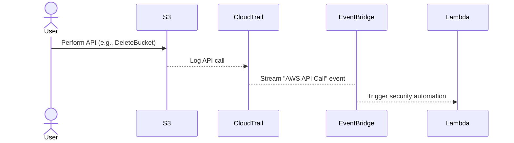

---
tags:
  - aws
  - aws/service
  - aws/domain/management-and-governance
  - aws/topic/cloud-trail
aliases:
  - "Problem-Solution How Does S3 Trigger EventBridge"
  - "Cloud Trail With Event Bridge"
---

# 🧩 Problem-Solution: How Does S3 Trigger EventBridge?

> ✅ Can S3 directly push events to EventBridge?
> ❓ When do we need CloudTrail?
> 🧠 Which method is better for file uploads vs. admin actions?

Let’s break it into two distinct types of integrations — **Push vs Pull**, based on your exact use case.

---

<div align="center">
  
</div>

---

## 🔁 There Are Two Ways to Get S3 Events into EventBridge

| Integration Type          | Mechanism                | Trigger Source   | Latency         | Best For                               |
| ------------------------- | ------------------------ | ---------------- | --------------- | -------------------------------------- |
| **Type 1: Direct Push**   | S3 → EventBridge         | Native S3 events | ⚡ Real-time    | File upload/delete triggers            |
| **Type 2: Pull via Logs** | CloudTrail → EventBridge | CloudTrail logs  | ⏳ \~15 minutes | Admin/API actions (e.g., DeleteBucket) |

---

## 🧭 Type 1: Direct Push – S3 Sends Events _Directly_ to EventBridge

### ✅ Best For:

- Object uploads, deletions, lifecycle events
- Real-time pipelines and automation
- Triggering Lambda/SNS/SQS without CloudTrail overhead

---

### 🔧 How It Works


```mermaid
sequenceDiagram
    actor User
    participant S3
    participant EventBridge
    participant Lambda

    User->>S3: Upload file to bucket
    S3-->>EventBridge: Push "ObjectCreated" event
    EventBridge-->>Lambda: Invoke function
```

- **No CloudTrail needed**
- Works only for **object-level events**

---

### 🛠 Setup Steps

1. **Enable S3 → EventBridge**

   - Go to **S3 > Bucket > Properties > Event Notifications**
   - Enable: ✅ **Send events to EventBridge**

2. **Create EventBridge Rule**

   - Pattern:

     ```json
     {
       "source": ["aws.s3"],
       "detail-type": ["Object Created"],
       "detail": {
         "bucket": { "name": ["my-bucket"] },
         "object": { "key": [{ "prefix": "uploads/" }] }
       }
     }
     ```

3. **Set target**: Lambda / SNS / Step Function / SQS

---

### 📦 Example Event from Direct S3 Push

```json
{
  "source": "aws.s3",
  "detail-type": "Object Created",
  "detail": {
    "bucket": { "name": "my-bucket" },
    "object": {
      "key": "uploads/image.jpg",
      "size": 204800
    }
  }
}
```

---

## 🚫 Limitations of Type 1 (Direct Push)

| Not Supported                                | Why                     |
| -------------------------------------------- | ----------------------- |
| `ListBucket`, `DeleteBucket`, `PutBucketAcl` | Not object-level events |
| IAM-level permission tracking                | Handled via CloudTrail  |
| Full API call auditing                       | Needs CloudTrail        |

---

## 🕵️ Type 2: Pull-Based – EventBridge Gets Events via CloudTrail Logs

### ✅ Best For:

- Tracking **any API call to S3**, not just file events
- Detecting dangerous or unexpected admin actions
- Compliance & security automation

---

### 🔧 How It Works


```mermaid
sequenceDiagram
    actor User
    participant S3
    participant CloudTrail
    participant EventBridge
    participant Lambda

    User->>S3: Perform API (e.g., DeleteBucket)
    S3-->>CloudTrail: Log API call
    CloudTrail-->EventBridge: Stream "AWS API Call" event
    EventBridge-->>Lambda: Trigger security automation
```

- CloudTrail writes **management events** to a **log stream**
- EventBridge **pulls** and matches those logs based on rule filters

---

### 🛠 Setup Steps

1. **Enable CloudTrail Management Events**

   - Go to **CloudTrail > Trails**
   - Create a Trail or use existing one
   - Enable “Management events” (Read/Write)

2. **Create EventBridge Rule**

   - Example for detecting bucket deletion:

     ```json
     {
       "source": ["aws.s3"],
       "detail-type": ["AWS API Call via CloudTrail"],
       "detail": {
         "eventName": ["DeleteBucket"]
       }
     }
     ```

3. **Target**: Lambda / SNS / SQS, etc.

---

### 📦 Example Event from CloudTrail

```json
{
  "source": "aws.s3",
  "detail-type": "AWS API Call via CloudTrail",
  "detail": {
    "eventName": "DeleteBucket",
    "requestParameters": {
      "bucketName": "prod-logs"
    },
    "userIdentity": {
      "type": "IAMUser",
      "userName": "admin-user"
    }
  }
}
```

---

## 🔍 Comparison Summary

| Feature                      | S3 → EventBridge (Push) | CloudTrail → EventBridge (Pull)   |
| ---------------------------- | ----------------------- | --------------------------------- |
| Supports object-level events | ✅ Yes                  | ✅ Indirectly (via PutObject API) |
| Supports admin operations    | ❌ No                   | ✅ Yes                            |
| Real-time                    | ✅ Yes (seconds)        | ❌ \~15 mins delay                |
| Cost                         | 💸 Free (built-in)      | 💸 CloudTrail + Event Data Store  |
| Best for                     | Upload triggers         | Security auditing                 |

---

## 💡 Which One Should You Use?

| Goal                                        | Best Mechanism                       |
| ------------------------------------------- | ------------------------------------ |
| React to file uploads                       | ✅ S3 Direct Push to EventBridge     |
| Monitor who deleted a bucket                | 🕵️ CloudTrail + EventBridge          |
| Audit all actions against S3                | ✅ CloudTrail required               |
| Trigger ETL or ML pipeline on new file      | ✅ S3 Direct + Lambda                |
| Detect usage anomalies (like spike in PUTs) | ✅ CloudTrail Insights + EventBridge |

---

## 🧪 Final Real-World Examples

| Use Case                          | Setup                             |
| --------------------------------- | --------------------------------- |
| Auto-process image on upload      | S3 → EventBridge → Lambda         |
| Alert if public bucket created    | CloudTrail → EventBridge → SNS    |
| Log unauthorized IAM access to S3 | CloudTrail → EventBridge → Lambda |
| Track large file uploads > 100MB  | S3 + Rule filter on `object.size` |

---

## ✅ Final Takeaways

- **S3 → EventBridge (Direct)** = Best for real-time file automation
- **CloudTrail → EventBridge** = Best for **admin actions**, **security**, and **auditing**
- You can (and often should) **combine both methods** for full visibility and fast automation

> 🎯 Use the **right event source** based on the **event type you care about**.
---

## Related Notes
- [[aws-services/1.management-governance/3.2.cloud-trail/|Index]] - folder map
- [[aws-services/1.management-governance/3.2.cloud-trail/4.1.cloud-trail-integrations|Where Can AWS CloudTrail Send Logs]] - previous lesson
- [[aws-services/1.management-governance/3.2.cloud-trail/4.3.cloud-trail-organization|AWS CloudTrail Organization Trail]] - next lesson
- [[aws-services/7.application-integration/sqs/1.1.sqs|Amazon SQS Mastering Serverless Message Queues]] - mentions SQS
- [[aws-services/7.application-integration/sns/1.sns|Amazon SNS The Clouds Pub/Sub Notification Engine]] - mentions SNS
- [[aws-services/2.security/1.1.iam/1.fundmmentals/1.2.iam|AWS Identity and Access Management IAM]] - mentions IAM

---
