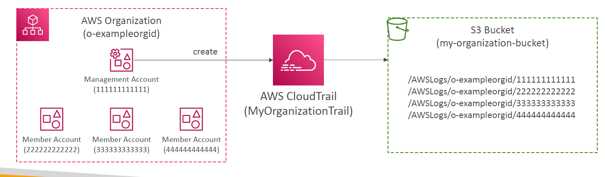

# 🏢 AWS CloudTrail: Organization Trail

**Organization trails** in AWS CloudTrail offer centralized governance and security visibility across all accounts in your AWS Organization. This is essential for enterprises practicing multi-account architectures with AWS Organizations.

---

<div align="center">
  
</div>

---

## 🧠 What Is an Organization Trail?

An **Organization Trail** is a CloudTrail configuration that:

- Logs all **management events** (and optionally **data and insight events**) across every account in the AWS Organization.
- Is **created from the management account** and automatically applied to **all member accounts**.
- Uses a **central S3 bucket** to store all logs (organized by account ID under `/AWSLogs/<OrgId>/<AccountId>`).

---

## 📦 Key Features

| Feature                      | Description                                                              |
| ---------------------------- | ------------------------------------------------------------------------ |
| 🔐 Centralized Logging       | All logs from every account stored in one central S3 bucket              |
| 📎 Immutable by Members      | Member accounts **cannot** disable, delete, or modify the trail          |
| 🧾 Uniform Naming            | The trail is **replicated** (same name) across all organization accounts |
| ☁️ Supported Events          | Logs **Management**, **Data**, and **Insight** events                    |
| 🗃️ Fine-Grained Storage Path | Logs organized under account IDs per organization in the S3 bucket       |

---

## 🔧 Hands-On: How to Create an Organization Trail

### ✅ Prerequisites

- You must be in the **Management Account**
- Your org must have **All Features enabled**
- S3 bucket must have correct **bucket policy** allowing log writes

### 🛠 Steps

1. Go to **CloudTrail Console** in the Management Account
2. Create a new trail and select **Apply trail to all accounts in my organization**
3. Specify a **central S3 bucket** (e.g., `my-organization-bucket`)
4. Choose what events to capture:

   - Management events (default)
   - Data events (optional, more verbose)
   - Insights events (optional, for unusual behavior)

5. Finish setup – AWS replicates the trail in all member accounts automatically

---

## 📁 S3 Bucket Log Structure

```plaintext
/AWSLogs/o-exampleorgid/111111111111/
/AWSLogs/o-exampleorgid/222222222222/
/AWSLogs/o-exampleorgid/333333333333/
/AWSLogs/o-exampleorgid/444444444444/
```

> Each folder represents a different AWS account in the organization.

---

## 🧪 Example: Create the Org Trail (Step-by-Step)

### 🛠️ Console Setup

1. From **management account**, go to **CloudTrail > Trails > Create Trail**
2. Name: `OrgTrail`
3. ✅ Check: _Apply trail to all accounts in my organization_
4. S3 Bucket: `my-org-trail-logs`
5. Select **Management events**, optionally **Data** and **Insight** events
6. Enable **Log File Validation** and **Encryption**
7. Done!

---

## 🛡️ Example: S3 Bucket Policy for Org Trails

```json
{
  "Version": "2012-10-17",
  "Statement": [
    {
      "Sid": "AllowOrgWrite",
      "Effect": "Allow",
      "Principal": { "Service": "cloudtrail.amazonaws.com" },
      "Action": "s3:PutObject",
      "Resource": "arn:aws:s3:::my-org-trail-logs/AWSLogs/o-exampleorgid/*",
      "Condition": {
        "StringEquals": {
          "aws:SourceArn": "arn:aws:cloudtrail:us-east-1:111111111111:trail/OrgTrail",
          "aws:SourceAccount": "111111111111"
        }
      }
    }
  ]
}
```

---

## 🎯 Example: Trigger Alert from Any Account via EventBridge

Use CloudTrail + EventBridge to notify when **root login** occurs in any account:

```json
{
  "source": ["aws.cloudtrail"],
  "detail-type": ["AWS API Call via CloudTrail"],
  "detail": {
    "userIdentity.type": ["Root"],
    "eventName": ["ConsoleLogin"]
  }
}
```

Send to **SNS**, **Lambda**, or **Security Hub**.

---

## 🛡️ Security Considerations

- Enable **S3 encryption** (SSE-S3 or SSE-KMS)
- Enable **log file integrity validation**
- Enable **object lock** and **versioning** to prevent log tampering
- Restrict bucket access using **bucket policy and SCPs**

---

## 🧰 Use Cases

- 🔍 **Security auditing** across accounts (e.g., root usage, IAM changes)
- 📜 **Compliance** (PCI-DSS, HIPAA, etc.)
- 🔔 Triggering **EventBridge rules** across orgs for automation
- 📦 Store logs in **centralized data lake** for analytics (e.g., Athena + Lake Formation)

---

## 📝 Final Thoughts

✅ Use **Organization Trails** for scalable and compliant logging across AWS accounts.  
🔒 They ensure member accounts **can’t bypass visibility**—critical for enterprise governance.
