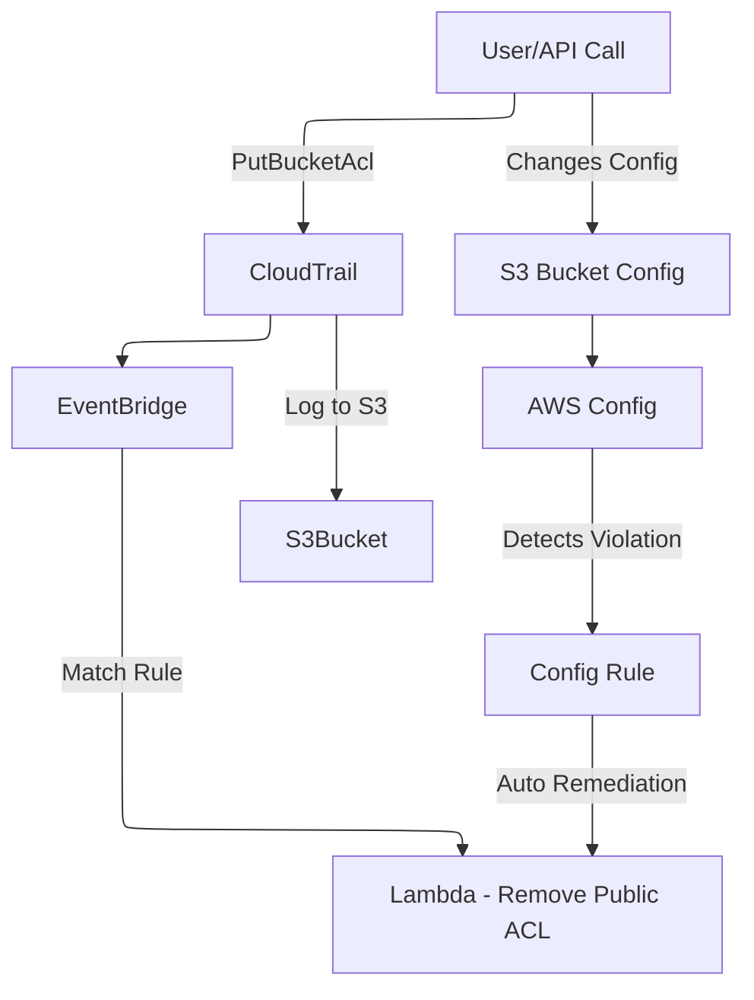

# ⚔️ **CloudTrail + EventBridge vs AWS Config**

> 💡 Both can track changes in your AWS environment, but they are designed for **different purposes**.

---

## ⚙️ Architecture Diagram

---

## 🧠 TL;DR

| Feature                  | **CloudTrail + EventBridge**                                    | **AWS Config**                                              |
| ------------------------ | --------------------------------------------------------------- | ----------------------------------------------------------- |
| 🔍 **What It Tracks**    | **Who did what?** → API calls (e.g., `CreateUser`, `PutObject`) | **What changed?** → Resource configuration history (state)  |
| 🕵️ **Focus**             | Activity & auditing (security, API calls, user actions)         | Compliance & configuration state tracking                   |
| 🔁 **Integration Style** | Event-driven automation (via **EventBridge**)                   | Continuous config monitoring + rules                        |
| ⏱️ **Timeliness**        | Near real-time (with EventBridge rules)                         | Delayed (minutes), but complete snapshot of the state       |
| 🛠️ **Automation**        | Triggers **Lambda**, **SNS**, **SQS**, **Step Functions**, etc. | Can auto-remediate via **AWS Config Rules** + custom Lambda |
| 📜 **Retention**         | 90 days (by default) or long-term in S3                         | Full historical config snapshots + compliance history       |
| 💬 **Event Detail Type** | Event metadata + parameters of the API call                     | Full **before/after** of the resource config (JSON diff)    |

---

## 💡 Example Use Case Comparisons

### ✅ **Use CloudTrail + EventBridge** _When:_

| Scenario                                                  | Why it's best                                                            |
| --------------------------------------------------------- | ------------------------------------------------------------------------ |
| Someone attaches an admin IAM policy to a user            | You want to **detect that API call immediately** and trigger remediation |
| A developer deletes an RDS DB instance                    | You want to know **who did it**, **from where**, and **what time**       |
| You want to trigger a CI/CD pipeline on `PutObject` to S3 | S3 doesn't natively emit to EventBridge, but **CloudTrail does**         |

> 🧠 You care about **who did what**, **when**, **how**, and **take action fast**.

---

### ✅ **Use AWS Config** _When:_

| Scenario                                                                   | Why it's best                                              |
| -------------------------------------------------------------------------- | ---------------------------------------------------------- |
| A resource’s config changed (e.g., public S3 bucket)                       | You want to track the **config diff over time** and fix it |
| You need to **enforce compliance** (e.g., all EC2s must use specific AMIs) | AWS Config can evaluate resources **continuously**         |
| You want to audit historical settings                                      | AWS Config stores snapshots of all previous config states  |

> 🧠 You care about **state**, **compliance**, and **audit over time** — not just who changed it.

---

## 🔍 Example: Someone Adds a Public S3 Bucket

| With CloudTrail + EventBridge             | With AWS Config                                         |
| ----------------------------------------- | ------------------------------------------------------- |
| 🔔 Detects that `PutBucketAcl` was called | 🔎 Detects that S3 bucket is now public                 |
| 🧠 Know **who** did it                    | 📜 Know **what the full configuration** looks like      |
| 🚀 Can trigger a **Lambda function**      | ✅ Can enforce an **AWS Config rule** to auto-remediate |

---

## ✅ Final Advice

| If your focus is...                            | Use...                   |
| ---------------------------------------------- | ------------------------ |
| Near-real-time detection + automation          | CloudTrail + EventBridge |
| Audit trail for compliance (NIST, HIPAA, etc.) | AWS Config               |
| Both (state + action + compliance)             | Use them **together**!   |

> 🧠 **Smart setups combine both**:
> Use **CloudTrail + EventBridge** for instant action, and **AWS Config** for long-term visibility & compliance.
