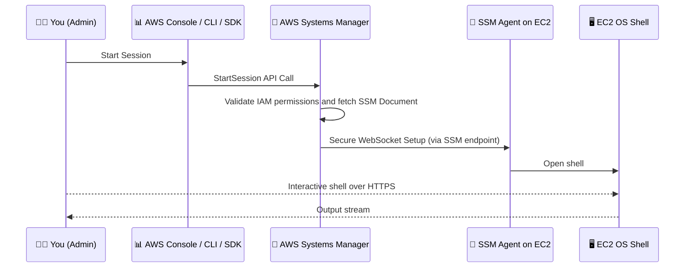

---
tags:
  - aws
  - aws/service
  - aws/domain/management-and-governance
  - aws/topic/system-manager
aliases:
  - "AWS SSM Session Manager Secure Shell Access Without SSH"
  - "Session Manager"
---

# 🔐 **AWS SSM Session Manager: Secure Shell Access Without SSH**

_The safest, most cloud-native way to connect to your EC2 and on-prem instances._

---

## 📘 **What Is Session Manager?**

> **Session Manager** is a feature of **AWS Systems Manager** that allows you to **securely connect** to **EC2 instances**, **on-prem servers**, and **hybrid environments** without using SSH, opening ports, or managing SSH keys.

It's like having a **built-in, fully audited terminal** for your instances. Yes, even the ones in a **private subnet**.

---

## 🔍 **Why Use Session Manager?**

| Feature                    | SSH                              | Session Manager                       |
| -------------------------- | -------------------------------- | ------------------------------------- |
| 🔐 Keyless & Portless      | ❌ Needs SSH keys & open port 22 | ✅ No keys, no open ports             |
| 📜 Audit Logging           | ❌ Manual setup                  | ✅ Built-in (CloudTrail & CloudWatch) |
| 🧠 IAM Integrated          | ❌ No                            | ✅ Yes                                |
| 🏞️ Works in Private Subnet | ❌ Needs bastion or NAT          | ✅ Yes                                |
| 🎯 Session Control         | ❌ Hard                          | ✅ Timeout, idle settings, logging    |
| 🌐 Browser Access          | ❌                               | ✅ Terminal in AWS Console            |

---

## 🧪 **How Session Manager Works Internally**

<div align="center">



</div>

> 💡 **No inbound ports**, **no SSH Daemon**, just **SSM Agent + HTTPS**.

---

## 🧩 **Requirements & Setup**

### 1️⃣ Step 1: **Create and Attach an IAM Role for the EC2 Instance**

This role allows the EC2 instance to register with Systems Manager and respond to session traffic.

#### ✅ Create IAM Role (Instance Profile Role)

1. Go to **IAM > Roles > Create Role**
2. Select **Trusted entity type**: `AWS service`
3. Use case: **EC2**
4. Click **Next**
5. **Attach the following AWS-managed policy**:

   - ✅ `AmazonSSMManagedInstanceCore`

6. Name the role: e.g., `EC2SessionManagerRole`
7. Click **Create Role**

#### ✅ Attach the Role to EC2 Instance

1. Go to **EC2 > Instances**
2. Select your instance → **Actions > Security > Modify IAM Role**
3. Choose `EC2SessionManagerRole` and save

🔐 **This policy contains:**

```json
{
  "Effect": "Allow",
  "Action": [
    "ssm:UpdateInstanceInformation",
    "ssmmessages:*",
    "ec2messages:*",
    "cloudwatch:PutMetricData",
    "logs:CreateLogGroup",
    "logs:CreateLogStream",
    "logs:PutLogEvents"
  ],
  "Resource": "*"
}
```

---

### 2️⃣ Step 2: **Ensure EC2 Network Access to SSM**

Your instance must reach these **SSM endpoints**:

#### ✅ Option 1: Instance has Internet access

- Use a **public subnet with Internet Gateway**
- Or use a **private subnet with a NAT Gateway**

#### ✅ Option 2: Use Private Access via VPC Endpoints (recommended for private subnets)

Create the following **VPC interface endpoints**:

- `com.amazonaws.<region>.ssm`
- `com.amazonaws.<region>.ec2messages`
- `com.amazonaws.<region>.ssmmessages`

Also create a **Gateway endpoint** for:

- `com.amazonaws.<region>.s3` (required for SSM agent to download documents)

> Example (us-east-1):
> `com.amazonaws.us-east-1.ssm`

---

### 3️⃣ Step 3: **Grant IAM Users or Admins Session Manager Permissions**

This role or user is the **person initiating the SSM session via CLI or Console**.

#### ✅ Create IAM Policy for Users/Admins

Go to **IAM > Policies > Create Policy** and add this JSON:

```json
{
  "Version": "2012-10-17",
  "Statement": [
    {
      "Effect": "Allow",
      "Action": [
        "ssm:StartSession",
        "ssm:DescribeInstanceInformation",
        "ssm:DescribeSessions",
        "ssm:GetConnectionStatus",
        "ssm:TerminateSession"
      ],
      "Resource": "*"
    }
  ]
}
```

#### ✅ Attach to the IAM User or Role

1. Go to **IAM > Users or Roles**
2. Select your admin/developer identity
3. Click **Add permissions**
4. Choose the above policy or attach AWS-managed policy `AmazonSSMFullAccess` (more permissive)

---

### 4️⃣ Step 4: **Start a Session (Test)**

#### From AWS Console:

1. Go to **Systems Manager > Session Manager**
2. Click **Start session**
3. Select the target EC2 instance (must be in `Managed` state)
4. Start shell session

#### From AWS CLI:

```bash
aws ssm start-session --target i-xxxxxxxxxxxxxxxxx
```

---

### 🧪 (Optional) Verify the Instance is Managed by SSM

Run this to check the managed instance status:

```bash
aws ssm describe-instance-information
```

Look for your instance ID in the list with `PingStatus: Online`.

---

## 🚀 **How to Start a Session**

### 🔸 **Via Console:**

1. Go to **Systems Manager > Session Manager**
2. Click **Start Session**
3. Choose your EC2 instance
4. Get instant access to a browser-based terminal!

### 🔸 **Via AWS CLI:**

```bash
aws ssm start-session --target i-1234567890abcdef0
```

---

## 🗂️ **Optional Configurations**

### 📦 **Audit Logs (Enable Logging):**

You can log:

- Commands run during session
- Full shell output

To:

- 📄 **CloudWatch Logs**
- 📦 **S3**

```bash
aws ssm put-document \
  --name MySessionLogConfig \
  --content file://session-config.json \
  --document-type Session
```

### Example `session-config.json`

```json
{
  "schemaVersion": "1.0",
  "description": "Log all session activity",
  "sessionType": "Standard_Stream",
  "inputs": {
    "s3BucketName": "my-log-bucket",
    "cloudWatchLogGroupName": "ssm-session-logs"
  }
}
```

---

## 🧰 Use Cases

| Scenario                       | SSM Session Manager Benefit                |
| ------------------------------ | ------------------------------------------ |
| EC2 in Private Subnet          | No NAT or bastion needed                   |
| Remote Admin                   | Use browser from any machine               |
| Security-Hardened Environments | No SSH key exposure                        |
| Audit & Compliance             | Every session logged and traceable         |
| Incident Response              | Drop into machine ASAP from console or CLI |

---

## 🧠 Best Practices

- ✅ Always enable **CloudWatch or S3 logging** for auditability
- ✅ Apply **IAM condition policies** (e.g. only allow sessions to prod if MFA is used)
- ✅ Disable direct SSH and close port 22 completely!
- ✅ Tag sessions or log groups by user/instance environment

---

## 🚫 Common Pitfalls

| Issue                                 | Cause                                     | Fix                                          |
| ------------------------------------- | ----------------------------------------- | -------------------------------------------- |
| ❌ "Session cannot be started"        | SSM agent not installed or IAM missing    | Ensure agent runs and IAM is correct         |
| ❌ Session opens but no output        | Logging misconfigured or CW not permitted | Fix IAM for logs and verify log group exists |
| ❌ Can’t access EC2 in private subnet | No NAT or SSM VPC endpoint                | Add VPC endpoint or route through NAT        |

---

## 🔚 Summary

✅ **SSM Session Manager** gives you:

- Keyless, portless, secure shell access
- Fully auditable session history
- IAM-controlled and regionally available
- Works in **ANY VPC** — even isolated ones

---

## 🔗 References

- [📘 Official Docs](https://docs.aws.amazon.com/systems-manager/latest/userguide/session-manager.html)
- [📘 Start Session (CLI)](https://docs.aws.amazon.com/cli/latest/reference/ssm/start-session.html)
- [📘 IAM Policies for SSM Access](https://docs.aws.amazon.com/systems-manager/latest/userguide/session-manager-getting-started-instance-profile.html)
- [📘 Session Logging](https://docs.aws.amazon.com/systems-manager/latest/userguide/session-manager-logging.html)
---

## Related Notes
- [[aws-services/1.management-governance/4.1.system-manager/|Index]] - folder map
- [[aws-services/1.management-governance/4.1.system-manager/1.3.ssm-core|AWS Systems Manager SSM Your Smart Admin Sidekick]] - previous lesson
- [[aws-services/1.management-governance/4.1.system-manager/2.2.run-command|AWS SSM Run Command]] - next lesson
- [[aws-services/misc/xx-aws-ssm-session-manager|AWS SSM Session Manager Secure and Simplified Instance Management]] - mentions AWS Ssm Session Manager
- [[aws-services/1.management-governance/3.1.cloud-watch/3.1.cw-logs|Amazon CloudWatch Logs]] - mentions CloudWatch Logs
- [[aws-services/3.network/1.vpc/1.fundmentals/5.1.vpc-endpoint|AWS VPC Endpoints]] - mentions Vpc Endpoint
- [[aws-services/3.network/1.vpc/1.fundmentals/2.1.nat-gateway|NAT Gateway]] - mentions Nat Gateway
- [[aws-services/2.security/1.1.iam/1.fundmmentals/3.iam-policy|IAM Policies in AWS Control Access with Precision]] - mentions Iam Policy
- [[aws-services/10.developer/1.1.aws-cli/aws-cli|Aws Cli]] - mentions Aws Cli
- [[aws-services/1.management-governance/4.3.config/x.config|AWS Config Track Manage and Secure Your AWS Resources]] - mentions Config
- [[aws-services/1.management-governance/1.cloudformation/.docs|CND Useful References]] - mentions Docs
- [[aws-services/2.security/1.1.iam/1.fundmmentals/1.2.iam|AWS Identity and Access Management IAM]] - mentions Iam

---
