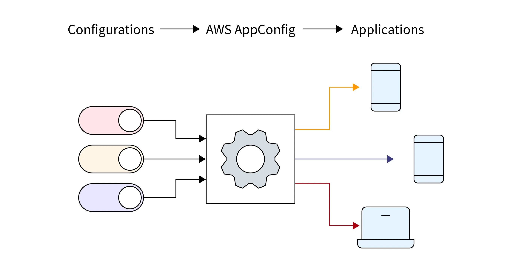
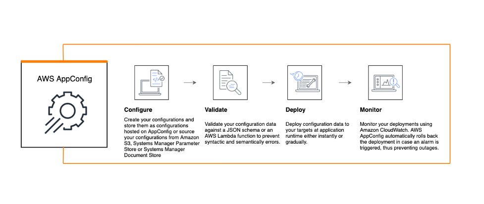
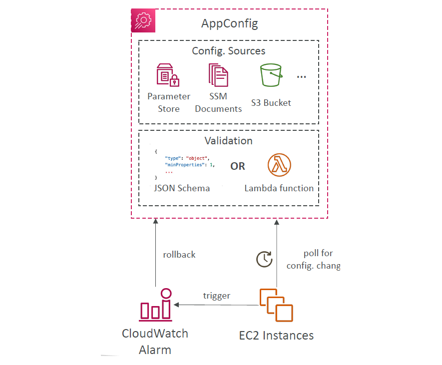
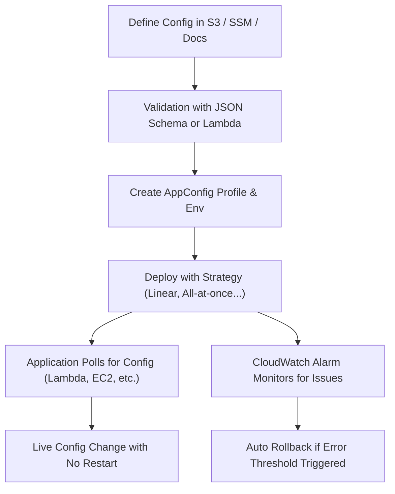

# ⚙️ **AWS AppConfig**

> _Dynamic Configuration Management for Applications_

---

<div style="text-align: center;">
    
</div>

---

## 🪄 **What is AWS AppConfig**

**AWS AppConfig**, part of **AWS Systems Manager**, enables you to **create, manage, validate, deploy, and monitor runtime configuration** for your applications **without redeploying your code**.

This is ideal for use cases like **feature flags**, **app tuning**, **environment toggles**, and **emergency configuration changes**.

---

<div style="text-align: center;">
    
</div>

---

## 🤔 **Why Use AWS AppConfig?**

| Feature                   | Benefit                                                      |
| ------------------------- | ------------------------------------------------------------ |
| 🧠 Dynamic Configuration  | Push new settings to applications in real time               |
| ✅ Validated Rollouts     | Ensure configs are safe with **schema or Lambda validation** |
| 🎯 Targeted Deployment    | Deploy per environment (e.g., staging, production)           |
| 🔁 Rollback Support       | Auto-rollback if issues arise                                |
| ⚡ No Downtime            | Apps update config without restart or redeployment           |
| 📈 Monitoring Integration | Integration with **CloudWatch Alarms** for rollout health    |

---

## 🧩 **How AWS AppConfig Works** – Illustrated

1️⃣ **Define Configuration**: JSON/YAML in SSM Parameter Store, S3, or Systems Manager Documents  
2️⃣ **Validate Before Deploy**: Use a **JSON Schema** or **Lambda Function** for validation  
3️⃣ **Deploy Configuration**: Gradual rollout across EC2, Lambda, ECS, etc.  
4️⃣ **Monitor & Rollback**: Use **CloudWatch alarms** to detect anomalies and rollback automatically

---

<div style="text-align: center;">
    
</div>

---

## 📄 **Example Use Case: Feature Flag for Dark Mode**

### 🔸 Step 1: Create a Config File (JSON)

```json
{
  "darkModeEnabled": false
}
```

Upload it to **SSM Parameter Store**, **S3**, or directly in AppConfig.

---

### 🔸 Step 2: Define Validation

#### ✅ JSON Schema Validator

```json
{
  "type": "object",
  "properties": {
    "darkModeEnabled": { "type": "boolean" }
  },
  "required": ["darkModeEnabled"]
}
```

#### OR 🧠 Lambda Validator

Use this if you want to validate **custom rules**, such as combinations of flags:

```javascript
exports.handler = async (event) => {
  if (typeof event.darkModeEnabled !== "boolean") {
    throw new Error("darkModeEnabled must be a boolean");
  }
};
```

---

### 🔸 Step 3: Start Deployment in AppConfig

Choose:

- **Environment** (e.g., `Production`, `Staging`)
- **Deployment strategy** (e.g., Linear: 10% every 5 minutes)
- Set **CloudWatch alarm** (e.g., if error rate > 5%)

AppConfig will:

- Gradually apply config to running services
- **Trigger rollback** if error alarm fires

---

## 🖥️ **Client Side: Poll for Configuration**

Your application polls AppConfig via the **AWS SDK** or **AppConfig Agent** to get the latest config.

```javascript
const { AppConfigDataClient, GetLatestConfigurationCommand } = require("@aws-sdk/client-appconfigdata");

const client = new AppConfigDataClient({});
const token = await client.send(
  new StartConfigurationSessionCommand({
    ApplicationIdentifier: "MyApp",
    ConfigurationProfileIdentifier: "FeatureFlags",
    EnvironmentIdentifier: "Production",
  })
);

const config = await client.send(
  new GetLatestConfigurationCommand({
    ConfigurationToken: token.InitialConfigurationToken,
  })
);

console.log(JSON.parse(config.Configuration.toString()));
```

---

## 🎯 **Common Use Cases**

| Use Case                    | Description                                                |
| --------------------------- | ---------------------------------------------------------- |
| 🔁 **Feature Toggles**      | Turn features on/off without deployment                    |
| 🧪 **A/B Testing**          | Switch UI behavior for % of users                          |
| 📉 **Failover Configs**     | Point your app to a backup endpoint or DB                  |
| ⚠️ **Emergency Switch**     | Block a feature immediately if it causes production issues |
| 🧬 **Environment Settings** | Load environment-specific tuning values dynamically        |

---

## ✅ **Best Practices**

- Use **schema validation for structure**, **Lambda for logic**
- Gradually roll out to small % of traffic first
- Always configure **CloudWatch alarms** to catch regressions
- Avoid hardcoded config in app code — rely on AppConfig or Parameter Store

---

## 🧠 **Recap: AppConfig Flow Summary**

<div align="center">



</div>
