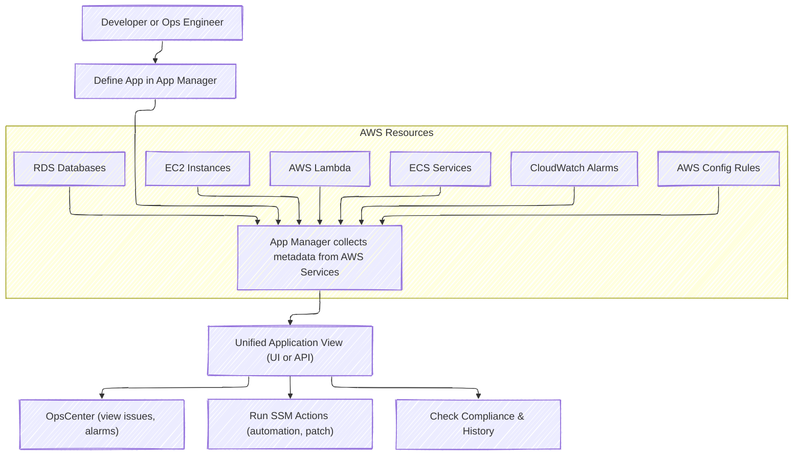

---
tags:
  - aws
  - aws/service
  - aws/domain/management-and-governance
  - aws/topic/system-manager
aliases:
  - "AWS App Manager Unified Application Operations in AWS Systems Manager"
  - "App Manager"
---

# 🧩 **AWS App Manager – Unified Application Operations in AWS Systems Manager**

> 👉🏻 Combine Application Components(EC2, Lambda, ECS, RDS, S3, CW, Config, OpsCenter) into a single view

**AWS App Manager**, part of **AWS Systems Manager**, provides a **single pane of glass** to manage and operate applications across your AWS environment—whether you're running them on **EC2, ECS, EKS, Lambda**, or other services.

> 🎯 It helps **map, monitor, troubleshoot, and operate** your app components from a centralized view.

---

## 🏗️ **What Is App Manager?**

**App Manager** allows you to group and visualize **all the AWS resources** that make up an application (e.g., Lambda, EC2, ECS, RDS, S3, CloudWatch Alarms, Config Rules, etc.).

| Feature                      | Benefit                                                                 |
| ---------------------------- | ----------------------------------------------------------------------- |
| 🧭 Centralized Visibility    | View **all application components** across services and regions         |
| 🛠️ Operational Tools Access  | Quick links to **Automation**, **Run Command**, **Patch Manager**, etc. |
| 🚨 Integrated Monitoring     | View **CloudWatch Alarms**, **Config compliance**, **OpsCenter issues** |
| 🧩 Application-Centric Model | Group AWS resources by **logical app** instead of service boundaries    |

---

## 🔍 **Why Use App Manager?**

| Use Case                     | Description                                                                  |
| ---------------------------- | ---------------------------------------------------------------------------- |
| 👀 **Full app visibility**   | View EC2, Lambda, ECS, RDS, CloudWatch, Config — all in one application view |
| 🔎 **Fast troubleshooting**  | Quickly find misbehaving resources or alarms linked to an app                |
| 🛠️ **Operational actions**   | Run SSM documents, patching, change tracking — from a single console         |
| 📜 **Auditing & Compliance** | Detect config drift, non-compliant rules, recent changes                     |

---

## 🖼️ **How It Works: App Manager Architecture**

<div align="center">



</div>

---

## 🛠️ **Creating an Application in App Manager**

You can create applications in **two ways**:

### 🧠 1. **Manual Creation**

- Go to **Systems Manager → Application Manager**
- Click **Create application**
- Add:

  - Application name
  - Associated AWS resources (select manually or tag-based)

### 🏷️ 2. **Tag-Based Discovery**

Define a **tag key-value pair**, and App Manager **automatically discovers and groups resources** across your account.

```yaml
Key: App
Value: MyEcommerceApp
```

Every resource tagged with `App=MyEcommerceApp` will be grouped under the same app.

---

## 🧪 **Operations You Can Perform From App Manager**

| Feature                     | Description                                     |
| --------------------------- | ----------------------------------------------- |
| 🔄 **Run Command**          | Execute shell scripts or commands on EC2/Lambda |
| 🧰 **Automation Docs**      | Trigger SSM Automation workflows                |
| 🚨 **Alarms View**          | CloudWatch alarm summary tied to the app        |
| 📦 **Patch Compliance**     | Check patching status of app's EC2 fleet        |
| 🔍 **AWS Config Findings**  | Review configuration compliance status          |
| 📖 **Change History**       | View changes made to app-related resources      |
| 🪲 **OpsCenter Integration** | Track issues and remediation across the app     |

---

## ✅ **Real Example: Managing a Serverless App**

Let’s say you deploy a serverless application with:

- **Lambda functions**
- **API Gateway**
- **DynamoDB table**
- **CloudWatch alarms**
- **S3 bucket**

If you tag all resources with:

```bash
App = ServerlessOrderApp
```

App Manager will **auto-discover all components**, and let you:

- View function logs & alarms 🔍
- Investigate latency issues via CloudWatch
- Run patching or restart EC2 workers from the same page
- Investigate changes using AWS Config & CloudTrail
- Fix and track issues in **OpsCenter**

---

## 💡 **Key Differences from AppConfig**

| Feature         | AppConfig                            | App Manager                                   |
| --------------- | ------------------------------------ | --------------------------------------------- |
| Primary Purpose | Dynamic config delivery & validation | Centralized app management & operations       |
| Operates On     | Application config parameters        | Entire AWS resources making up an application |
| Targets         | EC2, Lambda, ECS apps                | Any AWS service used in the app               |
| Validation      | JSON Schema or Lambda                | Compliance check via Config & CloudWatch      |
| Action Triggers | Deployment rollouts & rollback       | SSM Automation, Run Command, Patch Manager    |

---

## 🧠 **Best Practices**

- ✅ Tag your resources consistently for **App discovery**
- 📌 Use **CloudFormation** or **CDK** to automatically tag resources by application
- ⚠️ Monitor **CloudWatch alarms** and trigger SSM runbooks via **App Manager**
- 🧪 Link **OpsCenter** to surface critical events tied to specific applications
- 🔍 Combine with **AWS Config** to monitor compliance and drift

---

## 📦 **Summary: AWS App Manager Highlights**

| Feature               | Benefit                                       |
| --------------------- | --------------------------------------------- |
| 🔍 Unified View       | App-wide visibility across services           |
| 🎯 Resource Grouping  | Group by tags or manual selection             |
| ⚙️ Integrated Actions | Run automation, patch, diagnostics in-place   |
| 📊 Monitoring         | View alarms, config issues, and audit logs    |
| 🛡️ Better Security    | Detect misconfigurations and enforce policies |
---

## Related Notes
- [[aws-services/1.management-governance/4.1.system-manager/|Index]] - folder map
- [[aws-services/1.management-governance/4.1.system-manager/3.1.app-config|AWS AppConfig]] - previous lesson
- [[aws-services/1.management-governance/4.1.system-manager/3.3.parameter_store|AWS SSM Parameter Store]] - next lesson
- [[aws-services/1.management-governance/3.1.cloud-watch/4.cw-alarm|Amazon CloudWatch Alarms Smart Monitoring & Automated Reactions]] - mentions CloudWatch Alarm
-[[1.1.cfn|AWS CloudFormation]]] - mentions CloudFormation
- [[aws-services/1.management-governance/4.1.system-manager/2.3.patch-manager|AWS Systems Manager Patch Manager]] - mentions Patch Manager
- [[aws-services/1.management-governance/4.1.system-manager/2.2.run-command|AWS SSM Run Command]] - mentions Run Command
- [[aws-services/3.network/4.api-gateway/x.api-gateway|Amazon API Gateway Streamlining API Management]] - mentions API Gateway
- [[aws-services/3.network/4.api-gateway/1.1.api-gateway|AWS API Gateway The Front Door for Your APIs]] - mentions API Gateway
- [[aws-daily/aws-architectures/3.1.serverless|Server-Based Architectures vs. Serverless Computing]] - mentions Serverless
- [[aws-services/1.management-governance/4.3.config/1.aws-config|AWS Config Track Audit and Enforce Your AWS Resource Compliance]] - mentions AWS Config
-[[1.serverless|The Ultimate Guide to Serverless Computing & Tools]]] - mentions Serverless

---
