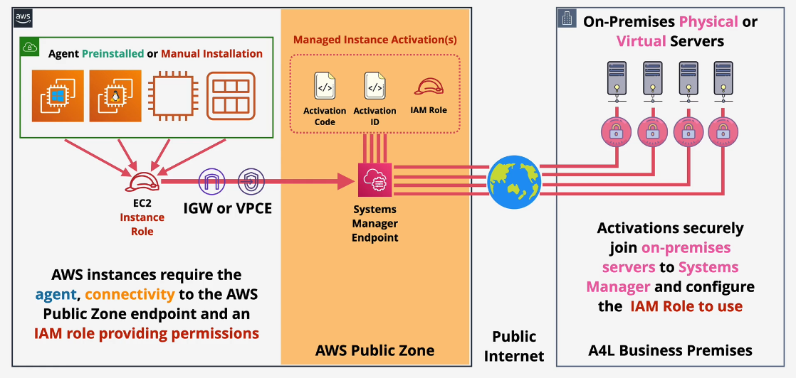

---
tags:
  - aws
  - aws/service
  - aws/domain/management-and-governance
  - aws/topic/system-manager
aliases:
  - "AWS Systems Manager SSM"
  - "Summary Cantriel"
---

# 🛠️ **AWS Systems Manager (SSM)**

> _Manage, automate, and control infrastructure across AWS and on-premises environments — all from a single interface._

  

  

---

## 📌 **What is AWS SSM?**

- A **management service** that lets you **control AWS and on-premises infrastructure**.
- It's **agent-based** – the **SSM Agent** communicates with the **AWS Systems Manager endpoint**.
- **Pre-installed** on most **Amazon Linux and Windows AMIs** (older AMIs may require manual setup).

---

## 🧠 **Core Features of AWS Systems Manager**

---

### 🧾 1. **Inventory Management**

- Automatically collects detailed info from your managed instances, such as:
  - Installed apps
  - Network configurations
  - OS patches and hotfixes
  - Hardware specs
  - Running services
  - Custom metadata

---

### 🏃‍♂️ 2. **Run Command**

- Run shell scripts or PowerShell commands across **multiple instances**.
- No SSH required 🔐
- Perfect for automation, updates, patches, or quick fixes.

---

### 🧩 3. **State Management (Desired State)**

> Ensure your instances stay configured the way you want

- Define how an instance should be configured.
- Example: Want port `8080` **blocked**? If someone opens it, SSM will detect & **revert it**.
- Keeps your infrastructure **compliant and secure**.

---

### 🧳 4. **Parameter Store**

> Securely store configuration data and secrets.

- Acts like a **key-value store** for:
  - App settings (e.g., DB connection strings)
  - Secrets (e.g., API keys)
- Supports encryption using **AWS KMS**.
- ❗ For highly sensitive secrets, use **Secrets Manager** (supports auto rotation but is **paid**).

---

### 💻 5. **Session Manager**

> SSH-like access, but **secure and audit-ready**.

- Connect to **EC2 instances**, even in **private VPCs**, **without needing SSH or bastion hosts**.
- Access is controlled via **IAM roles** and **logged via CloudTrail**.
- Great for regulated environments (HIPAA, PCI, etc).
---

## Related Notes
- [[aws-services/1.management-governance/4.1.system-manager/|Index]] - folder map
- [[aws-services/1.management-governance/4.1.system-manager/3.3.parameter_store|AWS SSM Parameter Store]] - previous lesson
- [[aws-services/1.management-governance/4.1.system-manager/2.1.session-manager|AWS SSM Session Manager Secure Shell Access Without SSH]] - mentions Session Manager
- [[aws-services/1.management-governance/4.1.system-manager/2.2.run-command|AWS SSM Run Command]] - mentions Run Command
- [[aws-services/4.storage/1.s3/2.5.encryption|Amazon S3 Encryption]] - mentions Encryption
- [[aws-services/2.security/2.1.kms/2.aws-kms|AWS KMS Centralized Key Management for Secure Cloud Encryption]] - mentions Aws Kms
- [[aws-services/2.security/1.1.iam/1.fundmmentals/1.2.iam|AWS Identity and Access Management IAM]] - mentions Iam

---
