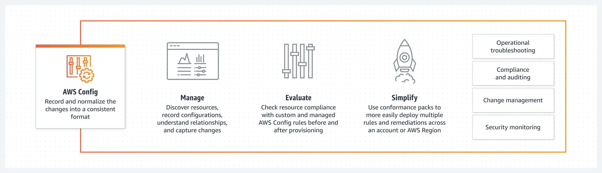
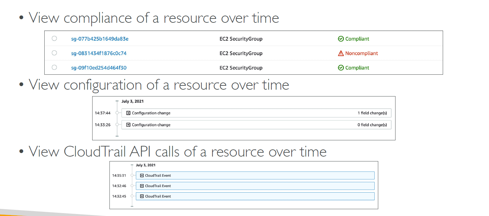
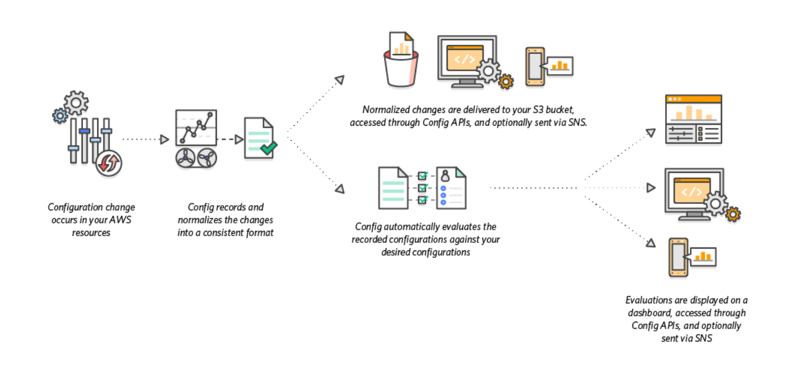
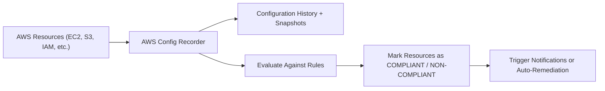

# 🛡️ **AWS Config: Track, Audit, and Enforce Your AWS Resource Compliance**

> _Continuously monitor and record your AWS resource configurations — and keep your cloud secure, compliant, and audit-ready._

---

  

---

## 🧠 **What is AWS Config?**

**AWS Config** is a **fully managed service** that enables you to:

- **Continuously monitor** resource configurations
- **Record** configuration changes over time
- **Evaluate** resource compliance against security or operational best practices
- **Automate** compliance auditing and security analysis

> 🧠 Simply put:  
> **AWS Config** is like a **"security camera"** for your AWS environment — watching all resource changes and ensuring they meet your rules.

---

## 📦 **What AWS Config Does for You**

| ✅ Capability              | 💬 Description                                                           |
| -------------------------- | ------------------------------------------------------------------------ |
| 📋 Resource Inventory      | List and track all your AWS resources automatically                      |
| 🎥 Configuration Recording | Monitor changes to resource settings (e.g., EC2 security groups updated) |
| 🧪 Compliance Evaluation   | Check if resources meet your organization's rules                        |
| 📜 Auditing and Reporting  | Generate audit-ready compliance reports anytime                          |
| 🛠️ Remediation Automation  | Fix non-compliant resources automatically with auto-remediation          |

> 🚨 `AWS Config Rules does not prevent actions from happening (no deny)`  
> 👉 Instead You Can use Automate remediation of non-compliant resources using `SSM Automation Documents`

---

  

---

## 🧩 **How AWS Config Works**

> AWS Config **records** → **evaluates** → **flags** → (optionally) **fixes** your resources.

---

  

---

---

## 🚀 **Key Concepts**

| 🧠 Concept                  | 📚 Description                                                                  |
| :-------------------------- | :------------------------------------------------------------------------------ |
| **Configuration Recorder**  | Continuously monitors changes to AWS resource settings                          |
| **Configuration Item (CI)** | Snapshot of a resource's state at a point in time                               |
| **AWS Config Rules**        | Logical checks (e.g., "S3 buckets must have encryption enabled")                |
| **Remediation Action**      | Automated fix applied when a resource is non-compliant                          |
| **Aggregation**             | Centralized multi-account, multi-region compliance view (via AWS Organizations) |

---

## 🔎 **Real-World Example**

Imagine you have a **company policy**:

- "Every S3 bucket must have server-side encryption enabled."

With AWS Config:

1. ✅ Enable a **managed rule**: `s3-bucket-server-side-encryption-enabled`
2. ✅ AWS Config automatically scans all S3 buckets.
3. ✅ If a bucket isn't encrypted:
   - It flags it as **NON-COMPLIANT** 🔥
   - (Optional) Automatically runs a remediation Lambda function to enable encryption.

> 🔥 **Security team stays informed. No manual audits needed.**

---

## 📋 **Built-in Managed Rules Examples**

| Rule Name                      | What It Checks                            |
| ------------------------------ | ----------------------------------------- |
| `ec2-instance-no-public-ip`    | EC2 instances must not have public IPs    |
| `s3-bucket-versioning-enabled` | S3 buckets must have versioning turned on |
| `iam-user-no-policies-check`   | IAM users must not have inline policies   |
| `rds-instance-backup-enabled`  | RDS instances must have backups enabled   |
| `cloudtrail-enabled`           | CloudTrail must be enabled in all regions |

> ✅ **No need to reinvent the wheel** — AWS provides 100+ pre-built rules!

---

## 🛠️ **How to Use AWS Config (Quick Flow)**

### ✅ 1. **Set Up AWS Config**

- Go to **AWS Console → AWS Config**
- Set:
  - Which resources to record (or all)
  - Where to store configuration snapshots (e.g., an S3 bucket)
  - SNS topics for compliance notifications

---

### ✅ 2. **Create or Use AWS Config Rules**

- Choose:
  - **Managed rules** (pre-built)
  - **Custom rules** (written in `AWS Lambda`)

---

### ✅ 3. **Remediate Non-Compliance (Optional)**

- Set up **auto-remediation** by:
  - Assigning pre-built remediation actions
  - Creating custom Lambda functions

---

### ✅ 4. **Monitor and Report**

- Use the **Config Dashboard** to:
  - View compliance status by account, region, or resource
  - Export detailed compliance reports

---

## 🧠 **When Should You Use AWS Config?**

| Scenario                                              | Should You Use AWS Config? |
| :---------------------------------------------------- | :------------------------- |
| Track changes to resource configurations              | ✅ Yes                     |
| Prove compliance during audits (HIPAA, PCI-DSS, SOC2) | ✅ Yes                     |
| Automate security enforcement                         | ✅ Yes                     |
| Inventory of multi-account AWS environments           | ✅ Yes                     |
| Small personal AWS account, no compliance needs       | ❌ Optional                |

---

## ⚖️ **AWS Config vs CloudTrail**

|          | AWS Config                              | AWS CloudTrail                             |
| :------- | :-------------------------------------- | :----------------------------------------- |
| Focus    | Resource state and compliance           | API activity (who did what)                |
| Records  | Resource settings (e.g., S3 encryption) | User/API actions (e.g., created S3 bucket) |
| Use Case | Compliance, auditing infrastructure     | Security analysis, incident investigation  |

✅ Both services **complement** each other, but they **do different things**.

---

## 📈 **Benefits of AWS Config**

| ✅ Benefit                           | 💬 Why It’s Important                                |
| :----------------------------------- | :--------------------------------------------------- |
| Always-On Visibility                 | See how your AWS environment changes over time       |
| Compliance as Code                   | Define and automate compliance checks easily         |
| Faster Audits                        | Generate reports instead of digging manually         |
| Auto-Fix Security Issues             | Remediate non-compliant resources automatically      |
| Centralized Multi-Account Management | Great for large organizations with many AWS accounts |

---

## 🔥 **Summary: Why AWS Config Matters**

> 🧠 **AWS Config makes your AWS environment auditable, accountable, and automatically compliant — without slowing down innovation.**

✅ It’s **essential** for enterprises, growing startups, and anyone who needs to meet **security**, **operational**, or **compliance** standards.
