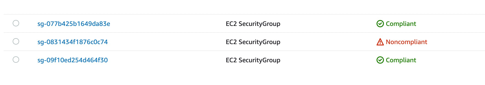
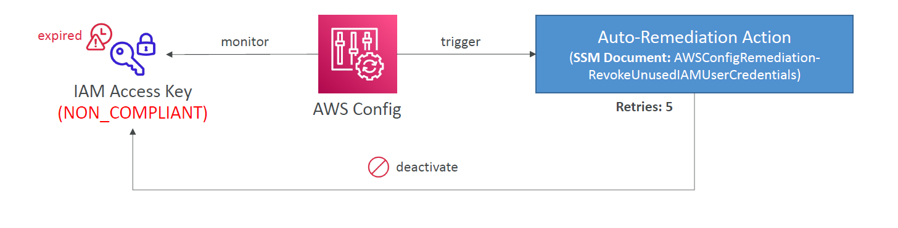
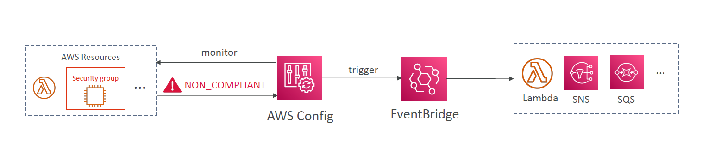
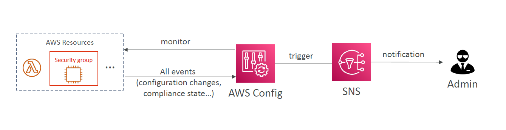

# [✅ or ❌] AWS Config Rules

AWS Config Rules enable you to **define and evaluate policies** for AWS resources, ensuring compliance with best practices, security, and governance standards.

---

  

---

## 🎯 What Are Config Rules?

Config Rules help you **define desired configurations** for AWS resources and continuously monitor them. If a resource **drifts** from the expected state, the rule marks it **NON_COMPLIANT**.

There are two types of rules:

- 🧠 **Managed Rules**: AWS provides 75+ pre-built rules (e.g., `required-tags`, `restricted-ssh`, etc.)
- 🛠️ **Custom Rules**: You define your own logic via a **Lambda function**

> 🧪 Example 1: Check if every EBS volume is `gp2`  
> 🧪 Example 2: Verify EC2 instances are of type `t3.micro`

---

## 🔄 When Do Rules Trigger?

Rules can be evaluated:

- 🔁 On every **configuration change**
- ⏰ At a regular **time interval** (e.g., every 6 hours)

---

## ⚙️ Hands-On: Create a Managed Rule

1. Go to the **AWS Config Console**
2. Click **Rules > Add Rule**
3. Choose a managed rule like `restricted-ssh`
4. Assign a target resource (e.g., EC2)
5. Set the evaluation trigger
6. Review and create

🔍 Now, AWS Config continuously evaluates the rule.

---

## ⚡ Remediation with SSM Automation

When resources become **non-compliant**, you can automatically fix them using **SSM Documents**.

### Auto-Remediation Example

> Revoke expired IAM access keys

  

🧰 Uses built-in SSM document:
`AWSConfigRemediation-RevokeUnusedIAMUserCredentials`

---

## 🛠️ Custom Remediation Flow

You can create **custom SSM documents** that:

- Invoke Lambda
- Perform external API calls
- Trigger workflows

💡 Set **remediation retries** (e.g., 5 attempts) in case the issue persists.

---

## 📢 EventBridge & Notifications

Trigger automation, Lambda functions, or SNS alerts when compliance fails:

  

💡 Use **EventBridge** filters or **SNS filtering policies** to avoid alert flooding.

---

## 👨‍💼 Notify Admins with Config + SNS

  

Admins receive notifications when **configuration drifts**, helping them take manual or automated action.

---

## 💸 Pricing Breakdown

| Metric                    | Price                                      |
| ------------------------- | ------------------------------------------ |
| 📦 Recording Config Items | \$0.003 per configuration item per region  |
| 🧾 Rule Evaluations       | \$0.001 per evaluation per rule per region |
| 🔄 Remediation Executions | Billed via **SSM Automation** pricing      |

---

## 🚀 Summary: Why Use Config Rules?

- ✅ Enforce compliance without manual review
- ✅ Automate remediation (no more Slack alerts with no action!)
- ✅ Integrate with EventBridge and Lambda for real-time control
- ✅ Enable continuous auditability and security
