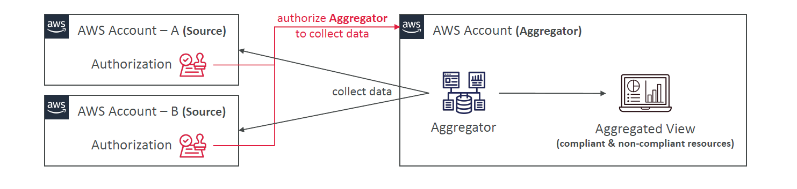

# 🧩 AWS Config Aggregators – Centralized Compliance Across Accounts

In a multi-account AWS environment, managing compliance checks independently in each account can quickly become unmanageable. Enter the **AWS Config Aggregator** – your single-pane-of-glass solution for compliance visibility across multiple accounts and regions.

---

<div align="center">
  
</div>

---

## 🔍 What is an AWS Config Aggregator?

An **AWS Config Aggregator** lets you **collect and view configuration and compliance data** from multiple accounts and regions **in one central account**.

- It **does not run config rules** or monitor changes itself
- It **aggregates data** already collected by **source accounts**
- Provides a **centralized compliance dashboard**

> 📌 The aggregator is only created in **one central aggregator account** – not in every account.

---

## 🧠 Why Use an Aggregator?

| Use Case                           | Benefit                                                           |
| ---------------------------------- | ----------------------------------------------------------------- |
| Multi-account, multi-region setups | Unified compliance view across environments                       |
| Audits & compliance                | Quick overview of compliant vs non-compliant resources            |
| Management & governance            | Enables monitoring at an org-level without disrupting local rules |

---

## 🛠️ How It Works

1. **Source Accounts**: Have AWS Config set up and tracking resources
2. **Aggregator Account**:

   - Create the **Config Aggregator**
   - Pulls data from source accounts and regions

3. **Authorization**:

   - 🔒 If using **AWS Organizations**: permissions are automatic
   - 🔑 If **not** using Organizations: you must manually **authorize** the aggregator in each source account

---

### ✅ Example: Aggregator Setup Without AWS Organizations

- You want to monitor compliance in Account A & B from a central Account C
- You deploy AWS Config in Account A and B
- In Account A & B:

  ```bash
  aws config put-aggregation-authorization \
      --authorized-account-id 111111111111 \
      --authorized-aws-region us-east-1
  ```

- In Account C, you create the aggregator pointing to A & B

---

### ✅ Example: Aggregator Setup With AWS Organizations

- Simply create the aggregator from the **management account**
- Choose **“aggregate data from my entire organization”**
- No need for `put-aggregation-authorization` in each account

---

## 🧩 Key Details

| Feature                  | Description                                                        |
| ------------------------ | ------------------------------------------------------------------ |
| Aggregator Account       | The **only place** where the aggregator is created                 |
| Source Accounts          | The accounts that AWS Config collects from                         |
| Data Aggregated          | Compliance state, config items, rule evaluations, etc.             |
| Regional Aggregation     | Works **across AWS regions** too                                   |
| Rule Ownership           | Rules **must be deployed** in each account (not centrally managed) |
| Deployment Best Practice | Use **CloudFormation StackSets** to deploy config rules org-wide   |

---

### 📦 Example Aggregated View Output

```json
{
  "AccountId": "222222222222",
  "Region": "us-west-2",
  "ResourceType": "AWS::EC2::SecurityGroup",
  "ComplianceType": "NON_COMPLIANT",
  "Annotation": "Port 22 open to the world"
}
```

This output comes from one account and region but is visible in the **aggregator view**.

---

## 🚀 Pro Tips for the Exam

✅ **Only one aggregator** per view — created in central account
✅ **No rules executed** in aggregator; it’s only for collection
✅ **Use StackSets** to deploy Config rules org-wide
✅ If using Organizations, **no need for per-account auth**
✅ Aggregator helps **unify compliance and governance** across large environments
