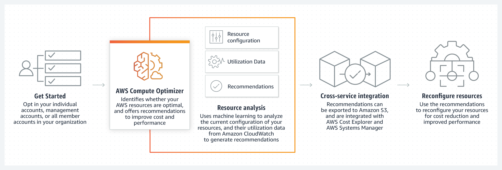
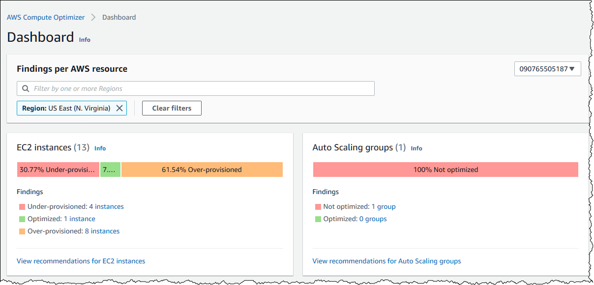

---
tags:
  - aws
  - aws/service
  - aws/domain/management-and-governance
  - aws/topic/compute-optimizer
aliases:
  - "AWS Compute Optimizer"
---

# 🚀 AWS Compute Optimizer

**AWS Compute Optimizer** is a service that analyzes the configuration and utilization data of your AWS compute resources and provides optimization recommendations to help reduce costs and enhance performance.

---

  

---

  

## **Key Features:**

### 🛠️ Resource Recommendations

Generates recommendations for:

- `EC2`
- `EC2 Auto Scaling Groups`
- `EBS Volumes attached to EC2 instances`
- `AWS Lambda`

### 📊 Utilization Metrics

Offers graphs of recent utilization metrics and projected recommendations for better price-performance evaluation.

### 🌐 Accessibility

Available through both a console dashboard and a set of APIs.

### 🤝 Multi-Account Support

Can be used across AWS organizations to find recommendations for management and member accounts.

### 📋 Opt-In Requirement

Customers must opt into the service to use it.
---

## Related Notes
- [[aws-services/1.management-governance/2.1.organizations/1.aws-organizations|AWS Organizations The Smart Way to Manage Multiple AWS Accounts]] - mentions AWS Organizations
- [[aws-services/5.compute/1.3.ec2-auto-scaling/1.1.ec2-auto-scaling|EC2 Auto Scaling]] - mentions EC2 Auto Scaling
- [[aws-services/5.compute/2.ebs/1.1.ebs|Amazon EBS Elastic Block Store Scalable Persistent Storage for EC2]] - mentions EBS

---
