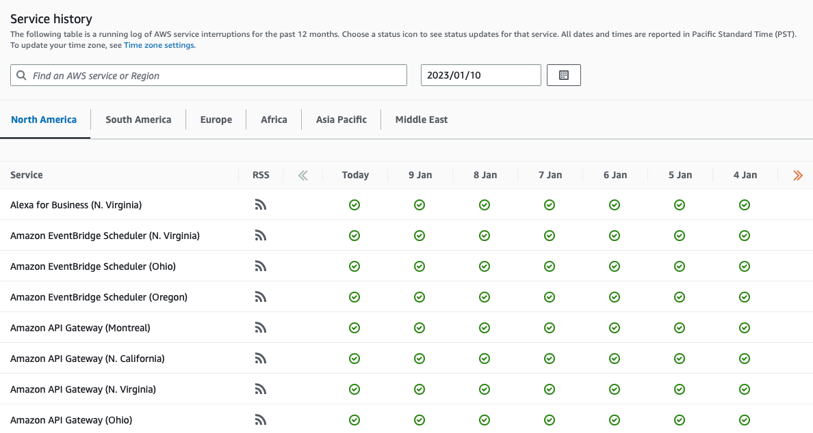
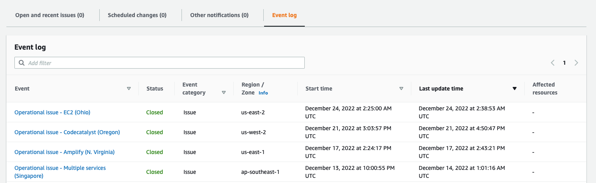
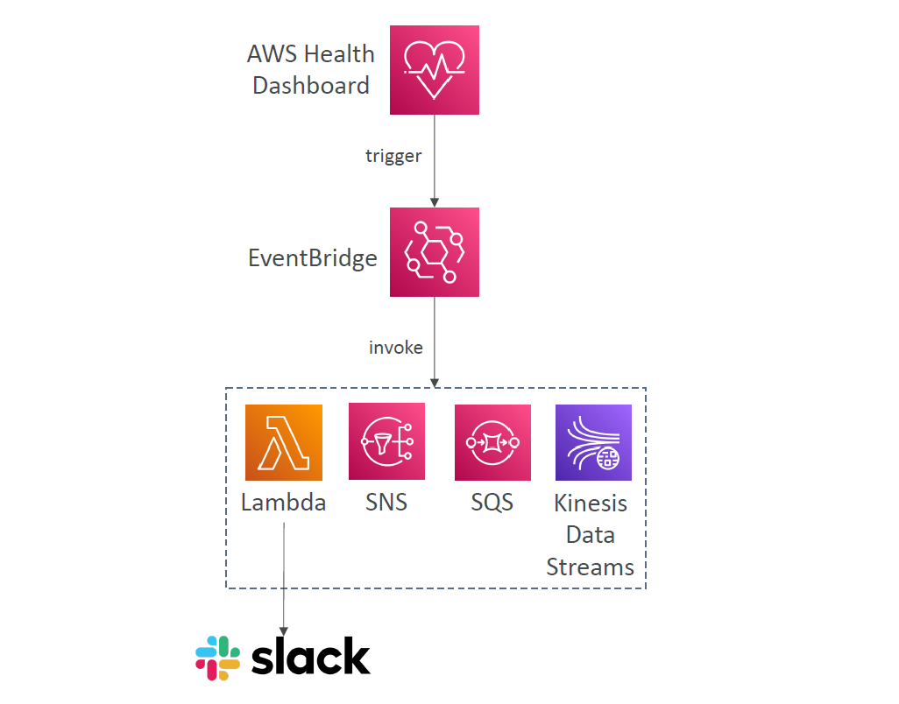
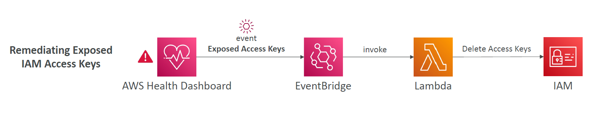
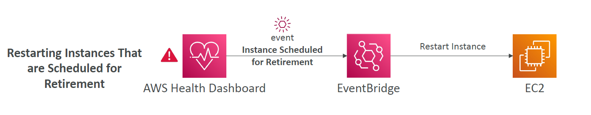

# 🩺 **AWS Health Dashboard: Monitor AWS Service & Account Impact**

The **AWS Health Dashboard** helps you stay informed about **AWS service status** and how outages or events may **personally impact your account**.

It has **two key views**:

---

## 🌐 **1. AWS Health Dashboard – Service History**

_Formerly: AWS Service Health Dashboard!_

---

<div style="text-align: center;">
    
</div>

---

| Feature                              | Description                                          |
| ------------------------------------ | ---------------------------------------------------- |
| 🌎 Covers **all regions & services** | See health status across the entire AWS platform     |
| 📅 Includes **daily history**        | Browse past service events by day                    |
| 📢 Offers **RSS feed**               | Subscribe for real-time status updates               |
| 🔎 Public-facing                     | For general awareness of AWS outages or degradations |

> ✅ Use this to check **if AWS had a service-level incident** — regardless of whether it affected you personally.

---

## 👤 **2. AWS Health Dashboard – Your Account**

_Formerly: AWS Personal Health Dashboard (PHD)!_

---

<div style="text-align: center;">
    
</div>

---

| Feature                        | Description                                                      |
| ------------------------------ | ---------------------------------------------------------------- |
| 🎯 **Personalized view**       | Shows how AWS events impact **your resources**                   |
| 🔔 **Real-time alerts**        | Get notified about outages, scheduled maintenance, or API issues |
| 🧰 **Remediation guidance**    | Includes steps to help resolve or respond to issues              |
| 📣 **Proactive notifications** | Plan ahead for scheduled maintenance                             |
| 👥 **Org-level visibility**    | Aggregate health across an **entire AWS Organization**           |
| 🌍 **Global service**          | Available in all regions and accounts                            |

> ✅ Use this dashboard to manage **your infrastructure’s availability** during AWS events.

---

## 📬 **Health Event Notifications – Stay Proactively Informed**

The **AWS Health Dashboard** doesn't just visualize incidents—it can also **trigger real-time actions**.

By integrating **AWS Health Events** with **Amazon EventBridge**, you can **automate alerts and remediation** when AWS detects issues affecting your resources.

---

### 💡 **Common Use Cases**

- 📩 Send email/slack alert if **an EC2 instance is scheduled for maintenance**
- 🔐 Automatically **disable a route** if a **VPN or Direct Connect issue** is reported
- 📊 Forward events to **SIEM/Splunk** for incident analysis
- 🧑‍🔧 Notify **DevOps teams** when **regional outages** affect services they manage

---

### 🧪 **Example: Email When EC2 Is Scheduled for Maintenance**

Let’s walk through an example setup:

**Goal**: Receive an email when EC2 health events affect your account.

---

<div style="text-align: center;">
    
</div>

---

#### 🛠️ Step-by-Step (EventBridge + SNS)

1. **Open EventBridge Console**
2. Create a new **Rule**

   - _Event Source_: AWS Health
   - _Event Pattern_:

     ```json
     {
       "source": ["aws.health"],
       "detail-type": ["AWS Health Event"],
       "detail": {
         "service": ["EC2"],
         "eventTypeCategory": ["scheduledChange"]
       }
     }
     ```

3. Set **target** to an SNS Topic (email)
4. **Subscribe** your email to the SNS Topic
5. Confirm the subscription via email

---

### 📌 **Event Types You Can Monitor**

| Event Scope           | Example Description                                    |
| --------------------- | ------------------------------------------------------ |
| 🧾 **Account Events** | EC2 maintenance, EBS degraded volume, IAM key rotation |
| 🌎 **Public Events**  | AWS global outage, degraded service in `us-east-1`     |

---

### ✍️ **Examples**

#### Remediating Exposed IAM Access Keys

<div style="text-align: center;">
    
</div>

---

#### Restarting Instances That are Scheduled for Retirement

<div style="text-align: center;">
    
</div>

---

## 🧠 Summary

| Dashboard Type      | Use It For...                                   |
| ------------------- | ----------------------------------------------- |
| **Service History** | Global AWS service status (all users)           |
| **Account Health**  | Alerts & guidance **for your specific account** |
