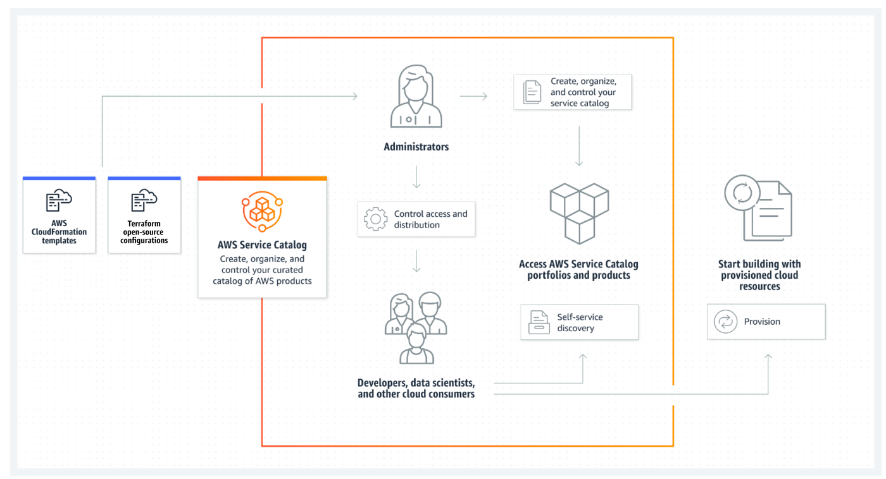
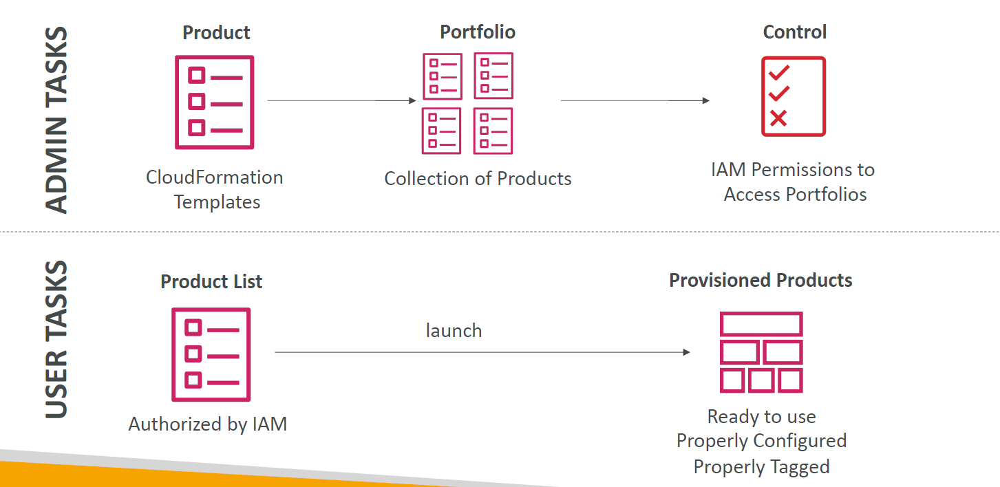
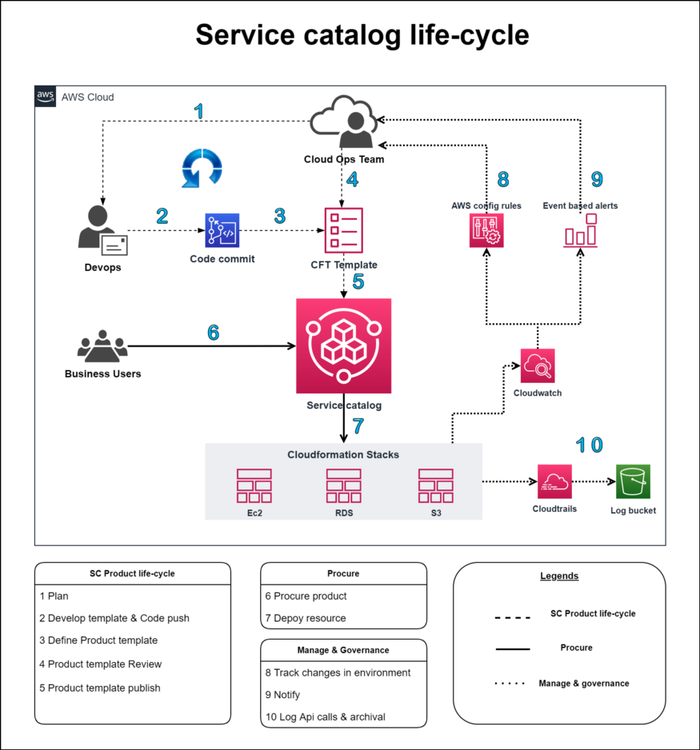
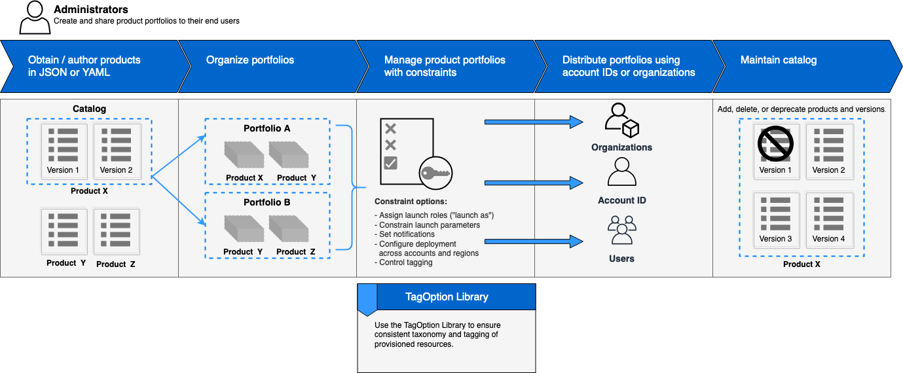
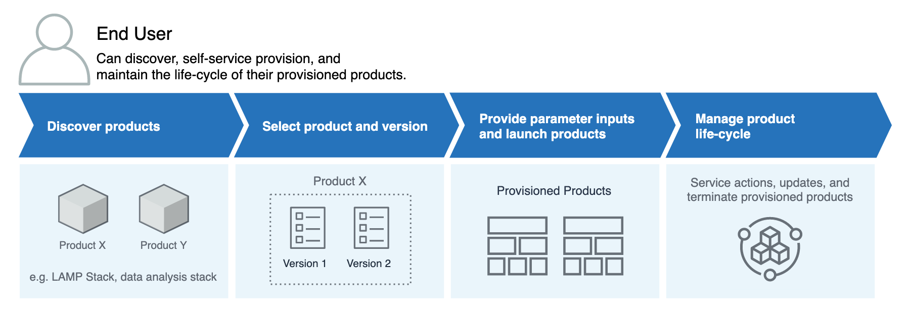
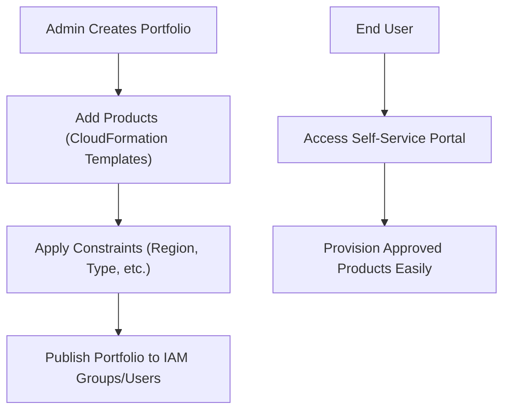

# 📚 **AWS Service Catalog: Organize, Control, and Accelerate IT Service Delivery**

> _Manage approved AWS resources centrally, standardize deployments, and empower teams with self-service — while maintaining full governance._

  

---

## 🧠 **What is AWS Service Catalog?**

**AWS Service Catalog** helps organizations manage and distribute IT services. Think of it like a menu at a restaurant, but instead of food, it's a list of approved IT resources and services you can use. Here’s a breakdown:

- 📋 **Catalog of approved products** (infrastructure, software, databases)
- 🛡️ **Enforced governance and compliance** at deployment
- 🚀 **Self-service** portal for end-users like developers, without losing security controls

> 💡 Think of it as a **secure AWS Marketplace customized for your organization**.

---

  

---

  

---

## 🌟 **Key Features of AWS Service Catalog**

### 🛠️ **1. Catalog Management**

| Feature                       | Description                                                                  |
| ----------------------------- | ---------------------------------------------------------------------------- |
| 🏢 **Centralized Control**    | Admins manage approved AWS products (e.g., EC2, RDS, S3 stacks) in one place |
| 🛡️ **Pre-approved Resources** | Products meet security, compliance, and cost standards before made available |

✅ Ensures consistency, security, and governance across all deployments.

---

### 🚀 **2. Efficient Provisioning**

| Feature                    | Benefit                                                           |
| -------------------------- | ----------------------------------------------------------------- |
| 🛒 **Self-Service Portal** | End-users easily find and deploy approved services                |
| ⚙️ **Automated Workflows** | Deploy resources with predefined settings, CI/CD style efficiency |

✅ Developers and teams move fast without risking compliance issues.

---

### 📈 **3. Enhanced Governance and Compliance**

| Feature                        | Why It Matters                                                             |
| ------------------------------ | -------------------------------------------------------------------------- |
| 📜 **Policy Enforcement**      | Enforce configurations, security settings, and resource restrictions       |
| 🎥 **Auditing and Monitoring** | Track who provisions what, and ensure it stays within organizational rules |

✅ You maintain full **control and visibility** over deployed resources.

---

### 🌐 **4. Flexible Integration**

| Feature                         | Benefit                                                              |
| ------------------------------- | -------------------------------------------------------------------- |
| 🔌 **Seamless AWS Integration** | Works well with IAM, CloudFormation, Config, Organizations, and more |
| 🛠️ **Customizable**             | Tailor templates and products to your company's needs and standards  |

✅ You can fit AWS Service Catalog into **any enterprise setup** — including multi-account environments.

---

## 👨‍🍳 **Creating the Catalog**

| Step                   | What Happens                                                          |
| ---------------------- | --------------------------------------------------------------------- |
| **Portfolio Creation** | Admins create **portfolios** (group of products + access permissions) |
| **Add Products**       | Products are defined using **CloudFormation templates** or other IaC  |
| **Set Constraints**    | Apply restrictions like regions, instance types, limits, etc.         |

✅ This way, every service used follows **your organization's approved blueprint**.

---

  

---

### 👥 **Using the Service Catalog**

| Role         | How They Interact                                              |
| ------------ | -------------------------------------------------------------- |
| **Admin**    | Curates products, sets constraints, controls access            |
| **End User** | Browses catalog, selects product, provisions service           |
| **Auditor**  | Monitors usage, ensures compliance through reports and tagging |

✅ Everyone plays their role without stepping over security or operational guidelines.

---

  

---

## 🛠️ **Typical AWS Service Catalog Setup (Quick Flow)**

---

## 📚 **Real-World Example**

> 🔥 Imagine you are an IT admin at a bank:

- You create a **Portfolio** with:
  - Pre-approved EC2 instances
  - Preconfigured RDS instances
  - Secure S3 buckets with encryption
- You define **constraints**:
  - EC2 instance type must be **t3.medium** or smaller
  - Only deploy in **`us-east-1`** region
- Developers access the **self-service portal**.
- They quickly launch EC2 instances or databases **without needing manual approval**.

✅ Developers stay productive  
✅ Security team stays happy  
✅ Organization stays compliant

---

## 🎯 **Benefits of AWS Service Catalog**

| ✅ Benefit                         | 💬 Why It’s Important                                                |
| ---------------------------------- | -------------------------------------------------------------------- |
| 🚀 Faster Service Delivery         | Developers don’t wait for manual approvals                           |
| 🛡️ Stronger Governance             | Only secure, compliant resources are deployed                        |
| 🔍 Complete Visibility             | Track and audit all provisioning activities                          |
| 🏷️ Cost Control                    | Define what products are allowed and prevent over-provisioning       |
| 🏛️ Consistency Across Organization | Templates and policies standardize all deployments organization-wide |

---

## ⚖️ **AWS Service Catalog vs AWS Marketplace**

| AWS Service Catalog                       | AWS Marketplace                             |
| ----------------------------------------- | ------------------------------------------- |
| Internal use only (your approved catalog) | Public marketplace with AWS-vetted software |
| Admin-curated templates (CloudFormation)  | Vendor-built SaaS, AMIs, etc.               |
| Full control over what’s published        | Limited to vendor-provided products         |

✅ **Use Service Catalog** when you want **internal control** and **pre-approval**.

---

## 🧠 **Summary: When Should You Use AWS Service Catalog?**

| Situation                                     | Should You Use Service Catalog? |
| --------------------------------------------- | ------------------------------- |
| Need to standardize cloud deployments         | ✅ Yes                          |
| Want fast self-service access for developers  | ✅ Yes                          |
| Must enforce governance and compliance rules  | ✅ Yes                          |
| Small team, no governance concerns            | ❌ Optional                     |
| You are using 3rd party SaaS from Marketplace | ❌ AWS Marketplace better       |

---

## 🚀 **Final Pro Tip**

> 🧠 **Use AWS Service Catalog when you want to blend the speed of cloud self-service with the control and governance your organization demands.**  
> It's like giving your developers a "**safe AWS playground**" built exactly to your enterprise's security and compliance standards.
