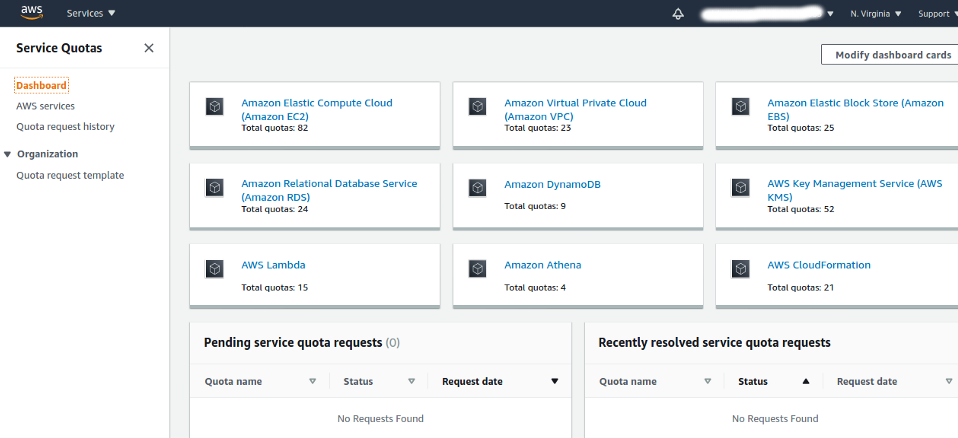
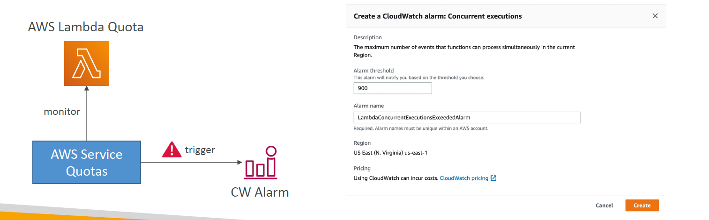
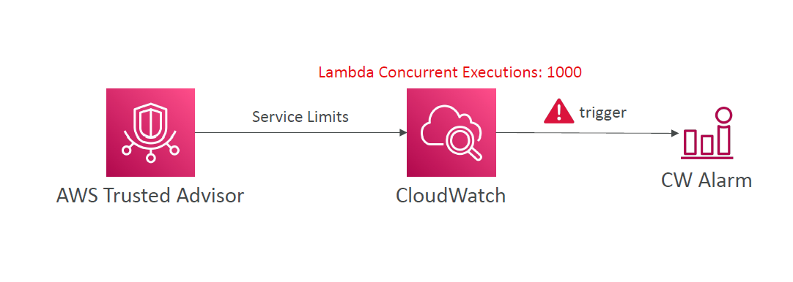

# 🚦 AWS Service Quotas & Monitoring: Stay Ahead of Your Limits

AWS imposes **service quotas** (a.k.a. limits) to ensure fair use and account stability. Whether you're scaling Lambda, launching EC2s, or provisioning RDS databases—these limits can impact your architecture and uptime.

---

<div align="center">
  
</div>

---

## 📋 What Are AWS Service Quotas?

**Service quotas** define the **maximum number of resources** or operations that you can use in your AWS account per region.

Examples:

- 💡 **Lambda concurrent executions** (default: 1000)
- 🖥️ **EC2 instances per region**
- 🧠 **Secrets Manager requests per second**

You can find, track, and request changes to these quotas via the **Service Quotas dashboard**.

---

## 🧰 Key Features

### 🔍 Centralized Dashboard

- View all quotas across services and regions in one place.
- See current usage vs. maximum allowed.
- Filter by AWS service or quota name.

### ⚙️ Requesting Quota Increases

- For soft limits (e.g., Lambda executions), you can submit a request directly.
- AWS support will process and approve/deny.
- Hard limits (e.g., EBS snapshot max size) cannot be changed.

---

## 📊 Real-Time Monitoring with CloudWatch

You can **monitor quotas** using **CloudWatch Alarms** to stay proactive and avoid failures.

### ✅ Example: Monitor Lambda Concurrent Executions

<div align="center">
  
</div>

🛎️ Set an alarm to notify you when usage nears 90%:

```bash
Alarm threshold: 900
Alarm name: LambdaConcurrentExecutionsExceededAlarm
```

This allows you to either:

- Scale down workload
- Request a quota increase before breaching the limit

---

## 🧭 Alternative - Trusted Advisor + CloudWatch Integration

When Service Quotas doesn’t support a metric, use **Trusted Advisor** as an alternative source:

<div align="center">
  
</div>

### How it works

1. **Trusted Advisor** checks your service limit usage (\~50 services)
2. **Publishes to CloudWatch**
3. You create alarms on **Trusted Advisor check metrics**

🔔 Example: Notify when EC2 On-Demand instances are 85% consumed

---

## 🔐 Why You Should Monitor Quotas

| Reason 🧠                   | Benefit 🚀                                  |
| --------------------------- | ------------------------------------------- |
| Prevent service disruptions | Avoid hitting hard limits unexpectedly      |
| Scale safely                | Increase limits in advance during growth    |
| Improve visibility          | Understand which quotas are critical to ops |

---

## 🛠️ Hands-On: Setup a Service Quota Alarm for Lambda

1. Go to **Service Quotas Console**
2. Choose **AWS Lambda → Concurrent Executions**
3. Click “**Configure alarm**”
4. Set threshold: `> 900`
5. Configure SNS notifications or EventBridge trigger
6. Hit “Create”

---

## 🌐 Sharing Dashboards with Quotas

Combine **CloudWatch Dashboards** and **Service Quotas** metrics to build a **real-time quota tracking view** for your DevOps/Platform team.

✔️ Share with:

- IAM roles
- External users via Cognito (SSO)
- Public access (for dashboards only, not metrics)

---

## 💵 Pricing

- **Free Tier**: 3 dashboards (50 metrics max)
- **Beyond**: \$3/dashboard/month

---

## 🧠 Pro Tip

Always set alarms **below the quota threshold** (e.g., 80–90%) to give you time to act before reaching a limit.
