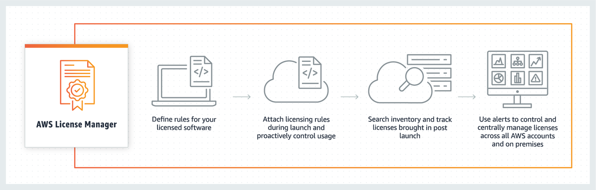
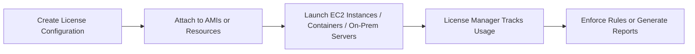

# 🧾 **AWS License Manager: Simplified License Management in the Cloud**

> _Track, manage, and control software licenses across AWS and on-premises — with ease and automation._

---

  

---

## 🧠 **What is AWS License Manager?**

**AWS License Manager** is a **fully managed service** that helps you:

- **Track** software licenses (Windows, SQL Server, SAP, Oracle, BYOL, etc.)
- **Control** license usage across AWS accounts, services, and regions
- **Enforce** license rules automatically
- **Manage** Bring-Your-Own-License (BYOL) compliance
- **Integrate** with AWS services like EC2, Marketplace AMIs, and on-premises servers

> 🔥 Simply put: It acts like your **automated licensing police + tracking system** inside AWS.

---

## 🌟 **Why is AWS License Manager Important?**

| 🚨 Problem Without It          | ✅ Solved With AWS License Manager |
| ------------------------------ | ---------------------------------- |
| Overuse/underuse of licenses   | License counting and enforcement   |
| Manual tracking (spreadsheets) | Automated usage reports            |
| Licensing compliance issues    | Rules enforced automatically       |
| Difficulty tracking BYOL usage | Centralized, easy monitoring       |
| Risk of audits and penalties   | Audit-ready reports                |

---

## 🧩 **Key Components of AWS License Manager**

| Component                      | 📚 Description                                                                  |
| ------------------------------ | ------------------------------------------------------------------------------- |
| 🎟️ **License Configuration**   | Define license rules (number of vCPUs, cores, instances, etc.)                  |
| 📈 **Usage Tracking**          | Monitor license usage across AWS and linked accounts (Organizations support)    |
| 🚫 **Enforcement Actions**     | Prevent launching non-compliant instances                                       |
| 🔄 **License Counting**        | Track license consumption across EC2, ECS, or on-premises systems               |
| 🛒 **Marketplace Integration** | Use AWS Marketplace products with built-in License Manager configurations       |
| 🏢 **On-Prem Integration**     | Extend tracking to physical servers or VMware workloads via AWS Systems Manager |

---

## 🌐 **How AWS License Manager Works (Behind the Scenes)**

### 🧠 Simply

1. ✅ Define your license rules (e.g., "Max 10 Windows Server instances")
2. ✅ Attach the rule to your images/resources
3. ✅ License Manager monitors launches
4. ✅ If limits exceeded, it can:
   - Block instance launches 🚫
   - Alert administrators 📢
   - Log events 📜

---

## 🔧 **Key Features**

| Feature                          | What It Does                                                        |
| -------------------------------- | ------------------------------------------------------------------- |
| 🎯 Centralized License Tracking  | Monitor across AWS Organizations (multi-account setups)             |
| ⚙️ Automatic Enforcement         | Auto-stop or auto-deny non-compliant launches                       |
| 🗃️ Usage Reports and Dashboards  | Real-time dashboards + exportable reports                           |
| 🔑 Bring Your Own License (BYOL) | Safely use your existing licenses in AWS without overstepping terms |
| 🏷️ Tagging Support               | Apply tags for billing, tracking, or team ownership                 |

---

## 🛠️ **How to Use AWS License Manager (Step-by-Step)**

### ✅ 1. **Create License Configuration**

- Go to **AWS Console → AWS License Manager**
- Click **“Create license configuration”**
- Define:
  - License type (Standard, Windows, SQL, SAP, Oracle)
  - Metrics (instances, vCPUs, cores, sockets)
  - Limits (e.g., Max 20 licenses)

### ✅ 2. **Associate Configuration with Resources**

- Associate the configuration with:
  - AMIs (EC2 Images)
  - Launch Templates
  - Instances
  - Systems Manager managed instances (on-prem)

### ✅ 3. **Track and Enforce**

- Monitor usage through the License Manager dashboard
- View:
  - Active vs available licenses
  - License breaches
- Choose actions on breach (block, notify, or log)

---

## 🔥 **Real-World Example**

> Let's say you have a **Windows Server Standard BYOL** license for **20 instances** maximum.

- You create a license configuration in AWS License Manager specifying:

  - Product: Windows Server
  - Metric: Instance
  - Hard limit: 20 instances

- If your team tries to launch a 21st instance, AWS can:
  - **Block** the launch automatically
  - **Notify** you about non-compliance
  - **Generate a compliance report**

✅ Now you can scale safely without risking a software audit or huge license penalties.

---

## 🔥 **Integration with Other AWS Services**

| Service                 | How It Integrates                                                      |
| ----------------------- | ---------------------------------------------------------------------- |
| **AWS Systems Manager** | Tracks licenses on on-premises servers                                 |
| **AWS Marketplace**     | Many Marketplace products have license rules linked to License Manager |
| **EC2 Image Builder**   | Automatically embed license configs into your custom AMIs              |
| **AWS Organizations**   | Centralized license tracking across multi-account setups               |
| **AWS Config**          | Create compliance rules that monitor license usage continuously        |

---

## 📈 **Benefits of AWS License Manager**

| ✅ Benefit                      | 💬 Why It’s Important                                       |
| ------------------------------- | ----------------------------------------------------------- |
| Prevents overspending           | Track exactly what licenses you use (and avoid buying more) |
| Minimizes audit risks           | Proof-ready usage reports and enforcement                   |
| Simplifies BYOL management      | Allows compliant BYOL strategies in the cloud               |
| Enhances operational efficiency | Automates tracking and reporting, freeing up ops teams      |
| Centralized license visibility  | Single dashboard for entire AWS environment (and on-prem)   |

---

## ⚖️ **AWS License Manager vs AWS Marketplace License Tracking**

| AWS License Manager            | AWS Marketplace Licenses                           |
| ------------------------------ | -------------------------------------------------- |
| Manage your own BYOL licenses  | Pre-packaged licenses from AWS Marketplace vendors |
| Works across EC2, on-premises  | Works mostly for AWS Marketplace bought products   |
| Manual license creation needed | Auto-managed license tracking                      |

---

## 🧠 **Summary: When Should You Use AWS License Manager?**

| Situation                                     | Should You Use License Manager? |
| --------------------------------------------- | ------------------------------- |
| Managing BYOL licenses (Windows, Oracle, SAP) | ✅ Yes                          |
| Auto-blocking non-compliant EC2 launches      | ✅ Yes                          |
| Tracking third-party Marketplace AMI licenses | ✅ (via integration)            |
| Simple environment, no BYOL involved          | ❌ Not mandatory                |
| On-prem licensing extension                   | ✅ Yes (with Systems Manager)   |

---

## 🎯 **Final Pro Tip**

> 🧠 **Always combine License Manager with IAM permissions, tagging policies, and AWS Config compliance rules** to get a **full license governance** solution — especially for enterprise-scale AWS setups.
