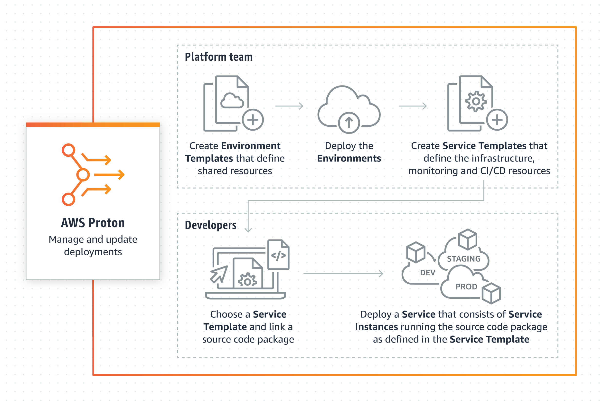
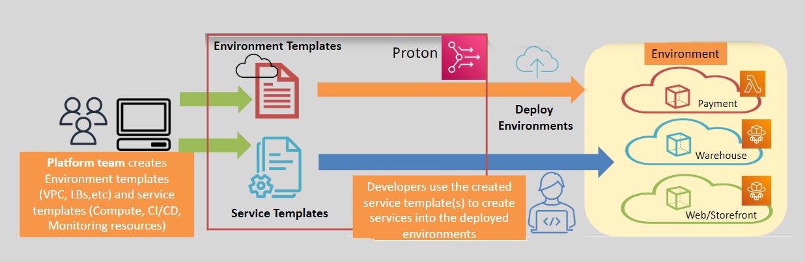
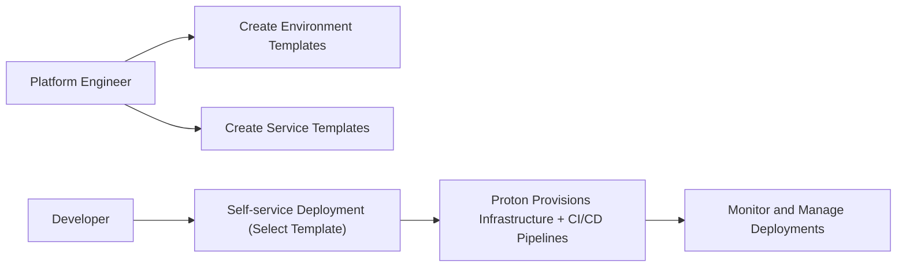
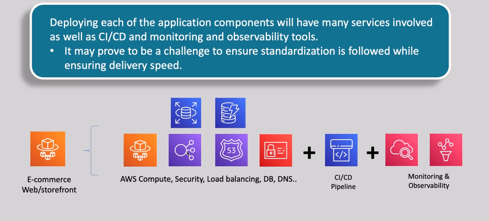

# ⚛️ **AWS Proton: Simplifying Modern Application Delivery**

> _Platform engineers use AWS Proton to define, vend and maintain self-service infrastructure templates._  
> _Standardize, automate, and accelerate microservices and serverless deployments._

---

  

---

  

---

## 🧠 **What is AWS Proton?**

**AWS Proton** is a **fully managed delivery service** that helps platform engineering teams:

- Standardize infrastructure
- Automate deployments
- Empower developers with **self-service** tools for building and deploying **container** and **serverless** applications.

> Think of AWS Proton as your internal "**Platform as a Service (PaaS)**" builder — but 100% customizable to your organization's cloud architecture.

---

## 🚨 **Problem Statement: Why Do We Need Proton?**

When deploying microservices or serverless apps, teams often struggle with:

| ❌ Challenge                    | 💬 Description                                                       |
| ------------------------------- | -------------------------------------------------------------------- |
| Infrastructure inconsistency    | Different teams create different architectures manually              |
| Slow delivery                   | Manual setups of CI/CD, monitoring, networking slow down development |
| Complex compliance requirements | Organizations need to enforce standards across cloud deployments     |

---

## 🎯 **Why AWS Proton Was Created**

| 🎯 Goal        | 🚀 Proton's Solution                                                 |
| -------------- | -------------------------------------------------------------------- |
| ✅ Consistency | Uses **approved templates** for all environments and services        |
| ✅ Speed       | Provides **automated, self-service deployments**                     |
| ✅ Efficiency  | Offloads heavy infra management from dev teams to platform engineers |

---

## 🌟 **Problems AWS Proton Solves**

1. **Infrastructure Complexity**

   - Standardizes environments (VPCs, ECS/EKS clusters, serverless setups).
   - Simplifies management with **templates** and **versions**.

2. **Lack of Standardization**

   - Enforces the same best practices and compliance standards across all teams.

3. **Slow Manual Processes**
   - Accelerates setup by letting developers **self-deploy** using ready-made templates.

---

## 🔧 **How AWS Proton Works (Behind the Scenes)**

---

## 🛠️ **Main Components of AWS Proton**

| 🧩 Component               | 📚 What It Is                                                                    |
| -------------------------- | -------------------------------------------------------------------------------- |
| **Environment Templates**  | Define shared infra like VPC, cluster, networking, security configs              |
| **Service Templates**      | Define app-specific setups like compute resources (Fargate tasks, Lambda funcs)  |
| **Proton Console/API/CLI** | Devs use self-service portal (GUI or CLI) to deploy using approved templates     |
| **CI/CD Integration**      | Automates building, testing, and deployment pipelines via CodePipeline or others |

---

## 🛠️ **Detailed Flow: How to Use AWS Proton**

### ✅ 1. **Platform Engineers Create Templates**

- Define **infrastructure templates** using **CloudFormation** or **Terraform**.
- Publish **versioned templates** for:
  - Environments (networking, security)
  - Services (specific microservice architecture)

---

### ✅ 2. **Developers Self-Deploy Applications**

- Browse available **Proton templates** in the AWS Console or API.
- Launch new services **without needing infrastructure expertise**.
- Focus on **code and business logic**, not wiring up networking, databases, scaling, etc.

---

### ✅ 3. **Automated CI/CD and Updates**

- Templates can embed **pipelines** (e.g., via AWS CodePipeline).
- When templates are updated (new version), Proton can **notify teams** or **automatically update services**.
- Helps organizations maintain **continuous compliance** with latest best practices.

---

## 📚 **Real-World Example**

Imagine your company requires:

- All new microservices must deploy into a **shared EKS cluster**.
- Every service must have:
  - Auto-scaling enabled
  - Centralized logging (CloudWatch)
  - Security groups pre-configured

With AWS Proton:

- Platform team builds a **Service Template** + **Environment Template**.
- Developers simply pick a template → fill a few parameters → Proton sets up the entire microservice stack.

✅ Developers move faster.  
✅ Platform teams sleep better.  
✅ Cloud environment stays consistent and compliant.

---

### Example scenario

Let's Say you wanna build an E-Commerce Web/Storefront App using AWS Services, and Solution Architect will face a lot of tools and different configurations, and you as a Platform Engineer want to ensure everything created or managed are follows a company policy and rules, so Proton Comes to solve that Problem!

  

---

## 📈 **Key Benefits of AWS Proton**

| 🚀 Benefit                          | 💬 Why It’s Important                                                  |
| ----------------------------------- | ---------------------------------------------------------------------- |
| **Standardized Environments**       | Uniform VPCs, IAM roles, security standards                            |
| **Self-Service for Developers**     | Developers launch apps without needing deep infra skills               |
| **Automated CI/CD Pipelines**       | Integrated deployments reduce manual errors                            |
| **Version Control for Templates**   | Safely roll out updates to infra and service templates                 |
| **Central Visibility and Control**  | Admins can monitor all deployments, configurations, and updates easily |
| **BYOT (Bring Your Own Templates)** | Supports CloudFormation and Terraform as infrastructure as code models |

---

## ⚖️ **AWS Proton vs CloudFormation vs CodePipeline**

| Service            | Purpose                                                                        |
| ------------------ | ------------------------------------------------------------------------------ |
| **CloudFormation** | Define and deploy individual infrastructure stacks manually                    |
| **CodePipeline**   | Automate software release process (build/test/deploy apps)                     |
| **AWS Proton**     | End-to-end platform: standardize infra + app deployment + CI/CD, all automated |

> 🧠 **Proton is not a replacement** for CloudFormation or CodePipeline — it **uses them internally** to build a full platform experience!

---

## 🧠 **Summary: When Should You Use AWS Proton?**

| Situation                                 | Should You Use Proton?   |
| ----------------------------------------- | ------------------------ |
| You have 5+ microservices on AWS          | ✅ Yes                   |
| You want fast, repeatable app deployments | ✅ Yes                   |
| You want developers to self-service infra | ✅ Yes                   |
| Single small app, no scaling needed       | ❌ Not needed yet        |
| Highly custom, experimental architectures | ❌ May prefer direct IaC |

---

## 🚀 **Final Pro Tip**

> 🧠 **Use AWS Proton if your goal is to standardize multi-team development across modern architectures (Kubernetes, Serverless) without slowing down speed or sacrificing security.**  
> It's a **platform engineering superpower** for growing cloud-native companies.

---

Would you like next a full practical guide like:

- "How to Create Your First Proton Environment and Service Templates" (with CLI + Terraform)?  
  It'll make you fully hands-on in 10 minutes! 🎯
