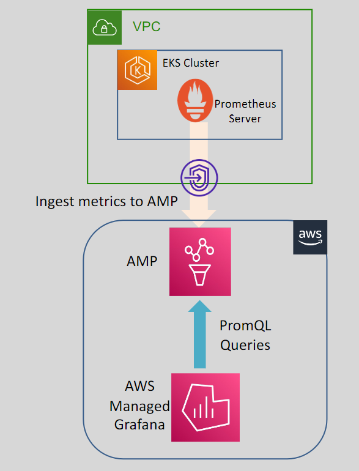
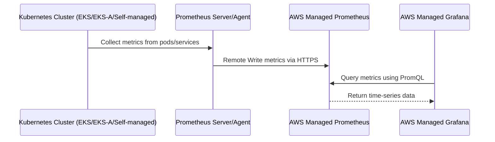

# 🚀 **AWS Managed Prometheus (AMP)**

> _Scalable, secure, and serverless Prometheus monitoring — without managing infrastructure._

---

<div align="center" style="padding:20px;">
  
</div>

---

## 🤖 **What is Prometheus?**

**Prometheus** is a **powerful open-source toolkit** for:

<div align="center" style="padding:20px;">

| ✅ Feature               | 💡 Description                                                                   |
| ------------------------ | -------------------------------------------------------------------------------- |
| 📊 **Data Collection**   | Collects and stores metrics as **time-series data** (timestamp + labels + value) |
| 🧠 **PromQL Language**   | Query, filter, and aggregate metrics easily using **PromQL**                     |
| 🐳 **Kubernetes Native** | Built for **monitoring containerized systems**, especially **Kubernetes**        |
| 🚨 **Alerting**          | Integrates with **Alertmanager** to trigger alerts on defined metric conditions  |

</div>

---

<div align="center" style="padding:20px;">
  
</div>

---

## 🌐 **What is AWS Managed Prometheus (AMP)?**

> **AWS Managed Prometheus (AMP)** is a **fully managed, Prometheus-compatible monitoring service** designed for Kubernetes and container-based workloads.

---

## 🌟 **Key Features of AMP**

<div align="center" style="padding:20px;">

| 🧩 Feature                        | ✅ Details                                                                            |
| --------------------------------- | ------------------------------------------------------------------------------------- |
| 🔁 **Prometheus-Compatible**      | Drop-in support for Prometheus metrics format and PromQL                              |
| ☁️ **Serverless Architecture**    | No need to manage Prometheus servers or storage volumes                               |
| 🔒 **Secure Monitoring**          | Integrated with IAM, VPC endpoints, and encryption-at-rest                            |
| 🏗️ **Scalable**                   | Handles **high cardinality** workloads across **millions of metrics**                 |
| 📈 **150-Day Retention**          | Retains ingested metrics for **up to 150 days**                                       |
| 🧩 **Grafana Integration**        | Pairs perfectly with **AWS Managed Grafana** to visualize metrics                     |
| 📦 **Multi-Environment Support**  | Supports **Amazon EKS, EKS Anywhere**, ECS, EC2, and even **self-managed Kubernetes** |
| 🌍 **Multi-AZ High Availability** | Metric data is **replicated across 3 AZs** for resilience                             |

</div>

---

## 🏠 **AMP Inside a VPC (Private Access)**

<div align="center" style="padding:20px;">
  
</div>

### 🔐 Private Connectivity

- You can deploy **VPC interface endpoints** (via AWS PrivateLink) to connect **privately** to AMP without using public internet.
- Works seamlessly with **VPC Service Controls** and **fine-grained IAM policies**.

---

## 🔁 **How Data Flows Into AMP**



---

## 🔧 **How to Use AMP (Step-by-Step)**

### ✅ 1. **Create a Workspace**

```bash
aws amp create-workspace --alias my-monitoring-env
```

### ✅ 2. **Get Endpoint**

```bash
aws amp list-workspaces
```

### ✅ 3. **Configure Remote Write (on Prometheus)**

```yaml
# prometheus.yaml
remote_write:
  - url: https://aps-workspaces.us-east-1.amazonaws.com/workspaces/ws-XXXX/api/v1/remote_write
    sigv4:
      region: us-east-1
```

> 🧠 You can use **AWS SigV4 Proxy** to sign requests automatically from your Prometheus setup.

### ✅ 4. **Visualize with Grafana**

- Use **AWS Managed Grafana**
- Connect it to AMP using the same region + workspace ID
- Query with **PromQL** (e.g., `rate(http_requests_total[5m])`)

---

## 🛠️ **Example Use Cases**

| Use Case                            | AMP Benefit                               |
| ----------------------------------- | ----------------------------------------- |
| 🔍 Monitoring EKS/ECS clusters      | Native integration with Prometheus agents |
| 💾 Long-term metric retention       | Store metrics for up to 150 days          |
| 📊 Infrastructure visualization     | Plug into Grafana dashboards easily       |
| ⚠️ Scalable alerting                | Alert on container CPU/memory spikes      |
| 🔐 Secure multi-tenant environments | IAM-based access control per workspace    |

---

## 🧠 Summary

| ✅ Pros                                | ❌ Cons                                        |
| -------------------------------------- | ---------------------------------------------- |
| Fully managed (no Prometheus server)   | Requires setup of Prometheus remote write      |
| PromQL-compatible (no re-learning)     | Limited to metric ingestion (no Alertmanager)  |
| Highly available, secure, scalable     | Some latency in ingestion vs. local Prometheus |
| Integrates with Grafana, EKS, ECS, EC2 | Paid service; cost scales with ingestion       |
