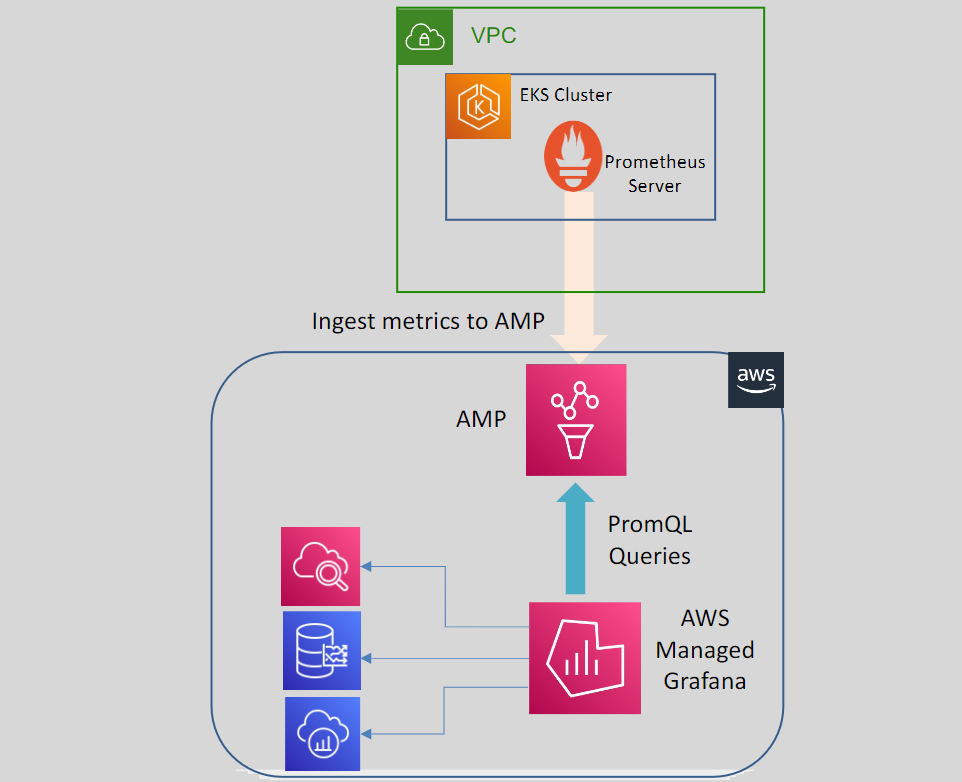

# 📊 **AWS Managed Grafana (AMG): Advanced Monitoring & Data Visualization**

> _Visualize metrics, logs, and traces from AWS and beyond — with zero Grafana server headaches._

---

<div align="center" style="padding:0 20px;">
  
</div>

---

## 🧠 **What is Grafana?**

**Grafana** is a popular **open-source analytics and visualization platform** used to display time-series metrics from various data sources in rich, customizable dashboards.

### ✨ Key Features

| 🔧 Feature                | 💡 Description                                                                  |
| ------------------------- | ------------------------------------------------------------------------------- |
| 📈 **Data Visualization** | Create beautiful charts, graphs, tables, heatmaps, and gauges                   |
| 🔍 **Query Interface**    | Use queries (e.g., **PromQL**, **CloudWatch Logs Insights**, SQL) to fetch data |
| 📊 **Dashboards**         | Combine multiple visual panels into interactive dashboards                      |
| 📤 **Data Sources**       | Supports Prometheus, InfluxDB, CloudWatch, Elasticsearch, PostgreSQL, etc.      |
| 🚨 **Alerting**           | Trigger alerts via Slack, Email, PagerDuty, Webhooks, etc.                      |

---

## 🌐 **What is AWS Managed Grafana (AMG)?**

> **AWS Managed Grafana (AMG)** is a **fully managed service** that lets you use Grafana without having to deploy, configure, or operate the infrastructure.

---

### 🛠️ Key Features of AMG

| ✅ Capability                   | 📘 Description                                                                    |
| ------------------------------- | --------------------------------------------------------------------------------- |
| 🧑‍🔧 **Fully Managed**         | AWS handles provisioning, patching, scaling, and maintenance of Grafana servers   |
| 🔗 **Multi-Source Integration** | Seamlessly integrates with AWS + 3rd-party services for metrics, logs, and traces |
| 🔒 **Access Control**           | Secure access with **IAM**, **SAML**, or **AWS IAM Identity Center (SSO)**        |
| 📈 **Built-in Dashboards**      | Pre-built dashboards for CloudWatch, X-Ray, AMP, Timestream, etc.                 |
| 🔒 **Private Access (VPC)**     | Option to access Grafana privately via VPC endpoints                              |
| 🌍 **Cross-Account Support**    | Query data from multiple AWS accounts with secure cross-account access            |

---

## 🔌 **Integrated AWS Services**

| 🌐 Source                     | 📊 Use Case Example                        |
| ----------------------------- | ------------------------------------------ |
| **Amazon CloudWatch**         | Visualize EC2 metrics, Lambda invocations  |
| **AWS X-Ray**                 | Trace distributed requests across services |
| **Amazon Timestream**         | Display time-series IoT metrics            |
| **Amazon Managed Prometheus** | Query container metrics using PromQL       |
| **Amazon OpenSearch**         | Analyze structured logs or log insights    |
| **AWS IoT SiteWise**          | Visualize industrial equipment data        |

> And it also works with popular third-party sources like **Datadog**, **New Relic**, **Splunk**, **Snowflake**, **MySQL**, and more!

---

## 🧰 **Benefits of AWS Managed Grafana (AMG)**

| ⭐ Benefit                       | 💬 Why It Matters                                                        |
| -------------------------------- | ------------------------------------------------------------------------ |
| ✅ **No Infra Management**       | Focus on insights, not server ops                                        |
| ✅ **Enterprise-Grade Security** | Integrates with AWS IAM & identity federation                            |
| ✅ **Scales Automatically**      | Handles growing metrics without manual tuning                            |
| ✅ **Unified Observability**     | View metrics, logs, and traces in a single dashboard                     |
| ✅ **Custom Dashboards**         | Personalize dashboards for teams, use variables, repeat panels, and more |
| ✅ **Team Collaboration**        | Share dashboards securely across orgs with role-based access             |

---

## 🛠️ **How to Get Started with AMG**

### ✅ Step 1: **Create Workspace**

- Go to the **AWS Console → AWS Managed Grafana**
- Click **“Create workspace”**
- Choose your authentication method (IAM Identity Center, SAML, etc.)

### ✅ Step 2: **Assign IAM Roles**

- Grant Grafana permission to access your data sources (e.g., CloudWatch, AMP)
- Use managed policies like:

  ```json
  "arn:aws:iam::aws:policy/AmazonPrometheusQueryAccess"
  ```

### ✅ Step 3: **Add Data Sources in Grafana UI**

- Navigate to **Configuration > Data Sources**
- Add AWS CloudWatch, Prometheus, etc.

### ✅ Step 4: **Create Dashboards**

- Use built-in dashboards or create your own using PromQL, Logs Insights, SQL, etc.

---

## 💡 Example Use Cases

| Scenario                       | AMG in Action                                                      |
| ------------------------------ | ------------------------------------------------------------------ |
| 🐳 Monitor EKS Cluster Health  | Use Prometheus metrics via AMP + Grafana for CPU/memory alerts     |
| 🌩️ Debug Slow API Requests     | Use AWS X-Ray as a data source to visualize trace waterfall charts |
| 🕵️‍♀️ Analyze EC2 and RDS Logs    | Connect CloudWatch Logs + Logs Insights to AMG                     |
| 🔋 Visualize IoT Device Uptime | Ingest and query Timestream or SiteWise data in real time          |

---

## ⚖️ **AMG: Pros & Cons**

| ✅ Pros                                    | ❌ Cons                                             |
| ------------------------------------------ | --------------------------------------------------- |
| Fully managed and easy to start            | You pay for active users and workspace usage        |
| Rich set of AWS and 3rd-party integrations | Some plugins are restricted in managed environments |
| Supports enterprise-grade security         | Custom plugins may not be installable               |
| Excellent for DevOps, SREs, and Monitoring | Limited direct access to backend Grafana configs    |

---

Let me know if you want a full **demo setup** that integrates:

- **EKS + AMP + AMG**
- **IAM Role setup**
- **Custom dashboard JSON exports**

Or if you'd like a follow-up topic comparing **AMG vs Self-Hosted Grafana vs Grafana Cloud**!
