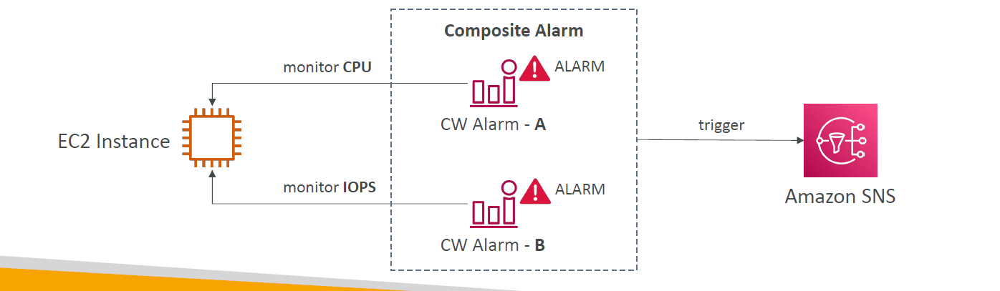
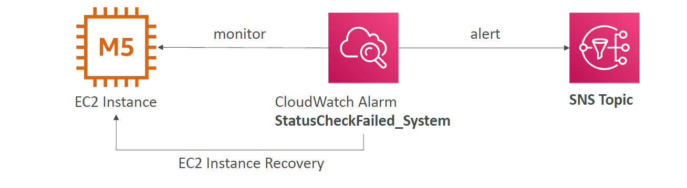
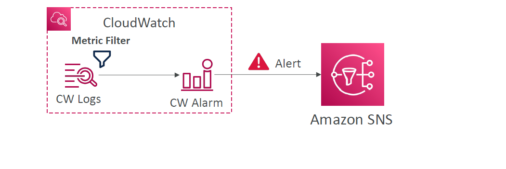

# ⏰ **Amazon CloudWatch Alarms – Smart Monitoring & Automated Reactions**

> CloudWatch Alarms allow you to **watch any AWS metric** (or your own), define thresholds, and take **automated actions** like sending alerts, scaling systems, or recovering EC2 instances — all in real-time.

They’re the **first line of defense** in keeping your system reliable, cost-efficient, and proactive.

---

## 🧠 What Is a CloudWatch Alarm?

An **alarm** watches over one or more **CloudWatch metrics**, evaluates them over time, and moves through **states**:

| Alarm State            | Meaning                                       |
| ---------------------- | --------------------------------------------- |
| ✅ `OK`                | Everything is normal                          |
| ⚠️ `ALARM`             | Threshold has been breached (trigger actions) |
| ❓ `INSUFFICIENT_DATA` | Not enough metric data to evaluate            |

You define:

- The **threshold** (e.g. CPU > 80%)
- The **evaluation period** (e.g. for 2 x 5 minutes)
- And what happens when it goes into `ALARM` 🚨

---

## 🔧 Key Components

### 📏 Metric Threshold

> _A **threshold** is a specific value that, when **exceeded** or **dropped below** for a given number of evaluation periods, causes a CloudWatch alarm to transition states._

You specify:

- **Metric name**: `CPUUtilization`, `Latency`, or custom metric
- **Stat**: `Average`, `Sum`, `Minimum`, `Maximum`, `Percentile`
- **Operator**: `GreaterThanThreshold`, `LessThanThreshold`, etc.
- **Threshold value**: e.g. 80%
- **Period**: how often the metric is evaluated (e.g. 60s, 300s)
- **Evaluation Periods**: how many periods must be in violation

---

### 🛠️ Alarm Actions

When an alarm triggers, you can **automatically react** using:

| Action Type               | Example                                                 |
| ------------------------- | ------------------------------------------------------- |
| 🔔 **SNS Notification**   | Send alerts via email, SMS, or trigger Lambda workflows |
| 🚀 **Auto Scaling**       | Add/remove EC2s based on CPU or traffic                 |
| 🔁 **EC2 Recovery**       | Automatically reboot or recover failed EC2 instances    |
| 🛑 **EC2 Stop/Terminate** | Control instances on low usage or overuse               |

➡️ You can also **manually test alarms** via:

```bash
aws cloudwatch set-alarm-state --alarm-name myAlarm --state-value ALARM --state-reason "Testing"
```

---

## 🧮 Composite Alarms (Advanced)

> Combine **multiple alarms into one** using logical conditions (`AND`, `OR`).

---

<div style="text-align: center;">
    
</div>

---

✅ Great for reducing **alert fatigue** and creating **smart alert rules**.

| Example Composite Alarm  | Triggers when...           |
| ------------------------ | -------------------------- |
| CPU Alarm AND Disk Alarm | Both alarms are in ALARM   |
| CPU Alarm OR Error Alarm | Either one goes into ALARM |

---

## 🔄 EC2 Instance Recovery – Auto-Healing

> Use alarms like `StatusCheckFailed_System` to trigger **EC2 recovery**.

---

<div style="text-align: center;">
    
</div>

---

✅ The same:

- **Elastic IP**
- **Private/public IP**
- **Instance metadata**

💡 Not to be confused with auto-scaling replacement — this is recovery **in place**.

---

## 🔔 Log-Based Alarms

> You can create **CloudWatch Metric Filters** from Logs, then trigger alarms!

---

<div style="text-align: center;">
    
</div>

---

Example:

- Metric filter: count lines with `"ERROR"`
- Create custom metric: `AppErrorCount`
- Set alarm: if `AppErrorCount > 10` → alert via SNS

---

## 🛠️ Creating an Alarm (Console / CLI)

### 📘 Console Steps

1. Go to **CloudWatch > Alarms > Create Alarm**
2. Select a metric (e.g., `EC2 > CPUUtilization`)
3. Set:

   - `Threshold`: e.g., CPU > 80%
   - `Period`: e.g., every 1 min
   - `EvaluationPeriods`: e.g., 2

4. Add actions (e.g., SNS topic, EC2 recovery)
5. Create

---

### 💻 CLI Example

```bash
aws cloudwatch put-metric-alarm \
  --alarm-name "HighCPUAlarm" \
  --metric-name "CPUUtilization" \
  --namespace "AWS/EC2" \
  --statistic "Average" \
  --period 60 \
  --threshold 80 \
  --comparison-operator "GreaterThanThreshold" \
  --evaluation-periods 2 \
  --alarm-actions arn:aws:sns:region:account-id:MyTopic
```

---

## 💸 Cost Considerations

| Feature                  | Free Tier?      | Notes                                   |
| ------------------------ | --------------- | --------------------------------------- |
| Alarms                   | ✅ First 10     | More → \$0.10/month per alarm           |
| High-res Alarms (10s)    | ❌ Extra charge | Needed for **quick reaction** use cases |
| SNS Notifications        | Partly free     | After 1M email/SMS/HTTP requests: pay   |
| Scaling/Recovery Actions | Based on usage  | EC2s added/removed may cost more        |

---

## 🧪 Use Cases

| Use Case                       | Description                                            |
| ------------------------------ | ------------------------------------------------------ |
| 🖥️ **System Monitoring**       | CPU > 90% → scale EC2 or notify team                   |
| ⚡ **Cost Control**            | Billing alert if spending > \$500/month                |
| 🚨 **Security Alerts**         | Alert on repeated failed logins or unauthorized access |
| 🛠️ **App Performance**         | Trigger if API errors > 5% or latency > 2s             |
| 💥 **Infrastructure Recovery** | Restart EC2 when disk check or instance check fails    |

---

## ✅ Summary

| Feature                           | Benefit                                                 |
| --------------------------------- | ------------------------------------------------------- |
| Real-time monitoring              | React to CPU, disk, error spikes, or billing thresholds |
| Multiple states                   | OK, ALARM, INSUFFICIENT_DATA                            |
| Trigger automatic actions         | EC2 recovery, scale, stop, notify, run automation       |
| Composite alarms                  | Reduce noise with smart, multi-metric logic             |
| Integrates with Logs & Synthetics | Alert on error patterns or app outages                  |
