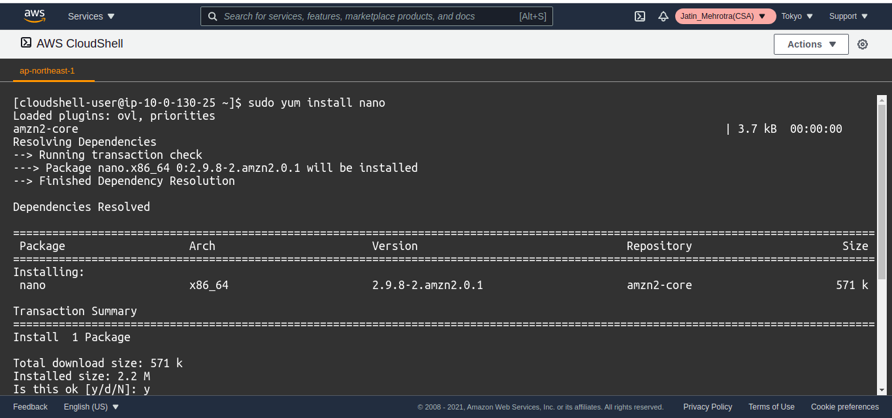
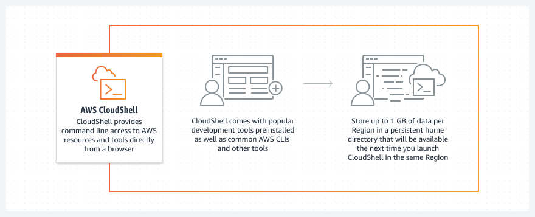

# 🖥️ **AWS CloudShell – The Browser-Based Dev Terminal for AWS**

**AWS CloudShell** is a **browser-based, pre-authenticated shell** available right from the AWS Console. It provides developers and admins with a **secure, ready-to-use terminal** that includes the **AWS CLI**, popular tools, and even **persistent storage** — all without needing to configure your own local setup.

---

<div align="center">
  
</div>

---

## 🧠 **What Is AWS CloudShell?**

> **CloudShell is a browser-based terminal pre-loaded with the AWS CLI, SDKs, and common tools.**

---

<div align="center">
  
</div>

---

You access it directly from the AWS Console and start running commands within seconds — no local setup, IAM credential copying, or config required.

---

## ⚙️ **Key Features**

| Feature                       | Description                                                             |
| ----------------------------- | ----------------------------------------------------------------------- |
| 🧑‍💻 **CLI-Ready**           | Comes pre-installed with **AWS CLI v2**, Python, Git, Node.js, and more |
| 🧰 **Built-In Tools**         | Includes popular development tools (e.g., pip, npm, bash, PowerShell)   |
| 🔐 **Pre-authenticated**      | Automatically uses your **current AWS Console credentials**             |
| 🧾 **Persistent 1GB Storage** | Save your files/scripts in **`~/`** — persists across sessions          |
| 🌍 **Region-Aware**           | Launches in your selected AWS region                                    |
| ☁️ **Secure by Default**      | Runs in a **sandboxed environment** with scoped IAM role access         |
| 🔄 **Always Up-to-Date**      | AWS manages all updates and patches behind the scenes                   |

---

## 🚀 **Why Use AWS CloudShell?**

| Use Case                        | Benefit                                                                     |
| ------------------------------- | --------------------------------------------------------------------------- |
| ⚙️ **Ad-hoc CLI Tasks**         | Quickly run AWS CLI commands without setting up credentials                 |
| 💻 **Dev & Automation Scripts** | Run scripts stored in the persistent shell or upload via GUI                |
| 🧪 **Testing & Debugging**      | Test API responses, IAM permissions, etc., in a safe AWS-native environment |
| 🛰️ **Working on the Go**        | No need for your own machine or VPN — just a browser and login              |

---

## 📂 **Persistent Storage (1GB)**

CloudShell provides a **1 GB persistent home directory** per region:

- Accessible at `~/`
- Files here remain available across sessions
- Use it to store scripts, configs, temp outputs, etc.

```bash
cd ~
nano my-script.sh
aws s3 ls
```

> ⚠️ Anything stored outside `~/` is ephemeral and lost when session ends.

---

## 🛠️ **Popular Pre-installed Tools**

- `aws` (AWS CLI v2)
- `python3`, `pip`
- `node`, `npm`
- `git`
- `bash`, `zsh`, `PowerShell`
- `kubectl`, `docker` (some regions)

> You can install your own binaries too (but only persist them in `~/`).

---

## 🌍 **How to Access AWS CloudShell**

1. Go to the **AWS Management Console**
2. Click the **CloudShell icon** (top-right of the console)
3. A new terminal tab opens with AWS CLI access
4. Start working!

---

## 🔐 **IAM & Security**

- CloudShell **uses your console identity/role**
- Follows the **same permissions** as your IAM policy
- For example, if your IAM user cannot `s3:ListBucket`, neither can your CloudShell session

✅ No need to manage long-term access keys or set up AWS profiles

---

## ⚡ Sample Use Cases

```bash
# Deploy a Lambda
aws lambda create-function --function-name my-fn ...

# Upload file to S3
aws s3 cp my-data.json s3://my-bucket/

# Start a CodeBuild project
aws codebuild start-build --project-name my-build

# Run Terraform or SAM from ~/tools
```

---

## ❗ Limits & Considerations

| Limit                     | Value                               |
| ------------------------- | ----------------------------------- |
| 💾 Storage                | 1 GB per region                     |
| 🕒 Session Timeout        | Idle timeout (20–30 minutes)        |
| 🧱 Not for production use | Not designed for long-running jobs  |
| 🌍 Region-specific        | Files are not shared across regions |

---

## ✅ Summary

| ✅ Pros                         | ❌ Cons                               |
| ------------------------------- | ------------------------------------- |
| No setup, instant access        | 1 GB limit only                       |
| Secure and role-based           | Region-specific storage               |
| Built-in CLI + tools            | Not designed for long-lived workloads |
| Perfect for demos, testing, ops | Session timeouts on idle              |

---

## 📌 Final Thoughts

**AWS CloudShell** is a **must-know tool** for DevOps engineers, cloud architects, and developers alike. Whether you're troubleshooting IAM policies, deploying test stacks, or poking around with AWS CLI — **CloudShell gets you up and running in seconds**.

> ☁️ All you need is your browser.  
> 🚀 The cloud terminal is already waiting.
