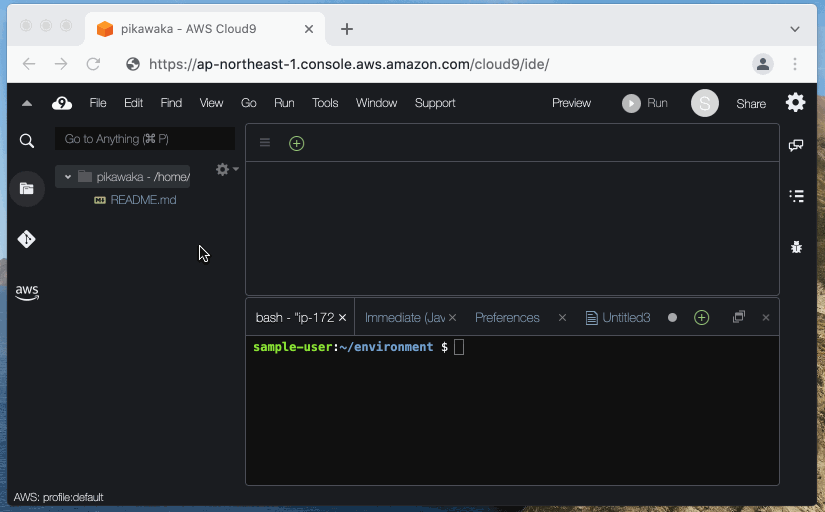
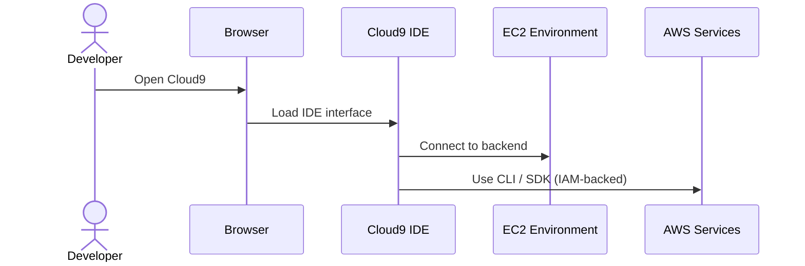
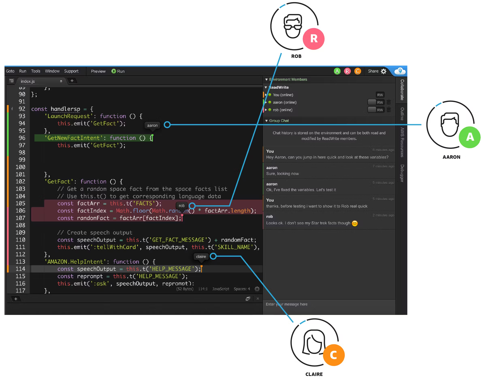

# 🧠 **AWS Cloud9 – Your Cloud-Powered IDE for Development Anywhere**

> **AWS Cloud9** is a **browser-based Integrated Development Environment (IDE)** that lets you **write, run, and debug code** with nothing but a browser — no local installs, no setup chaos.

---

  

---

It comes preloaded with essential tools, deep AWS integration, and collaborative capabilities — perfect for developers, teams, and DevOps engineers who want to code **from anywhere** with minimal friction.

---

## 🌟 **What Is AWS Cloud9?**

AWS Cloud9 is a **cloud-based IDE** that runs in the browser and includes:

- A **code editor**
- A **built-in terminal**
- A **built-in debugger**
- Support for over **40 programming languages** (including Python, JavaScript, C++, Go, PHP, etc.)

🔧 It runs on **Amazon EC2** instances or **your own compute environment**, with full access to the AWS CLI and SDK.

---

## 🚀 **Key Features of Cloud9**

| Feature                        | Description                                                                 |
| ------------------------------ | --------------------------------------------------------------------------- |
| 💻 **Cloud IDE**               | Access your full development environment from any browser                   |
| 🛠️ **Built-in Terminal**       | Run shell commands with AWS CLI pre-installed                               |
| 🐞 **Debugger**                | Debug your applications with breakpoints, watch expressions, and call stack |
| 📁 **File System Access**      | Access local and remote files via the terminal                              |
| 🔗 **AWS Integration**         | Pre-authenticated AWS CLI access with your IAM credentials                  |
| 🤝 **Real-time Collaboration** | Share your IDE with others (live pair-programming supported)                |
| 🔒 **Security**                | Runs in a sandboxed, isolated EC2 or container environment                  |

---

## 💡 **Why Use Cloud9?**

| Use Case                           | Benefit                                                             |
| ---------------------------------- | ------------------------------------------------------------------- |
| 🧑‍💻 Cloud-Native Development     | Start building serverless, Lambda, or EC2-backed apps right away    |
| 📦 No Local Setup                  | No need to install compilers, SDKs, or dependencies                 |
| 💼 Team Environments               | Enable real-time collaboration across distributed teams             |
| 🧪 Experimenting with AWS Services | Test AWS resources with built-in AWS CLI/SDK                        |
| 🏃 Lightweight DevOps Tasks        | Manage infrastructure or run CI scripts using the built-in terminal |

---

## 🧪 **Supported Workloads & Languages**

- ✅ Node.js
- ✅ Python
- ✅ Java
- ✅ Go
- ✅ C / C++
- ✅ Ruby
- ✅ PHP
- ✅ Bash scripting
- ✅ YAML, JSON, HTML/CSS/JS, etc.

> ⚠️ You can install anything else using the built-in terminal!

---

## 🧱 **How It Works (Behind the Scenes)**

---

## 🔧 **Common Workflow**

| Step | What You Do                                |
| ---- | ------------------------------------------ |
| 1️⃣   | Open AWS Console and launch Cloud9 IDE     |
| 2️⃣   | Choose to create a new environment         |
| 3️⃣   | Select an EC2 instance or SSH target       |
| 4️⃣   | Write code, run tests, and debug           |
| 5️⃣   | Use terminal to deploy via CLI or Git push |

---

## 🧑‍🤝‍🧑 **Live Collaboration**

- Invite team members to your Cloud9 environment
- All collaborators can:

  - Edit files simultaneously ✍️
  - Use chat and terminal 🖥️
  - Watch debugging sessions 👀

---

    

> 🛡️ Permissions are managed via IAM roles — no external accounts needed

---

## ⚙️ **Pricing & Cost Control**

- You pay for the **underlying EC2 instance** and **EBS storage**
- Cloud9 itself is **free**
- Ideal for **ephemeral dev environments** or **on-demand provisioning**
- You can configure **auto-hibernation** to save costs

---

## ⚠️ **Limitations & Gotchas**

| ⚠️ Concern             | What to Watch Out For                                        |
| ---------------------- | ------------------------------------------------------------ |
| 🔄 Idle timeout        | Environments hibernate after inactivity                      |
| 💵 EC2 costs           | Make sure to shut down or hibernate unused environments      |
| 🌐 Region-specific     | Environments are region-bound                                |
| 🧰 Tooling Limitations | Heavy IDE extensions (like VSCode) aren’t supported natively |

---

## ✅ **Summary – Why You Should Try Cloud9**

| ✅ Pros                              | ❌ Cons                                 |
| ------------------------------------ | --------------------------------------- |
| No setup, runs in browser            | IDE performance varies on browser       |
| Built-in CLI, debugger, and terminal | EC2-based, can incur costs              |
| Perfect for Lambda, SAM, DevOps      | Lacks deep plugin ecosystem (vs VSCode) |
| Great for learning and quick protos  | Might not suit large enterprise apps    |

---

## 🛠️ **Great Use Cases**

- Build & test **AWS Lambda functions** with SAM
- Run **infrastructure scripts** with AWS CLI
- Develop & debug **API Gateway-backed apps**
- Set up **CI/CD pipelines** with Git & CLI
- Learn new AWS services or SDKs

---

## 🚀 How to Get Started

1. Go to the [AWS Cloud9 Console](https://console.aws.amazon.com/cloud9/)
2. Click **Create environment**
3. Choose EC2 instance type, name your env
4. Start coding in seconds!
