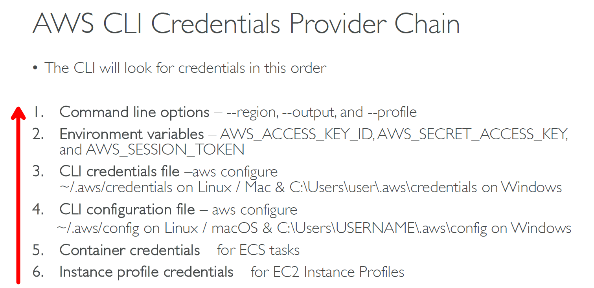

---
tags:
  - aws
  - aws/service
  - aws/domain/developer-tools
  - aws/topic/aws-cli
aliases:
  - "AWS CLI Chaining Credentials"
  - "AWS Cli Chaining Credentials"
---

# AWS CLI Chaining Credentials

    

---

## Related Notes
- [[aws-services/10.developer/1.1.aws-cli/aws-cli|AWS Cli]] - previous lesson

---
