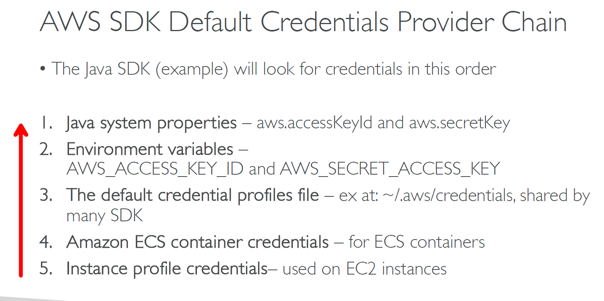

---
tags:
  - aws
  - aws/service
  - aws/domain/developer-tools
  - aws/topic/aws-sdk
aliases:
  - "AWS SDK Chaining Credentials"
  - "AWS Sdk Chaining Credentials"
---

# AWS SDK Chaining Credentials

    

---

## Related Notes
- [[aws-services/10.developer/1.2.aws-sdk/aws-sdk|AWS Sdk]] - previous lesson

---
