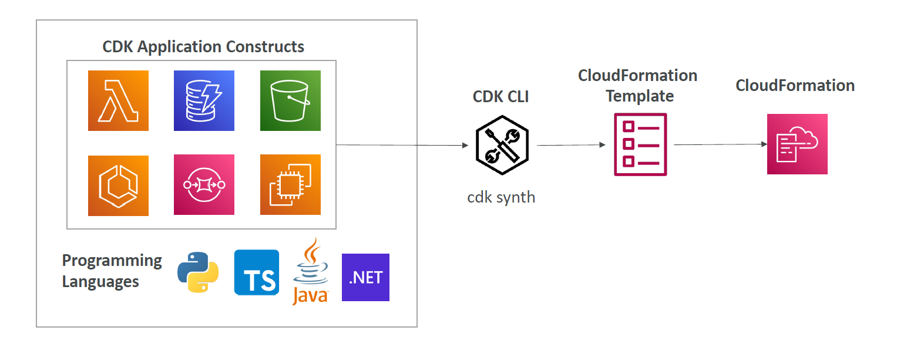
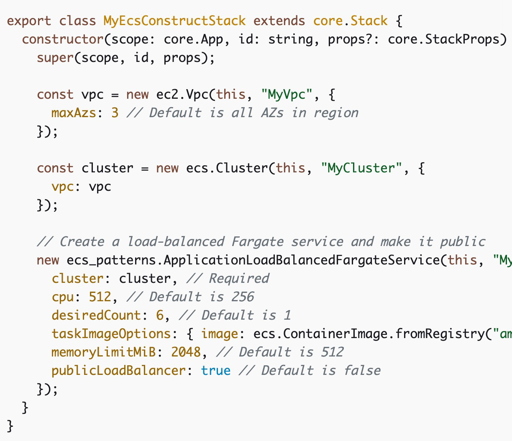

# 👷🏻 **AWS CDK (Cloud Development Kit)**

> AWS CDK (Cloud Development Kit) is a **modern Infrastructure-as-Code (IaC)** framework that allows you to define AWS infrastructure using **real programming languages** instead of static YAML or JSON.

---

<div style="text-align: center;">
    
</div>

---

## 💡 At a Glance

| Feature               | Description                                                 |
| --------------------- | ----------------------------------------------------------- |
| 💬 **Languages**      | TypeScript, Python, Java, C#, F#                            |
| 🧱 **Constructs**     | Reusable code components that model cloud resources         |
| ⚙️ **Compiled to**    | CloudFormation templates (JSON/YAML)                        |
| 📦 **Great for**      | Lambda functions, APIs, ECS, EKS, event-driven applications |
| 🔁 **CI/CD friendly** | Can be versioned, tested, and integrated into pipelines     |

---

<div style="text-align: center;">
    
</div>

---

## 🎯 **Why Use AWS CDK Over Raw CloudFormation?**

- ✅ Define your infrastructure using **real code** (variables, loops, logic)
- ✅ Fewer lines vs. verbose YAML
- ✅ Native **IDE support**, type checking, and auto-complete
- ✅ Modular & reusable with **constructs**
- ✅ Integrated with **npm**, **pip**, or **Maven** ecosystems
- ✅ Auto-synthesizes to CloudFormation behind the scenes

---

## 🛠️ **Step 1: Install & Set Up CDK**

### 🔧 Prerequisites

- AWS CLI (configured)
- Node.js 14+
- npm (comes with Node.js)
- TypeScript (optional but recommended)

### 📥 Install CDK CLI

```bash
npm install -g aws-cdk
cdk --version
```

---

## 📦 **Step 2: Create a CDK Project**

### 📁 Init a New Project

```bash
mkdir my-cdk-app && cd my-cdk-app
cdk init app --language typescript
```

🔀 Use `--language python`, `java`, or `csharp` for other languages.

---

## 🧱 **Step 3: Understand the Project Structure**

```bash
my-cdk-app/
│
├── bin/                  # Entry point of the app
├── lib/                  # Define stacks and constructs here
├── cdk.json              # CDK configuration
├── package.json          # Node dependencies
├── tsconfig.json         # TypeScript config
```

---

## 🌐 **Step 4: Define AWS Resources Using Constructs**

CDK uses **constructs** (classes) to model cloud resources.

### 🧰 Example: Create an S3 Bucket

Edit `lib/my-cdk-app-stack.ts`:

```ts
import * as cdk from "aws-cdk-lib";
import * as s3 from "aws-cdk-lib/aws-s3";

export class MyCdkAppStack extends cdk.Stack {
  constructor(scope: cdk.App, id: string, props?: cdk.StackProps) {
    super(scope, id, props);

    new s3.Bucket(this, "MyBucket", {
      versioned: true,
      removalPolicy: cdk.RemovalPolicy.DESTROY,
    });
  }
}
```

---

## 🚀 **Step 5: Deploy Your Stack**

### 🔍 1. **Synthesize CloudFormation Template**

```bash
cdk synth
```

🧾 This creates the raw CloudFormation JSON from your code.

### ⬆️ 2. **Deploy to AWS**

```bash
cdk deploy
```

🎉 Your stack (with the S3 bucket) is now deployed!

---

## 🧹 **Step 6: Stack Management**

| Command       | Description                             |
| ------------- | --------------------------------------- |
| `cdk list`    | List all stacks                         |
| `cdk diff`    | Compare local code vs deployed stack    |
| `cdk destroy` | Remove deployed resources               |
| `cdk watch`   | Auto-deploy on code change (hot reload) |

---

## 🧪 **Step 7: Add More Resources – Lambda Example**

### 📂 Create a Lambda Function

`lambda/index.js`:

```js
exports.handler = async (event) => {
  return { statusCode: 200, body: "Hello from Lambda!" };
};
```

### 📝 Add to Your Stack

```ts
import * as lambda from "aws-cdk-lib/aws-lambda";

new lambda.Function(this, "HelloLambda", {
  runtime: lambda.Runtime.NODEJS_14_X,
  handler: "index.handler",
  code: lambda.Code.fromAsset("lambda"),
});
```

---

## 🧼 **Best Practices**

✅ **Organize into Constructs** (modular, reusable classes)
✅ Use **Environment-aware Stacks** for multi-region/account
✅ Store secrets in **AWS Secrets Manager**
✅ Use **context parameters** & `cdk.json` for config
✅ Run `cdk diff` before deployment to preview changes
✅ Use **Git** for versioning your infrastructure code

---

## 💡 CDK Behind the Scenes

| Layer          | What's Happening                            |
| -------------- | ------------------------------------------- |
| Your Code      | You define resources using JS, Python, etc. |
| CDK CLI        | Synthesizes → CloudFormation template       |
| CloudFormation | Deploys infrastructure to AWS               |

📦 You get the power of CloudFormation **without writing raw YAML**.

---

## 🔥 Bonus: Reusable Constructs

You can create your own reusable **constructs** (like React components):

```ts
export class MyQueueConstruct extends Construct {
  constructor(scope: Construct, id: string) {
    super(scope, id);

    new sqs.Queue(this, "MyQueue", {
      visibilityTimeout: Duration.seconds(30),
    });
  }
}
```

Then import and use in any stack:

```ts
new MyQueueConstruct(this, "CustomQueue");
```

---

## ✅ Summary

| Concept              | What You Did                                   |
| -------------------- | ---------------------------------------------- |
| ✅ CDK Init          | Bootstrapped your app with TypeScript          |
| ✅ Defined Resources | Created S3 and Lambda using real code          |
| ✅ Synth/Deploy      | Translated code to CloudFormation and deployed |
| ✅ Stack Management  | Listed, destroyed, and monitored changes       |
