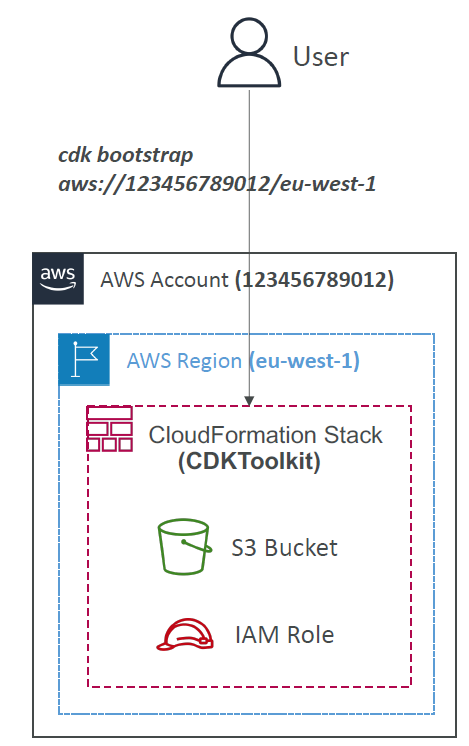

# 🧱 **AWS CDK Bootstrapping – What, Why, and How**

Before you can deploy your **first AWS CDK app**, there’s a **one-time setup step** required per environment: it's called **Bootstrapping**.

> Think of **CDK bootstrapping** as laying the foundation before building your cloud house.

---

<div style="text-align: center;">
    
</div>

---

## 🧠 **What is Bootstrapping in CDK?**

Bootstrapping is the process of **provisioning the initial infrastructure** (like S3 buckets and IAM roles) in your AWS account that **CDK needs to function**.

### 📦 Specifically, it creates a **CloudFormation stack** called

```ini
CDKToolkit
```

Which contains:

| Resource         | Purpose                                                                    |
| ---------------- | -------------------------------------------------------------------------- |
| ✅ **S3 Bucket** | Stores synthesized CloudFormation templates and Lambda deployment packages |
| ✅ **IAM Roles** | Grants CDK the permissions to deploy and manage your stacks                |

---

## 💡 **Why is Bootstrapping Required?**

When you run `cdk deploy`, CDK needs a place to:

- Upload your Lambda ZIP files or container images
- Store synthesized CloudFormation templates
- Execute deploy actions with permission

⚠️ Without bootstrapping, you'll hit errors like:

> `"Policy contains a statement with one or more invalid principal"`
> (Translation: CDK doesn’t have the roles and buckets it needs yet.)

---

## 🌍 **What is an AWS Environment in CDK?**

An **environment** = one combination of:

```bash
<aws_account_id>/<region>
```

Examples:

- `123456789012/us-east-1`
- `987654321098/eu-west-1`

📌 You need to **bootstrap each environment** **once** before deploying CDK stacks to it.

---

## 🛠️ **How to Bootstrap (Step-by-Step)**

### 🧪 Command

```bash
cdk bootstrap aws://123456789012/us-east-1
```

Replace with your actual AWS Account ID and Region.

### 🔄 What happens internally?

1. CDK runs a CloudFormation template that:

   - Creates the `CDKToolkit` stack
   - Provisions an S3 bucket and IAM roles

2. These resources are used for all future `cdk deploy` operations in that account + region

---

## 📂 **CDKToolkit Stack Example**

Once bootstrapped, the `CDKToolkit` CloudFormation stack looks like this:

| Resource Name             | Type             |
| ------------------------- | ---------------- |
| CDKToolkitBucket-XXXXXXXX | AWS::S3::Bucket  |
| CDKToolkitRole            | AWS::IAM::Role   |
| CDKToolkitExecutionPolicy | AWS::IAM::Policy |

📁 You can view these in the **CloudFormation Console**.

---

## ⚙️ Advanced: Customizing Bootstrapping

You can customize bootstrapping with flags:

```bash
cdk bootstrap \
  --cloudformation-execution-policies arn:aws:iam::aws:policy/AdministratorAccess \
  aws://123456789012/us-east-1
```

Or use **custom templates** for locked-down environments.

---

## 🧠 Common Questions

### ❓ Do I need to bootstrap for each project?

> **No.** Only **once per environment** (account/region combo).
> After that, multiple CDK apps can share the same bootstrapped resources.

---

### ❓ Can I reuse the same bootstrap across teams?

> ✅ Yes — as long as they deploy to the **same account and region**.

---

### ❓ What if I delete the CDKToolkit stack?

> CDK deploys will fail.
> You’ll need to rerun `cdk bootstrap` to recreate it.

---

## 📌 Summary: CDK Bootstrapping

| 🔍 Feature        | ✅ Description                                            |
| ----------------- | --------------------------------------------------------- |
| Purpose           | Provision CDK support resources like S3 & IAM             |
| Required?         | ✅ Yes, before your first `cdk deploy` in any environment |
| Resources Created | S3 bucket, IAM roles, CloudFormation stack                |
| Command           | `cdk bootstrap aws://<account>/<region>`                  |
| Scope             | Per AWS account + region                                  |
| Stack name        | `CDKToolkit`                                              |

---

## 🧪 Example Walkthrough

```bash
# Login with AWS CLI profile
aws configure --profile my-dev

# Bootstrap dev environment
cdk bootstrap aws://123456789012/us-east-1 --profile my-dev

# Now you can deploy your CDK app
cdk deploy --profile my-dev
```
