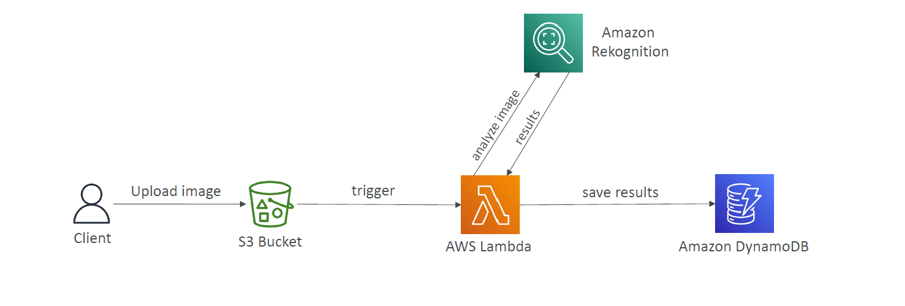

# 🧠 Project: Image Analysis with AWS Rekognition (CDK Version)

> Client uploads an image → S3 triggers Lambda → Lambda calls Rekognition → Saves results to DynamoDB.

---

<div style="text-align: center;">
    
</div>

---

## 📦 What You Will Use

- **S3** – store uploaded images
- **Lambda** – orchestrate the flow
- **Amazon Rekognition** – analyze image content
- **DynamoDB** – store labels/tags
- **AWS CDK** – deploy everything

---

## 🧰 Step-by-Step CDK Setup

### 🛠 1. **Install CDK CLI**

```bash
npm install -g aws-cdk
```

---

### 📁 2. **Initialize Project**

```bash
mkdir image-analyzer && cd image-analyzer
cdk init app --language typescript
```

---

### 📦 3. **Install Required Libraries**

```bash
npm install aws-cdk-lib constructs
npm install @aws-cdk/aws-s3 @aws-cdk/aws-lambda @aws-cdk/aws-dynamodb @aws-cdk/aws-s3-notifications
```

---

### 🧱 4. **Create Lambda Directory & Handler**

Create a folder `lambda/rekognition-handler.ts`:

```ts
import { S3Handler } from "aws-lambda";
import AWS from "aws-sdk";

const rekognition = new AWS.Rekognition();
const ddb = new AWS.DynamoDB.DocumentClient();

export const handler: S3Handler = async (event) => {
  for (const record of event.Records) {
    const bucket = record.s3.bucket.name;
    const key = decodeURIComponent(record.s3.object.key.replace(/\+/g, " "));

    const rekognitionResult = await rekognition
      .detectLabels({
        Image: { S3Object: { Bucket: bucket, Name: key } },
        MaxLabels: 5,
      })
      .promise();

    await ddb
      .put({
        TableName: process.env.TABLE_NAME!,
        Item: {
          id: key,
          labels: rekognitionResult.Labels,
        },
      })
      .promise();
  }
};
```

---

### 📜 5. **Define the Stack (lib/image-analyzer-stack.ts)**

```ts
import * as cdk from "aws-cdk-lib";
import { Construct } from "constructs";
import * as lambda from "aws-cdk-lib/aws-lambda";
import * as s3 from "aws-cdk-lib/aws-s3";
import * as dynamodb from "aws-cdk-lib/aws-dynamodb";
import * as s3n from "aws-cdk-lib/aws-s3-notifications";
import * as iam from "aws-cdk-lib/aws-iam";
import * as path from "path";

export class ImageAnalyzerStack extends cdk.Stack {
  constructor(scope: Construct, id: string, props?: cdk.StackProps) {
    super(scope, id, props);

    const bucket = new s3.Bucket(this, "ImageUploadBucket", {
      removalPolicy: cdk.RemovalPolicy.DESTROY,
      autoDeleteObjects: true,
    });

    const table = new dynamodb.Table(this, "ImageLabelsTable", {
      partitionKey: { name: "id", type: dynamodb.AttributeType.STRING },
      removalPolicy: cdk.RemovalPolicy.DESTROY,
    });

    const fn = new lambda.Function(this, "RekognitionFunction", {
      runtime: lambda.Runtime.NODEJS_18_X,
      handler: "rekognition-handler.handler",
      code: lambda.Code.fromAsset(path.join(__dirname, "../lambda")),
      environment: {
        TABLE_NAME: table.tableName,
      },
    });

    // Grant permissions
    bucket.grantRead(fn);
    table.grantWriteData(fn);
    fn.addToRolePolicy(
      new iam.PolicyStatement({
        actions: ["rekognition:DetectLabels"],
        resources: ["*"],
      })
    );

    // Trigger Lambda on S3 object creation
    bucket.addEventNotification(s3.EventType.OBJECT_CREATED, new s3n.LambdaDestination(fn));
  }
}
```

---

## 🧪 6. **Build & Test**

### 🔧 Compile your TypeScript

```bash
npm run build
```

### 🧬 Synthesize CloudFormation Template

```bash
cdk synth
```

---

## 🚀 7. **Bootstrap & Deploy**

### 📦 Bootstrap your environment (do once per region/account)

```bash
cdk bootstrap aws://YOUR_ACCOUNT_ID/us-east-1
```

### 🚀 Deploy the app

```bash
cdk deploy
```

---

## 🔄 8. **Verify Changes (if updated)**

```bash
cdk diff
```

---

## 🧹 9. **Cleanup**

```bash
cdk destroy
```

---

## ✅ Output Summary

| Resource        | Description                              |
| --------------- | ---------------------------------------- |
| S3 Bucket       | Upload image triggers Lambda             |
| Lambda Function | Analyzes image using Rekognition         |
| Rekognition     | Detects labels/tags from image           |
| DynamoDB Table  | Stores image file name & detected labels |
