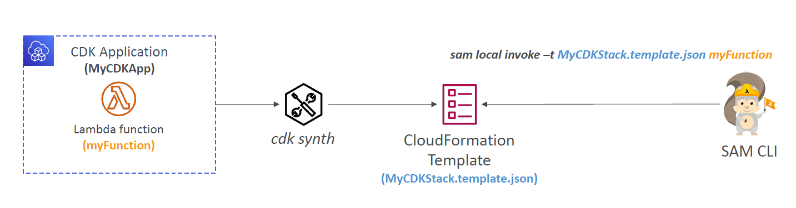

# 🧩 **CDK vs. SAM – Choosing the Right Tool for Serverless & Infrastructure as Code**

When working with AWS, both **AWS CDK (Cloud Development Kit)** and **AWS SAM (Serverless Application Model)** offer Infrastructure as Code (IaC) capabilities. They share some similarities but target **different use cases** and **developer styles**.

Let’s break them down and compare with real-world developer-friendly clarity. 👇

---

## 🚀 What Are They?

| Tool           | Description                                                                                                                                  |
| -------------- | -------------------------------------------------------------------------------------------------------------------------------------------- |
| 🧱 **AWS CDK** | A framework for defining **any AWS infrastructure** using **real programming languages** like TypeScript, Python, Java, .NET.                |
| ⚡ **AWS SAM** | A specialized framework for **serverless applications** that uses **YAML/JSON** to define Lambda, API Gateway, DynamoDB, etc. declaratively. |

---

## 🧪 Core Differences

| Feature                     | **AWS SAM**                                       | **AWS CDK**                                   |
| --------------------------- | ------------------------------------------------- | --------------------------------------------- |
| 💻 Language                 | YAML / JSON (declarative)                         | TypeScript, Python, Java, C# (imperative)     |
| ☁️ Service Scope            | Serverless-focused (Lambda, API GW, S3, DynamoDB) | All AWS services                              |
| 🛠 Local Testing             | ✅ SAM CLI supports local testing                 | Needs `cdk synth` + SAM CLI                   |
| 🧠 Abstraction              | Declarative, less logic                           | Full programming logic                        |
| 📦 Packaging                | `sam build`, `sam deploy`                         | `cdk deploy`, `cdk synth`                     |
| 📊 CI/CD Integration        | Native with CodeDeploy/CloudWatch                 | Needs manual CI/CD setup or CDK Pipelines     |
| 🧪 Built-in Canary / Hooks  | ✅ Native pre/post traffic hooks                  | ✅ With CodeDeploy config                     |
| 🔁 Reusability / Constructs | Limited                                           | High – CDK **Constructs** make logic reusable |

---

## 💡 Example Workflow Comparison

### 🧾 SAM Workflow

```bash
sam build
sam deploy --guided
sam local invoke MyFunction
```

### 🧠 CDK Workflow

```bash
cdk init app --language=typescript
cdk synth              # Generates CFN template
cdk deploy             # Deploys stack
sam local invoke -t cdk.out/MyStack.template.json MyFunction
```

> ✅ **You can use SAM CLI to locally test CDK apps** after synthesizing them!

---

## 🎯 When to Use What?

### 🏗 Use **AWS CDK** if

- You want full control of **all AWS services** (not just serverless)
- You're building **complex architectures**
- You love **coding over configuration**
- You need **reusable components** (constructs)
- You want to **programmatically generate stacks**

### ⚡ Use **AWS SAM** if

- You're only building **serverless applications**
- You prefer **declarative YAML** configuration
- You need **quick local testing** with `sam local`
- You want **tight integration with CodeDeploy/CloudWatch** for traffic shifting
- You're aiming for **simpler setups**

---

## 🧠 Bonus: Use Them Together

<div style="text-align: center;">
    
</div>

---

Yes, they can **work together**!

You can write CDK code, synthesize it to CloudFormation, and then use `sam local`:

```bash
cdk synth > template.yaml
sam local invoke -t template.yaml MyFunction
```

---

## 📌 Summary Table

| Feature                    | AWS SAM         | AWS CDK                          |
| -------------------------- | --------------- | -------------------------------- |
| Language                   | YAML/JSON       | TypeScript, Python, Java, C#     |
| Ideal for                  | Serverless Apps | All AWS Services & Architectures |
| Testing                    | `sam local`     | Requires `cdk synth` + `sam`     |
| Abstraction                | Declarative     | Imperative / OOP                 |
| Reusability                | Low             | High (Constructs / Patterns)     |
| Extensibility              | Medium          | Very High                        |
| Full AWS Service Support   | ❌ Partial      | ✅ Yes                           |
| Custom Logic in Infra Code | ❌ No           | ✅ Yes                           |

---

## 🧠 Final Takeaway

| If you're building...                      | Use...                           |
| ------------------------------------------ | -------------------------------- |
| A quick serverless MVP or demo             | **SAM**                          |
| A robust, scalable, enterprise-grade app   | **CDK**                          |
| A hybrid system (Lambda + EC2 + VPC + RDS) | **CDK**                          |
| Purely Lambda + API Gateway app            | **SAM or CDK** (your preference) |
