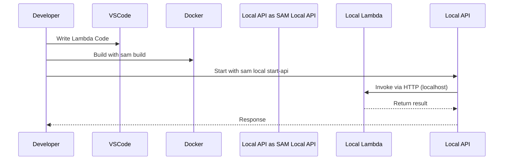

# 🧪 **AWS SAM Local Capabilities**

> **AWS SAM Local** is the **developer-friendly CLI** extension of the AWS Serverless Application Model (SAM) that lets you **build, run, test, and debug AWS Lambda functions locally** — no need to deploy to the cloud for every small change.

It uses **Docker containers** to emulate the **Lambda execution environment**, allowing you to simulate API Gateway, Lambda, S3, DynamoDB, and other AWS integrations — right from your machine.

---

## ⚙️ SAM Local Capabilities Overview

| Capability                      | Description                                                             |
| ------------------------------- | ----------------------------------------------------------------------- |
| 🏗️ `sam local start-lambda`     | Emulates AWS Lambda service locally                                     |
| 🧪 `sam local invoke`           | Invokes a specific Lambda function with test payload                    |
| 🌐 `sam local start-api`        | Spins up a local API Gateway emulator with live endpoints               |
| 🎯 `sam local generate-event`   | Generates mock AWS events (e.g., S3, API Gateway, DynamoDB) for testing |
| 🔍 Debugging Support            | Built-in debugging with IDEs (VSCode, IntelliJ, etc.)                   |
| 🧱 Mount Local Code/Volume      | Supports code hot reload and Docker volume mounts                       |
| 🧪 Integration Testing Friendly | Easily test your Lambda in CI/CD pipelines before deploying             |

---

## 1️⃣ `sam local start-lambda` – Simulate the AWS Lambda Service

```bash
sam local start-lambda
```

### 🔧 What it does

- Starts a **local endpoint** that mimics the AWS Lambda API.
- Useful for testing tools that invoke Lambda **programmatically** (like Step Functions or AWS SDKs).

### 🧪 Use Case

> Test how other services (e.g., Step Functions, local scripts) would call your Lambda using the **Lambda Invoke API**.

---

## 2️⃣ `sam local invoke` – Run Your Lambda with a Test Payload

```bash
sam local invoke MyFunction --event event.json
```

### 🔧 What it does

- Invokes a specific Lambda **once**, waits for it to finish, and returns the result.
- Simulates Lambda execution locally using **Docker**.

### 🧪 Use Case

> Quickly test your Lambda logic without deploying anything to the cloud.

---

> 💡 **Note**: If your function calls other AWS services (e.g., S3, DynamoDB), be sure to use:

```bash
--profile my-aws-profile
```

---

## 3️⃣ `sam local start-api` – Mock API Gateway Locally

```bash
sam local start-api
```

### 🔧 What it does

- Spins up a **local HTTP server** to simulate **API Gateway**.
- Maps your `template.yaml` `Events` section to HTTP endpoints.
- Automatically reloads functions on code changes (live reload).

### 🧪 Use Case

> Develop and test your REST APIs locally before deploying to API Gateway.

```yaml
Events:
  HelloWorld:
    Type: Api
    Properties:
      Path: /hello
      Method: GET
```

> Access at: [http://localhost:3000/hello](http://localhost:3000/hello)

---

## 4️⃣ `sam local generate-event` – Generate Mock AWS Events

```bash
sam local generate-event s3 put
```

### 🔧 What it does

- Creates **sample event payloads** that emulate real AWS service events.

### 🎯 Supported Events

| Service     | Event Types                      |
| ----------- | -------------------------------- |
| S3          | `put`, `delete`, etc.            |
| API Gateway | `GET`, `POST`, `with authorizer` |
| DynamoDB    | `insert`, `modify`, `remove`     |
| Kinesis     | Record ingestion                 |
| SNS / SQS   | Standard payloads                |
| CloudWatch  | Scheduled events                 |
| EventBridge | Custom rule matches              |

> 🧪 Use Case:
> Automatically create input JSON files to simulate service triggers.

---

## 5️⃣ Debugging with SAM Local 🐞

SAM supports **step-through debugging** in popular IDEs using:

- **`--debug-port`** to expose debugger ports
- **VSCode** / **IntelliJ** debugging configurations

```bash
sam local invoke MyFunction --debug-port 5858
```

### 💡 Tip

Use the **AWS Toolkit Extension** for VSCode to simplify debugging and invocation.

---

## 6️⃣ Real-World Dev Workflow Using SAM Local 🔁



---

## 🛠️ Best Practices

| Tip                            | Why it matters                                              |
| ------------------------------ | ----------------------------------------------------------- |
| ✅ Use `sam local start-api`   | For continuous local development of REST APIs               |
| 🔒 Configure AWS profile       | Ensure access to AWS services when needed (`--profile`)     |
| 🧪 Automate `sam invoke`       | Use for unit/integration tests in CI/CD pipelines           |
| 🎯 Generate test payloads      | Use `sam generate-event` to simulate multiple event sources |
| 🔁 Combine with Docker Volumes | Enable hot-reloading for rapid iteration                    |

---

## 🧩 When to Use SAM Local?

| Scenario                         | SAM Local Usage                                           |
| -------------------------------- | --------------------------------------------------------- |
| Developing Lambda-backed APIs    | ✅ `start-api` gives local endpoint                       |
| Debugging IAM/Permissions issues | ✅ Run with `--profile` to test against real AWS services |
| Event source simulations         | ✅ Use `generate-event` to simulate S3/DynamoDB/etc.      |
| CI/CD Pre-deployment checks      | ✅ Use `sam build` + `sam local invoke` for smoke tests   |

---

## 📌 Summary

**AWS SAM Local** gives developers a **lightning-fast feedback loop** for building serverless apps by allowing local emulation of:

- 🔁 AWS Lambda functions
- 🌐 API Gateway endpoints
- 📦 Events from S3, DynamoDB, SNS, etc.
- 🧪 Complete integration and debugging experience
