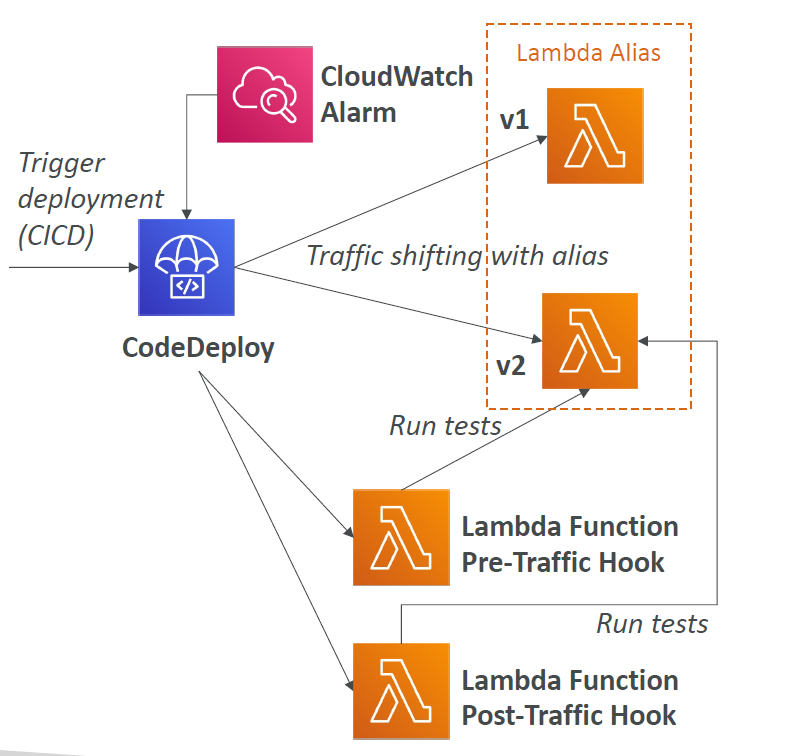
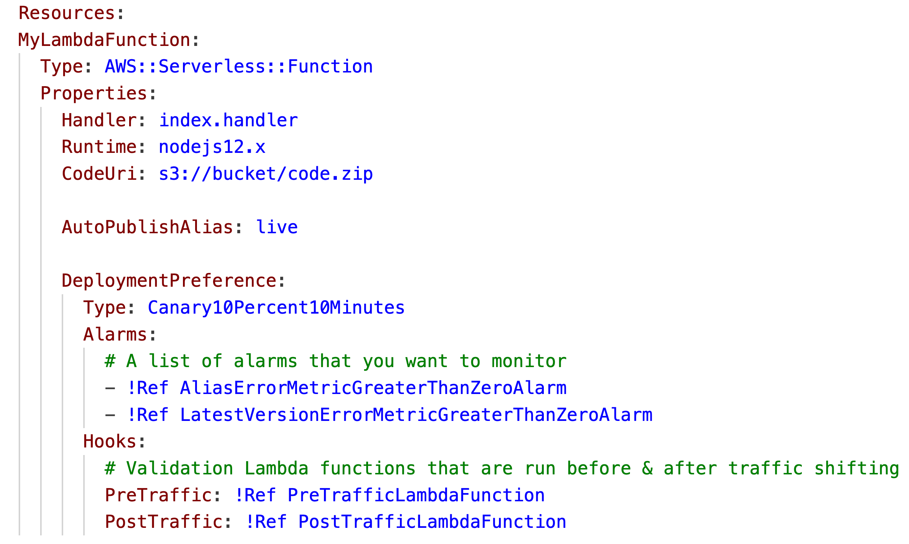

# 🚀 **AWS SAM + CodeDeploy – Safe and Smart Lambda Deployments**

AWS **Serverless Application Model (SAM)** simplifies deployment of serverless applications, and under the hood, it integrates with **AWS CodeDeploy** to perform **safe**, **automated**, and **controlled** updates of Lambda functions using traffic shifting and hooks.

---

<div align="center">
  
</div>

---

## 🧩 What Is CodeDeploy in SAM?

SAM automatically uses **AWS CodeDeploy** to manage **Lambda deployments** when you define:

- `AutoPublishAlias`: SAM creates a new Lambda version and updates an alias to point to it.
- `DeploymentPreference`: You control how traffic is shifted between old and new Lambda versions.

---

## 🔁 **Traffic Shifting Types**

| Deployment Type               | Description                                          |
| ----------------------------- | ---------------------------------------------------- |
| `Canary10Percent10Minutes`    | 10% traffic is shifted, then 90% after 10 min        |
| `Linear10PercentEvery1Minute` | 10% more traffic every minute                        |
| `AllAtOnce`                   | All traffic switches immediately (not safe for prod) |

---

## 🛠️ **Example SAM Template (with Pre/Post Hooks)**

```yaml
Resources:
  MyLambdaFunction:
    Type: AWS::Serverless::Function
    Properties:
      Handler: index.handler
      Runtime: nodejs18.x
      CodeUri: s3://bucket/code.zip
      AutoPublishAlias: live
      DeploymentPreference:
        Type: Canary10Percent10Minutes
        Alarms:
          - !Ref AliasErrorMetricGreaterThanZeroAlarm
        Hooks:
          PreTraffic: !Ref PreTrafficLambdaFunction
          PostTraffic: !Ref PostTrafficLambdaFunction
```

- 🔹 **AutoPublishAlias** ensures a new version is published and `live` alias is moved.
- 🔹 **DeploymentPreference** controls rollout speed and enables rollback via alarms.
- 🔹 **Hooks** let you test before and after traffic is routed.

---

## 🔍 **What Are PreTraffic and PostTraffic Hooks?**

<div align="center">
  
</div>

- **PreTraffic Hook**: Runs tests before traffic is shifted to new version.
- **PostTraffic Hook**: Runs after the shift completes to validate the new version.
- If either hook fails (returns an error), **CodeDeploy rolls back**.

---

## 📊 **Monitoring and Rollback with CloudWatch**

- Use **CloudWatch Alarms** in `DeploymentPreference.Alarms` to auto-trigger rollbacks.
- Alarms monitor metrics like:

  - `Errors`
  - `Duration`
  - `Throttles`

- If an alarm breaches during rollout, deployment stops and **traffic reverts** to old version.

---

## 🧪 Benefits of SAM + CodeDeploy

| Benefit                  | Explanation                                                |
| ------------------------ | ---------------------------------------------------------- |
| 🧩 Zero downtime deploys | Canary & linear strategies let you deploy without outages. |
| ✅ Automated rollback    | Triggered on CloudWatch alarm or hook failure.             |
| 🔍 Built-in testing      | Use hooks to validate deployments before full rollout.     |
| 🧙 Easy to configure     | One YAML block handles deployment logic via SAM.           |

---

## 📝 Summary

SAM + CodeDeploy is perfect for **safe**, **controlled**, and **automated** Lambda deployments.

You get:

- ✅ Automatic versioning
- ✅ Canary or linear traffic shifting
- ✅ Pre/Post validation hooks
- ✅ Rollback on failure
- ✅ Metrics-driven feedback loop
