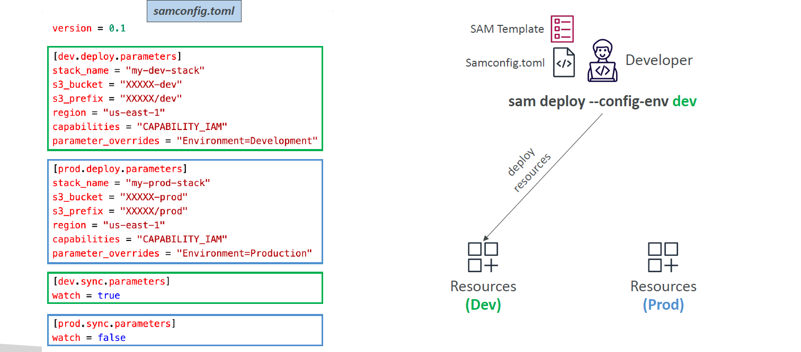

# 🧪 **AWS SAM – Multiple Environments (Dev, Prod, etc.)**

Managing different environments like **Development**, **Testing**, and **Production** is essential for modern software delivery pipelines. AWS **SAM (Serverless Application Model)** makes it easy to **deploy and sync your application code to multiple environments** — using the **`samconfig.toml`** file.

---

<div align="center">
  
</div>

---

## 🧠 **What’s the Goal?**

You want to:

- Deploy the **same SAM application** to multiple environments (like `dev`, `prod`, `test`)
- Use **different stacks**, **S3 buckets**, and **parameters** for each environment
- Avoid manually changing deploy flags every time

✅ That’s where the **`samconfig.toml`** file shines.

---

## ⚙️ **How It Works**

SAM reads environment-specific settings from `samconfig.toml`.

### ✅ Command

```bash
sam deploy --config-env dev
sam deploy --config-env prod
```

This lets you switch environments just by changing a flag.

---

## 🧾 **Sample `samconfig.toml` Structure**

```toml
version = 0.1

[dev.deploy.parameters]
stack_name = "my-dev-stack"
s3_bucket = "XXXX-dev"
s3_prefix = "XXXX/dev"
region = "us-east-1"
capabilities = "CAPABILITY_IAM"
parameter_overrides = "Environment=Development"

[prod.deploy.parameters]
stack_name = "my-prod-stack"
s3_bucket = "XXXX-prod"
s3_prefix = "XXXX/prod"
region = "us-east-1"
capabilities = "CAPABILITY_IAM"
parameter_overrides = "Environment=Production"
```

### 👀 What This Does

| Section                  | Meaning                                                              |
| ------------------------ | -------------------------------------------------------------------- |
| `stack_name`             | Unique CloudFormation stack name for each environment                |
| `s3_bucket`, `s3_prefix` | S3 storage location for packaged code                                |
| `region`                 | AWS Region to deploy to                                              |
| `capabilities`           | IAM permission acknowledgment                                        |
| `parameter_overrides`    | Dynamic values passed to your SAM template (e.g., `Environment=dev`) |

---

## 🔄 **Adding Sync Configurations**

You can also configure **`sam sync`** behavior per environment:

```toml
[dev.sync.parameters]
watch = true

[prod.sync.parameters]
watch = false
```

> 🔁 `sam sync --config-env dev`
> 📦 Keeps your local dev stack hot-updated with file changes

---

## 🧪 **Use Case Example**

Let’s say your SAM template contains:

```yaml
Globals:
  Function:
    Environment:
      Variables:
        STAGE: !Ref Environment
```

You can now inject `Environment=Development` or `Environment=Production` dynamically from `samconfig.toml`.

---

## ✅ **Why Use Multiple Environments?**

| Use Case                 | Benefit                                   |
| ------------------------ | ----------------------------------------- |
| Isolated Dev/Prod stacks | No conflicts between test and prod code   |
| Different buckets        | Separate artifacts, logs, data per stage  |
| Param overrides          | Inject secrets, URLs, toggles dynamically |
| Easier CI/CD             | Build once, deploy to many                |

---

## 🚀 **Summary**

Managing environments with SAM is simple and powerful:

- Use `samconfig.toml` to **centralize env-specific config**
- Use `--config-env <env>` to **deploy anywhere with a single flag**
- Combine with `sam sync` for **fast feedback loops in dev**
- Inject custom parameters via `parameter_overrides`
