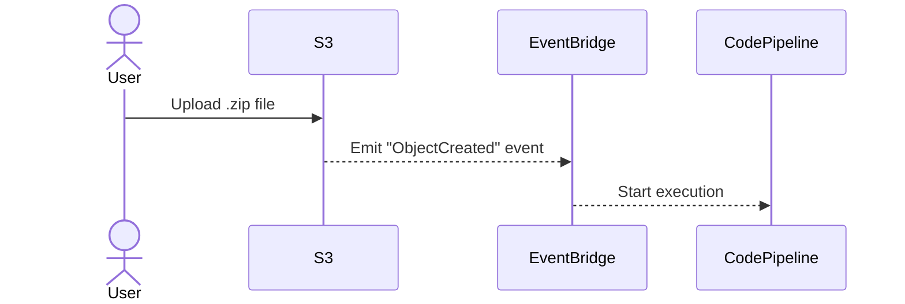
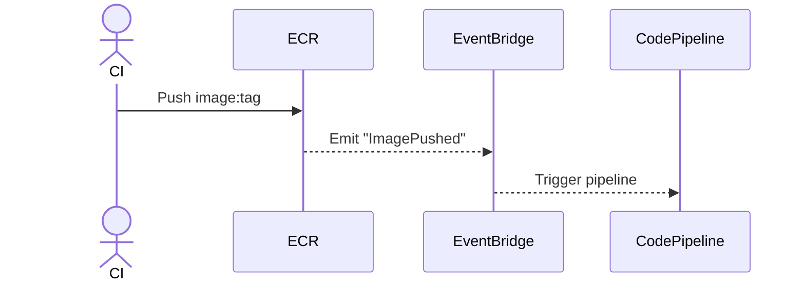
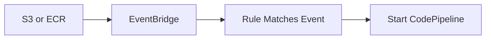

# 🧠 How AWS Source Providers Trigger CodePipeline Using EventBridge

> ✅ Covers: S3, ECR, EventBridge, CloudTrail
> 📦 First-party Sources: Amazon S3 & Amazon ECR
> 🚀 Goal: Automatically trigger pipelines when a resource changes (file upload, image push)

---

## ❓ Problem: How Do Source Actions in CodePipeline Detect Changes?

In CodePipeline, **source actions** (like S3 or ECR) are designed to **detect when something changes**, then automatically **start the pipeline**.

But how is that change detected?

Is it:

- Direct from S3 or ECR?
- Via CloudTrail logs?
- Magic?

Let’s break it down.

---

## 🧩 Solution: EventBridge Is the Reactive Trigger Engine

AWS uses **EventBridge** as the **event router** for all first-party sources in CodePipeline.

There are **two types** of source emission behaviors:

| Source         | Emission Type       | CloudTrail Needed? |
| -------------- | ------------------- | ------------------ |
| **Amazon S3**  | Native + CloudTrail | ❌ / ✅ (depends)  |
| **Amazon ECR** | Native only         | ❌ Not needed      |

---

## ⚙️ S3 Change Detection: Two Modes

### 🔹 Option 1: **Native Emission (Push-based)**

S3 directly sends `ObjectCreated` events to EventBridge — no CloudTrail involved.

**Used by modern pipelines.**

<div align="center">



</div>

### 🔹 Option 2: **CloudTrail-Based Emission (API event monitoring)**

S3 API calls like `PutObject`, `CopyObject` are logged in CloudTrail.
EventBridge can match those logs to trigger CodePipeline.

**Used for:**

- Fine-grained API filtering
- Legacy setups

---

### ✅ So, Is CloudTrail Required for S3?

| Use Case                                | CloudTrail Needed? |
| --------------------------------------- | ------------------ |
| File uploads to S3 → trigger pipeline   | ❌ No              |
| Detect object via `PutObject` API       | ✅ Yes             |
| Monitor IAM roles or permission changes | ✅ Yes             |

---

## 🐳 ECR Change Detection: Simple Native Emission

ECR **always emits events natively** when new container images are pushed — no CloudTrail needed.

<div align="center">



</div>

---

## 🏗️ EventBridge: How It All Works

1. **Event Emitters**: S3, ECR, and others emit events
2. **Event Bus**: Events land on the **default bus**
3. **Rules**: EventBridge uses **event patterns** to match events
4. **Targets**: CodePipeline (or Lambda/SNS/SQS) is triggered

---

<div align="center">



</div>

---

## 🧪 Example Event Payloads

### ✅ S3 Native Event

```json
{
  "source": "aws.s3",
  "detail-type": "Object Created",
  "detail": {
    "bucket": "my-source-bucket",
    "object": {
      "key": "site.zip"
    }
  }
}
```

### ✅ CloudTrail API Event (PutObject)

```json
{
  "source": "aws.s3",
  "detail-type": "AWS API Call via CloudTrail",
  "detail": {
    "eventName": "PutObject",
    "requestParameters": {
      "bucketName": "my-source-bucket",
      "key": "site.zip"
    }
  }
}
```

---

## 🛠️ Real Example: Trigger Pipeline on S3 File Upload

### ✅ Goal

Trigger a pipeline when `my-website.zip` is uploaded to `97hw-source-bucket`.

### 🔨 Solution Options

#### Option 1: Native S3 Event (Recommended)

1. Enable **EventBridge notifications** in S3
2. Create **EventBridge rule**:

   ```json
   {
     "source": ["aws.s3"],
     "detail-type": ["Object Created"],
     "detail": {
       "bucket": { "name": ["97hw-source-bucket"] },
       "object": { "key": [{ "suffix": ".zip" }] }
     }
   }
   ```

3. Target: `StartPipelineExecution`

#### Option 2: CloudTrail Event (API-level)

1. Ensure CloudTrail is logging `PutObject`
2. Create EventBridge rule:

   ```json
   {
     "source": ["aws.s3"],
     "detail-type": ["AWS API Call via CloudTrail"],
     "detail": {
       "eventSource": ["s3.amazonaws.com"],
       "eventName": ["PutObject"],
       "requestParameters": {
         "bucketName": ["97hw-source-bucket"],
         "key": ["my-website.zip"]
       }
     }
   }
   ```

---

## 🧠 Who Can Emit Events to EventBridge?

| Source Type            | Emits to EventBridge? | Notes                        |
| ---------------------- | --------------------- | ---------------------------- |
| AWS Services (S3, ECR) | ✅ Yes                | Native integration           |
| CloudTrail             | ✅ Yes                | Logs → stream to EventBridge |
| Custom Applications    | ✅ Yes                | Use `PutEvents` API          |
| SaaS Integrations      | ✅ Yes                | Via partner event sources    |

---

## 🎯 EventBridge Can Target Many AWS Services

| Target Type     | Example Use Case                        |
| --------------- | --------------------------------------- |
| CodePipeline    | Start pipeline execution                |
| Lambda Function | Run transformation or validation logic  |
| Step Functions  | Orchestrate approvals or ML pipelines   |
| SNS / SQS       | Notify or enqueue downstream processors |

---

## ✅ Final Summary

| Feature                      | Description                                    |
| ---------------------------- | ---------------------------------------------- |
| First-party change detection | Uses **EventBridge rules** to detect updates   |
| S3 Behavior                  | Native event + optional CloudTrail (if needed) |
| ECR Behavior                 | Native event for `ImagePushed`                 |
| EventBridge Role             | Routes matching events to pipeline targets     |
| CloudTrail Use Case          | Needed only for API-based detection or audit   |

---

## 🔗 Official References

- [🚀 S3 Source Action – CodePipeline Docs](https://docs.aws.amazon.com/codepipeline/latest/userguide/action-reference-S3.html)
- [🐳 ECR Source Action](https://docs.aws.amazon.com/codepipeline/latest/userguide/create-cwe-ecr-source.html)
- [📬 EventBridge Event Pattern Syntax](https://docs.aws.amazon.com/eventbridge/latest/userguide/eb-event-patterns.html)
- [🧠 Triggering CodePipeline with EventBridge](https://docs.aws.amazon.com/codepipeline/latest/userguide/triggering.html)
