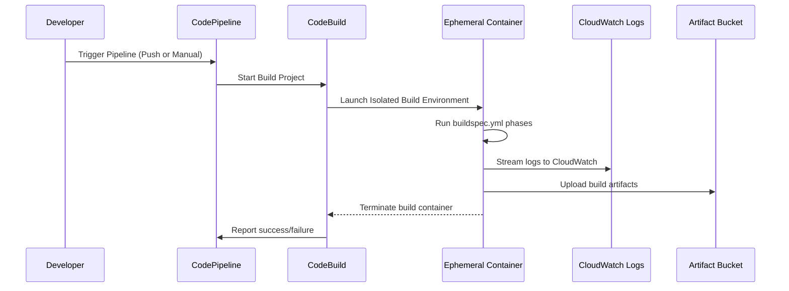

# 🏗️ **How AWS CodeBuild Works Internally — with Full Build Project Setup**

**AWS CodeBuild** is a fully managed CI (Continuous Integration) service that automates the build, test, and packaging of your source code. It acts like a serverless Jenkins agent: always ready, secure, isolated, and pay-as-you-go.

---

> 🧠 _Think of it as a temporary, clean build machine that AWS launches for you — just long enough to run your `buildspec.yml`, then throws away._

---

## 📘 Official Definition

> “**AWS CodeBuild** is a fully managed build service in the cloud. CodeBuild scales continuously and processes multiple builds concurrently, so your builds are never left waiting in a queue.”

---

## 🔄 CodeBuild Internal Flow



---

## 📦 What Is a Build Project?

A **CodeBuild Project** is the configuration template that tells CodeBuild:

- 🔍 Where to get the **source code**
- ⚙️ What **environment** to use
- 🧾 How to run the **build** (via `buildspec.yml`)
- 📦 What to produce as **output artifacts**
- 🔐 What **IAM role** to assume
- 📊 Where to send **logs**

---

## 🧱 How to Create a CodeBuild Project (Step-by-Step)

### ✅ Step 1: Open the Console

Go to: [AWS CodeBuild Console](https://console.aws.amazon.com/codebuild/home)

Click **"Create build project"**

---

### 📝 Step 2: Configure Project Settings

| Field            | Description                                      |
| ---------------- | ------------------------------------------------ |
| **Project name** | Choose a meaningful name like `my-react-build`   |
| **Description**  | Optional (e.g., "Build React app for S3 deploy") |
| **Tags**         | Add environment or team tags for visibility      |

---

### 📦 Step 3: Source Provider

| Option              | Notes                                                   |
| ------------------- | ------------------------------------------------------- |
| **Source Provider** | CodeCommit, GitHub, Bitbucket, GitHub Enterprise, or S3 |
| **Repository**      | If GitHub, connect using OAuth or token                 |
| **Branch**          | Set the default branch (e.g., `main`)                   |
| **Webhook**         | Optional — for automatic triggers                       |

✅ If you use CodePipeline, **this can be overridden** in the pipeline source stage.

---

### 🐳 Step 4: Environment Settings

| Field                 | Description                                                 |
| --------------------- | ----------------------------------------------------------- |
| **Environment image** | Choose: Managed image, custom image, or Dockerfile in repo  |
| **OS**                | Ubuntu (standard), Amazon Linux, Windows                    |
| **Runtime**           | Node.js, Python, Java, .NET, Go, etc.                       |
| **Privileged**        | Enable only if you need Docker (e.g., for Docker-in-Docker) |
| **Compute Type**      | `BUILD_GENERAL1_SMALL` for light builds (or MEDIUM/LARGE)   |

✅ Select **"Use a buildspec file"** to run from `buildspec.yml`
OR define an **inline buildspec** right in the console

---

### 🔐 Step 5: Service Role (IAM Permissions)

| Option                      | Description                                                          |
| --------------------------- | -------------------------------------------------------------------- |
| **Choose an existing role** | Select if you've already created a role with required permissions    |
| **Create a new role**       | Let CodeBuild create `codebuild-<project-name>-service-role` for you |

✅ Ensure the role has:

```json
{
  "Effect": "Allow",
  "Action": ["s3:GetObject", "s3:PutObject"],
  "Resource": "arn:aws:s3:::<your-bucket>/*"
}
```

And optionally:

- `logs:*`
- `secretsmanager:GetSecretValue`
- `ssm:GetParameters`

---

### 📤 Step 6: Artifacts

| Option             | Notes                                                    |
| ------------------ | -------------------------------------------------------- |
| **Type**           | Choose `Amazon S3` if you want to store zip/build output |
| **Name**           | e.g., `build-output.zip`                                 |
| **Path**           | Path inside S3                                           |
| **Namespace type** | `BUILD_ID` or `NONE` (to isolate by build)               |
| **Packaging**      | ZIP or none                                              |

🔧 Output location can also be passed from CodePipeline.

---

### 📊 Step 7: Logs

| Option              | Notes                                       |
| ------------------- | ------------------------------------------- |
| **CloudWatch Logs** | ✅ Recommended for all builds               |
| **S3 Logs**         | Optional backup                             |
| **Encryption**      | Use AWS-managed key unless needed otherwise |

---

### ✅ Step 8: Create Project

Click **Create build project**.

Now you can trigger builds manually or connect it to **CodePipeline** as a build stage.

---

## 🧾 buildspec.yml — The Build Brain

A `buildspec.yml` defines exactly what CodeBuild should do at each phase.

Example for a static site:

```yaml
version: 0.2

phases:
  build:
    commands:
      - echo "No build step, just packaging static files"

artifacts:
  base-directory: sample-js-app
  files:
    - "**/*"
```

---

## 🔒 IAM Breakdown

| Role                       | Purpose                                                 |
| -------------------------- | ------------------------------------------------------- |
| **CodeBuild Service Role** | Required to pull code, write to S3, log to CloudWatch   |
| **CodePipeline Role**      | Must have `codebuild:StartBuild` for this build project |
| **Cross-service roles**    | Used when accessing Secrets Manager, VPCs, or ECR       |

---

## 🧪 Use Case Example: Static Website

- You store code in GitHub
- You want to zip `/sample-js-app` only
- Then deploy to S3 via CodePipeline

✅ Setup:

- Use this `buildspec.yml`:

```yaml
version: 0.2
phases:
  build:
    commands:
      - echo "Zipping static files"
artifacts:
  base-directory: sample-js-app
  files:
    - "**/*"
```

- Add CodeBuild as a **Build Stage** in CodePipeline
- Add S3 as a **Deploy Stage** to publish the result

---

## 💡 Best Practices

| Best Practice                 | Why                                                            |
| ----------------------------- | -------------------------------------------------------------- |
| Use **buildspec.yml** in code | Keeps infra-as-code consistent                                 |
| Use **custom Docker image**   | Ensures all tools and versions are consistent                  |
| Enable **logs**               | Essential for debugging build failures                         |
| Cache dependencies            | Use caching for `node_modules`, `pip`, etc. to save build time |
| Minimize IAM access           | Always use least-privilege roles                               |

---

## 🏁 Final Thought

> CodeBuild is more than just a build runner — it's **a secure, isolated, CI environment** that runs exactly when needed, scales instantly, and integrates deeply with every AWS service.

Whether you're zipping static files, building containers, or compiling microservices — CodeBuild handles it cleanly, quietly, and efficiently.
