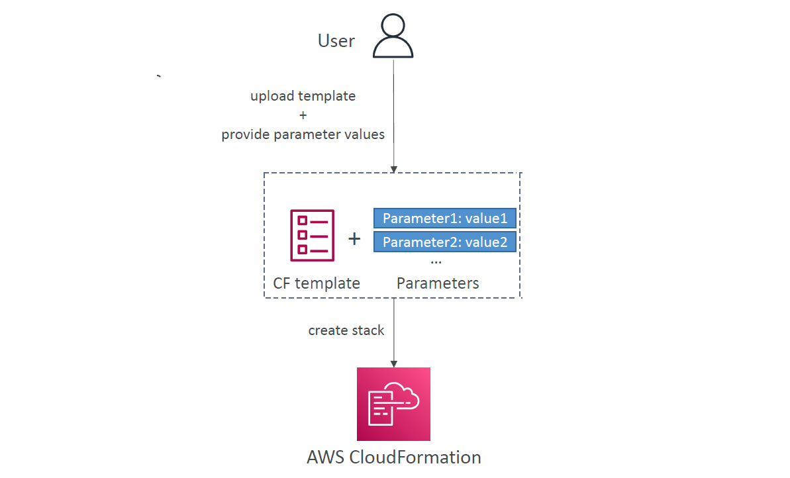

---
tags:
  - aws
  - aws/service
  - aws/domain/management-and-governance
  - aws/topic/cloudformation
aliases:
  - "AWS CloudFormation Parameters"
  - "Cfn Parameters"
  - "CloudFormation Parameters"
---

# 🔢 **AWS CloudFormation Parameters**

AWS CloudFormation **Parameters** allow you to **customize stack deployments** by providing **dynamic input values** instead of hardcoding them into your templates. This approach enhances **reusability, scalability,** and **flexibility** across different environments like Development, Staging, and Production.

When creating a stack, CloudFormation **prompts for parameter values** defined in the template and then **injects these values** into your resources during creation.

✅ **Reusability:** Use the same template in multiple environments.  
✅ **Scalability:** Deploy stacks with varying configurations without modifying the template.  
✅ **Flexibility:** Pass instance types, VPC IDs, security groups, and more dynamically.

---

<div style="text-align: center;">
    
</div>

---

## **📜 Structure of Parameters in CloudFormation**

Parameters are defined in the **`Parameters`** section of a CloudFormation template. Here is a typical structure:

```yaml
Parameters:
  <ParameterName>:
    Type: <Parameter Type>
    Default: <Default Value>
    Description: <Description of the Parameter>
    AllowedValues: <List of Allowed Values>
    AllowedPattern: <Regex Pattern for String Validation>
    NoEcho: <true/false>
    MinLength: <Minimum Number of Characters>
    MaxLength: <Maximum Number of Characters>
    MinValue: <Minimum Value (if Number)>
    MaxValue: <Maximum Value (if Number)>
    ConstraintDescription: <Error Message for Invalid Input>
```

---

## **🛠️ Types of CloudFormation Parameters**

AWS CloudFormation supports multiple **parameter types** that allow dynamic referencing, validation, and automation. These parameters ensure flexibility, reduce errors, and help enforce AWS best practices in infrastructure deployments.

---

### **📌 Standard Parameter Types**

Standard parameters allow basic input types used in CloudFormation templates.

| **Parameter Type**       | **Description**                         | **Example**              |
| ------------------------ | --------------------------------------- | ------------------------ |
| **`String`**             | Any text value                          | `"MyInstance"`           |
| **`Number`**             | Any integer or decimal value            | `4` / `2.5`              |
| **`List`\<`Number`>**    | Comma-separated list of numbers         | `[10, 20, 30]`           |
| **`List`\<`String`>**    | Comma-separated list of strings         | `["sg-1234", "sg-5678"]` |
| **`CommaDelimitedList`** | Single comma-separated string of values | `"value1,value2,value3"` |
|                          |                                         |                          |
|                          |                                         |                          |

💡 **Use Case Example:**

```yaml
Parameters:
  InstanceType:
    Type: String
    Default: "t3.micro"
  InstanceCount:
    Type: Number
    Default: 2
  AllowedInstanceTypes:
    Type: List<String>
    Default: ["t3.micro", "t3.small", "t3.medium"]
  SecurityGroupIds:
    Type: CommaDelimitedList
    Default: "sg-1234,sg-5678"

Resources:
  MyEC2Instance:
    Type: "AWS::EC2::Instance"
    Properties:
      InstanceType: !Ref InstanceType
      SecurityGroupIds: !Ref SecurityGroupIds
```

---

### **🌍 AWS-Specific Parameter Types**

AWS CloudFormation supports specialized **AWS-specific parameter types** that automatically validate the input against existing AWS resources. These prevent misconfigurations by ensuring that the provided values match real AWS resource IDs or names.

| **Parameter Type**                      | **Description**                                              | **Example**         |
| --------------------------------------- | ------------------------------------------------------------ | ------------------- |
| **AWS::EC2::KeyPair::KeyName**          | Validates that the input is an existing EC2 Key Pair         | `"MyKeyPair"`       |
| **AWS::EC2::VPC::Id**                   | Ensures the input is a valid VPC ID                          | `"vpc-0abc1234"`    |
| **AWS::EC2::Subnet::Id**                | Checks that the input is a valid Subnet ID                   | `"subnet-01234abc"` |
| **AWS::EC2::SecurityGroup::Id**         | Ensures that the provided Security Group ID is valid         | `"sg-01234abc"`     |
| **AWS::SSM::Parameter::Value\<String>** | Retrieves and validates a value from AWS SSM Parameter Store | `"MyParameterName"` |

> **Note:** These are just a few **AWS-specific parameters**. For the **full list**, refer to the official AWS documentation: 🔗 [AWS CloudFormation Parameter Types](https://docs.aws.amazon.com/AWSCloudFormation/latest/UserGuide/parameters-section-structure.html)

💡 **Use Case Example:**

```yaml
Parameters:
  MyVPC:
    Type: AWS::EC2::VPC::Id
    Description: "Select an existing VPC ID"
  MySubnet:
    Type: AWS::EC2::Subnet::Id
    Description: "Select a valid subnet from the chosen VPC"
  KeyPairName:
    Type: AWS::EC2::KeyPair::KeyName
    Description: "Enter a valid EC2 Key Pair name for SSH access"
```

---

### **♎ AWS Pseudo Parameters**

AWS CloudFormation provides predefined **pseudo parameters** that dynamically reference stack and environment-specific values without requiring explicit user input.

| **Pseudo Parameter**      | **Description**                                                    | **Example**                                      |
| ------------------------- | ------------------------------------------------------------------ | ------------------------------------------------ |
| **AWS::AccountId**        | Returns the AWS Account ID where the stack is deployed             | `"123456789012"`                                 |
| **AWS::NotificationARNs** | Retrieves Amazon SNS notification topic ARNs attached to the stack | `["arn:aws:sns:us-east-1:123456789012:MyTopic"]` |
| **AWS::NoValue**          | Used to conditionally remove a property from a resource            | `N/A`                                            |
| **AWS::Partition**        | Provides the AWS partition (`aws`, `aws-cn`, or `aws-us-gov`)      | `"aws"`                                          |
| **AWS::Region**           | Returns the AWS region where the stack is created                  | `"us-east-1"`                                    |
| **AWS::StackId**          | Returns the unique identifier of the stack                         | `"arn:aws:cloudformation:us-east-1:... "`        |
| **AWS::StackName**        | Retrieves the name of the CloudFormation stack                     | `"MyStack"`                                      |
| **AWS::URLSuffix**        | Returns the suffix for region-specific AWS service endpoints       | `"amazonaws.com"`                                |

💡 **Use Case Example (Dynamically Naming an S3 Bucket):**

```yaml
Resources:
  MyS3Bucket:
    Type: AWS::S3::Bucket
    Properties:
      BucketName: !Sub "my-bucket-${AWS::AccountId}-${AWS::Region}"
```

**🔹 Why Use AWS Pseudo Parameters?**

- They enable templates to **automatically adapt** to different AWS accounts and regions.
- They **eliminate the need for hardcoded account details**, making templates reusable across multiple environments.
- They help **create globally unique resource names** dynamically.

---

## **🛠️ Advanced Parameter Features**

### **🔢 Patterns for String Parameters (`AllowedPattern`)**

Enforce specific formats for string parameters using regular expressions.

💡 **Example: Enforcing an alphanumeric username**

```yaml
Parameters:
  Username:
    Type: String
    Description: "Enter a username consisting of only alphanumeric characters."
    AllowedPattern: "^[a-zA-Z0-9]+$"
    ConstraintDescription: "Username must contain only alphanumeric characters without spaces or special symbols."
```

If a user provides a username that includes special characters or spaces, the template validation fails with a clear error message.

---

### **🔐 Hiding Parameter Values (Sensitive Data) with `NoEcho`**

Hide sensitive parameter values such as passwords or API keys from being displayed in logs and the AWS Management Console.

💡 **Example: Securing a database password**

```yaml
Parameters:
  DBPassword:
    Type: String
    Description: "Enter the database password."
    NoEcho: true
    AllowedPattern: "[a-zA-Z0-9]{8,32}"
    ConstraintDescription: "Password must be 8 to 32 alphanumeric characters."
```

With `NoEcho: true`, the entered password will be masked, enhancing the overall security of your deployment.

---

## **📟 Functions used with Parameters**

AWS CloudFormation provides several intrinsic functions to **reference, manipulate, and transform** parameter values dynamically within templates.

---

### **1️⃣ Using `!Ref` to Reference Parameters**

Reference parameters directly to pass values to resources.

```yaml
Parameters:
  BucketName:
    Type: String
    Default: "my-custom-bucket"

Resources:
  MyBucket:
    Type: AWS::S3::Bucket
    Properties:
      BucketName: !Ref BucketName # Uses the value provided in Parameters
```

✅ **Benefit:** Allows flexible user-defined input for CloudFormation templates.

---

### **2️⃣ Using `!Sub` for String Substitution**

Embed dynamic values into strings using substitution.

```yaml
Resources:
  MyS3Bucket:
    Type: AWS::S3::Bucket
    Properties:
      BucketName: !Sub "my-bucket-${AWS::AccountId}"
```

✅ **Benefit:** Dynamically creates resource names using AWS Account IDs or other pseudo parameters.

---

### **3️⃣ Using `!Join` to Concatenate Values**

Concatenate strings or parameter values.

```yaml
Resources:
  MyS3Bucket:
    Type: AWS::S3::Bucket
    Properties:
      BucketName: !Join ["-", ["my-bucket", !Ref AWS::Region]]
```

✅ **Benefit:** Creates a unique bucket name per region.

---

### **4️⃣ Using `!Select` to Pick a Value from a List**

Select a specific index from a **list of values** (useful when parameters contain multiple options).

```yaml
Parameters:
  SubnetIds:
    Type: List<AWS::EC2::Subnet::Id>
    Description: "Select multiple Subnets"

Resources:
  MyInstance:
    Type: AWS::EC2::Instance
    Properties:
      SubnetId: !Select [0, !Ref SubnetIds] # Picks the first subnet from the list
```

✅ **Benefit:** Useful when a parameter contains multiple choices, and you need to extract a specific value dynamically.

---

### **5️⃣ Using `!FindInMap` for Lookup Values**

Retrieve values dynamically from a **Mappings section** based on input parameters.

```yaml
Mappings:
  RegionMap:
    us-east-1:
      AMI: "ami-12345"
    us-west-1:
      AMI: "ami-67890"

Resources:
  MyInstance:
    Type: AWS::EC2::Instance
    Properties:
      ImageId: !FindInMap [RegionMap, !Ref AWS::Region, AMI]
```

✅ **Benefit:** Helps store region-based or environment-based configurations inside a **Mappings** section.

---

### **6️⃣ Using `!If` for Conditional Logic**

Use conditions to modify resource properties dynamically.

```yaml
Conditions:
  IsProduction: !Equals [!Ref AWS::Region, "us-east-1"]

Resources:
  MyBucket:
    Type: AWS::S3::Bucket
    Properties:
      BucketName: !If [IsProduction, "prod-bucket", "dev-bucket"]
```

✅ **Benefit:** Enables conditional deployment of resources based on user input or environment settings.

---

### **7️⃣ Using `!Equals` for Comparisons in Conditions**

Compare two values and use the result in **Conditions**.

```yaml
Conditions:
  IsPrimaryRegion: !Equals [!Ref AWS::Region, "us-east-1"]

Outputs:
  DeploymentRegion:
    Value: !If [IsPrimaryRegion, "Primary Region", "Secondary Region"]
```

✅ **Benefit:** Helps define logic-driven deployments based on region or other factors.

---

### **8️⃣ Using `!And` / `!Or` for Multiple Conditions**

Combine multiple conditions in **logical operations**.

```yaml
Conditions:
  IsUSRegion: !Or
    - !Equals [!Ref AWS::Region, "us-east-1"]
    - !Equals [!Ref AWS::Region, "us-west-1"]
```

✅ **Benefit:** Allows multiple conditions to control resource provisioning dynamically.

---

### **9️⃣ Using `!Not` to Invert a Condition**

Negate a condition to **disable** or **enable** resources.

```yaml
Conditions:
  IsNotPrimaryRegion: !Not [!Equals [!Ref AWS::Region, "us-east-1"]]

Resources:
  MyBackupBucket:
    Type: AWS::S3::Bucket
    Condition: IsNotPrimaryRegion
```

✅ **Benefit:** Enables logic for **multi-region deployments** or **disaster recovery** setups.

---

### **🔹 Summary of Intrinsic Functions Used with Parameters**

| **Function**           | **Description**                                                    |
| ---------------------- | ------------------------------------------------------------------ |
| **`!Ref`**             | References a parameter’s value.                                    |
| **`!Sub`**             | Substitutes values into a string.                                  |
| **`!Join`**            | Joins multiple values into a single string.                        |
| **`!Select`**          | Picks a specific item from a list.                                 |
| **`!FindInMap`**       | Retrieves values from a **Mappings** section.                      |
| **`!If`**              | Evaluates conditions to dynamically modify resources.              |
| **`!Equals`**          | Compares two values for conditional logic.                         |
| **`!And`** / **`!Or`** | Logical conditions for multiple checks.                            |
| **`!Not`**             | Inverts a condition (e.g., deploy only outside a specific region). |

## **📌 Examples Using CloudFormation Parameters**

### **Example 1: EC2 Instance Configuration**

Allows users to specify the instance type, SSH key pair, and VPC ID during deployment.

```yaml
AWSTemplateFormatVersion: "2010-09-09"
Description: "Deploy an EC2 instance with user-defined parameters."

Parameters:
  InstanceType:
    Description: "EC2 instance type"
    Type: String
    Default: "t2.micro"
    AllowedValues:
      - "t2.micro"
      - "t2.small"
      - "t3.micro"
    ConstraintDescription: "Must be a valid EC2 instance type."

  KeyName:
    Description: "Name of the EC2 Key Pair"
    Type: AWS::EC2::KeyPair::KeyName

  VpcId:
    Description: "VPC ID where the instance will be launched"
    Type: AWS::EC2::VPC::Id

Resources:
  MyEC2Instance:
    Type: AWS::EC2::Instance
    Properties:
      InstanceType: !Ref InstanceType
      KeyName: !Ref KeyName
      NetworkInterfaces:
        - AssociatePublicIpAddress: true
          DeviceIndex: 0
          SubnetId: !Ref VpcId
```

✅ **Benefit:** Ensures that users can deploy an EC2 instance with their desired configurations.

---

### **Example 2: Using Secure String Parameters from AWS SSM**

Fetches sensitive data such as database passwords from AWS Systems Manager Parameter Store.

```yaml
Parameters:
  DatabasePassword:
    Type: AWS::SSM::Parameter::Value<String>
    Description: "Retrieve database password from AWS SSM Parameter Store"

Resources:
  MyDatabase:
    Type: AWS::RDS::DBInstance
    Properties:
      Engine: mysql
      MasterUsername: admin
      MasterUserPassword: !Ref DatabasePassword
      DBInstanceClass: db.t3.micro
      AllocatedStorage: 20
```

✅ **Benefit:** Improves security by not hardcoding credentials in the template.

---

## **✅ Best Practices for Using CloudFormation Parameters**

- **Use Parameters for Reusability:** Avoid hardcoding values in templates.
- **Set Default Values:** Provide sensible defaults to simplify deployments.
- **Restrict Allowed Values and Patterns:** Use `AllowedValues` and `AllowedPattern` to prevent invalid inputs.
- **Hide Sensitive Data:** Use `NoEcho` for passwords and other sensitive information.
- **Leverage AWS-Specific Types:** Automatically validate resources using AWS-specific parameter types.
- **Utilize Pseudo Parameters:** Dynamically reference environment details without manual input.

---

## Related Notes

- [[aws-services/1.management-governance/1.cloudformation/|Index]] - folder map
-[[1.4.cfn-resources-replacement|Stack Updates Causing Resource Replacement in AWS CloudFormation]]] - previous lesson
-[[1.6.cfn-metadata|AWS CloudFormation Metadata Section]]] - next lesson
- [[aws-services/1.management-governance/4.1.system-manager/3.3.parameter_store|AWS SSM Parameter Store]] - mentions AWS SSM Parameter Store
-[[1.1.cfn|AWS CloudFormation]]] - mentions AWS CloudFormation
- [[aws-daily/aws-cloud-Concepts/6.disaster-recovery|Disaster Recovery DR in AWS]] - mentions Disaster Recovery
- [[aws-services/5.compute/1.1.ec2/2.3.instance-types|Amazon EC2 Instance Types Explained Clearly]] - mentions Instance Types
- [[aws-services/2.security/1.1.iam/1.fundmmentals/1.1.aws-account|AWS Account Your Gateway to the AWS Cloud]] - mentions AWS Account
- [[aws-services/1.management-governance/1.cloudformation/.docs|CND Useful References]] - mentions Docs
- [[aws-services/7.application-integration/sns/1.sns|Amazon SNS The Clouds Pub/Sub Notification Engine]] - mentions SNS

---
