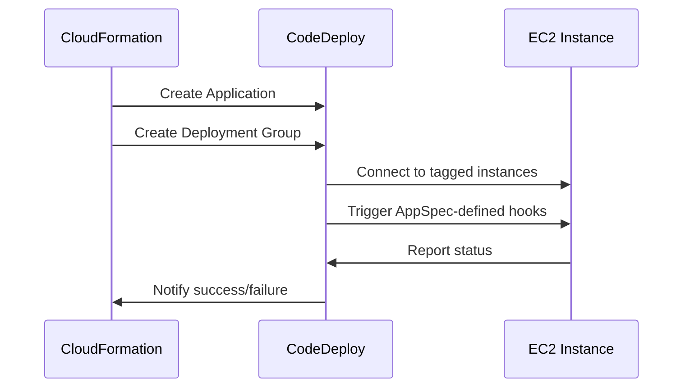

---
tags:
  - aws
  - aws/service
  - aws/domain/management-and-governance
  - aws/topic/cloudformation
aliases:
  - "AWS CloudFormation templates for CodeDeploy referencehttps//docs.aws.amazon.com/codedeploy/latest/userguide/reference-cloudformation-templates.html"
  - "Cfn Codedeply"
  - "CloudFormation Codedeply"
---

# 🚀 **[AWS CloudFormation templates for CodeDeploy reference](https://docs.aws.amazon.com/codedeploy/latest/userguide/reference-cloudformation-templates.html)**

## 📦 What is CodeDeploy?

**AWS CodeDeploy** is a fully managed service that **automates deployments** to:

- **EC2 instances**
- **On-premises servers**
- **Lambda functions**
- **ECS services**

It handles **rolling updates**, **blue/green deployments**, and **hooks** for lifecycle events.

---

## 📐 What is a CloudFormation Template for CodeDeploy?

It’s a **CloudFormation YAML/JSON file** that defines:

- The **CodeDeploy Application**
- The **Deployment Group**
- (Optionally) the EC2 instances or Lambda function being deployed to
- The deployment **strategy, alarms, and hooks**

🧠 The goal is to **provision your entire deployment pipeline as code**.

---

## 🎯 Key Resources in CloudFormation for CodeDeploy

| Resource Type                                  | Purpose                                                |
| ---------------------------------------------- | ------------------------------------------------------ |
| `AWS::CodeDeploy::Application`                 | Defines a CodeDeploy app (EC2/on-prem, Lambda, or ECS) |
| `AWS::CodeDeploy::DeploymentGroup`             | Defines a group of targets and deployment settings     |
| `AWS::IAM::Role`                               | Role that CodeDeploy uses to access resources          |
| `AWS::EC2::Instance` / `AWS::Lambda::Function` | Targets for the deployment                             |
| `AWS::CodeDeploy::DeploymentConfig` (optional) | Custom deployment strategy (canary, linear, etc.)      |

---

## 🧪 Example 1: Deploy to EC2 (In-Place)

### 🗂️ Sample Template:

```yaml
AWSTemplateFormatVersion: "2010-09-09"
Resources:
  CodeDeployApplication:
    Type: AWS::CodeDeploy::Application
    Properties:
      ComputePlatform: Server

  CodeDeployRole:
    Type: AWS::IAM::Role
    Properties:
      AssumeRolePolicyDocument:
        Version: 2012-10-17
        Statement:
          - Effect: Allow
            Principal:
              Service: codedeploy.amazonaws.com
            Action: sts:AssumeRole
      Policies:
        - PolicyName: CodeDeployAccess
          PolicyDocument:
            Version: 2012-10-17
            Statement:
              - Effect: Allow
                Action:
                  - ec2:*
                  - s3:*
                  - cloudwatch:*
                Resource: "*"

  CodeDeployDeploymentGroup:
    Type: AWS::CodeDeploy::DeploymentGroup
    Properties:
      ApplicationName: !Ref CodeDeployApplication
      DeploymentGroupName: MyEC2DeploymentGroup
      ServiceRoleArn: !GetAtt CodeDeployRole.Arn
      DeploymentConfigName: CodeDeployDefault.OneAtATime
      AutoScalingGroups:
        - Ref: MyASG
      Ec2TagFilters:
        - Key: Name
          Value: MyAppInstance
          Type: KEY_AND_VALUE
      DeploymentStyle:
        DeploymentType: IN_PLACE
        DeploymentOption: WITHOUT_TRAFFIC_CONTROL
```

🧠 This deploys to EC2 instances **tagged** as `Name=MyAppInstance` and uses the `OneAtATime` strategy.

---

## 🧪 Example 2: Deploy to Lambda (Blue/Green)

```yaml
Resources:
  MyLambdaApp:
    Type: AWS::CodeDeploy::Application
    Properties:
      ComputePlatform: Lambda

  MyCodeDeployRole:
    Type: AWS::IAM::Role
    Properties:
      AssumeRolePolicyDocument:
        Version: "2012-10-17"
        Statement:
          - Effect: Allow
            Principal:
              Service: codedeploy.amazonaws.com
            Action: sts:AssumeRole
      ManagedPolicyArns:
        - arn:aws:iam::aws:policy/service-role/AWSCodeDeployRoleForLambda

  MyLambdaDeploymentGroup:
    Type: AWS::CodeDeploy::DeploymentGroup
    Properties:
      ApplicationName: !Ref MyLambdaApp
      DeploymentGroupName: MyLambdaDG
      DeploymentConfigName: CodeDeployDefault.LambdaCanary10Percent5Minutes
      ServiceRoleArn: !GetAtt MyCodeDeployRole.Arn
      DeploymentStyle:
        DeploymentType: BLUE_GREEN
        DeploymentOption: WITH_TRAFFIC_CONTROL
      BlueGreenDeploymentConfiguration:
        TerminateBlueInstancesOnDeploymentSuccess:
          Action: TERMINATE
          TerminationWaitTimeInMinutes: 5
        DeploymentReadyOption:
          ActionOnTimeout: CONTINUE_DEPLOYMENT
          WaitTimeInMinutes: 0
      AlarmConfiguration:
        Alarms:
          - Name: MyLambdaDeploymentAlarm
        Enabled: true
```

🔁 This deploys to Lambda using a **canary strategy** (10% traffic for 5 min), with **automatic rollback on alarm**.

---

## 🧩 Optional Resource: Custom Deployment Config

```yaml
MyCustomDeploymentConfig:
  Type: AWS::CodeDeploy::DeploymentConfig
  Properties:
    DeploymentConfigName: Canary25Percent5Minutes
    ComputePlatform: Lambda
    TrafficRoutingConfig:
      Type: TimeBasedCanary
      TimeBasedCanary:
        Interval: 5
        Percentage: 25
```

Use this if the default configs (like `CodeDeployDefault.LambdaCanary10Percent5Minutes`) don’t suit your needs.

---

## 📋 Deployment Workflow Summary (EC2)



---

## 🧠 Best Practices

✅ Always **use tags or ASGs** to target EC2s — don’t hardcode instance IDs.
✅ **Use `AppSpec.yml`** in your S3 or GitHub source to define lifecycle hooks.
✅ For Lambda, use **canary or linear deployments** + alarms.
✅ Assign **minimal IAM roles** for security.
✅ Use **CloudWatch alarms** to auto-rollback on failures.

---

## 🧪 Want a Full Example Repo?

Would you like:

- A full CloudFormation + CodeDeploy + AppSpec.yml example?
- A pipeline-integrated version with CodePipeline?

I can generate and explain those for you too!
---

## Related Notes
- [[aws-services/1.management-governance/1.cloudformation/|Index]] - folder map
-[[8.1.stack-drifts|Stack Drifts]]] - previous lesson
-[[9.1.cfn-sam|SAM]]] - next lesson
-[[1.1.cfn|AWS CloudFormation]]] - mentions AWS CloudFormation
- [[aws-services/5.compute/1.3.ec2-auto-scaling/4.1.lifecycle-hooks|EC2 Auto Scaling Lifecycle Hooks Pause Prepare Proceed]] - mentions Lifecycle Hooks
-[[1.1.codedeploy|Introduction to AWS CodeDeploy]]] - mentions Codedeploy
-[[x.2.1.appspec|AWS CodeDeploy appspec.yml Full Syntax & Usage Guide]]] - mentions Appspec
- [[aws-services/1.management-governance/4.3.config/x.config|AWS Config Track Manage and Secure Your AWS Resources]] - mentions Config
- [[aws-services/1.management-governance/1.cloudformation/.docs|CND Useful References]] - mentions Docs
- [[aws-services/2.security/1.1.iam/1.fundmmentals/1.2.iam|AWS Identity and Access Management IAM]] - mentions IAM
- [[aws-services/6.containers/2.ecs/1.1.ecs|Amazon ECS Elastic Container Service]] - mentions ECS

---
