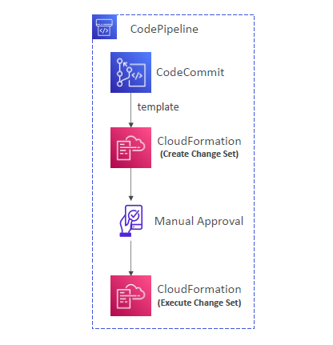
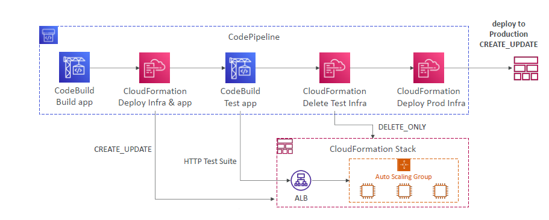

# 🚀 Using AWS CloudFormation as a Deployment Target in CodePipeline

> 📌 Problem: You want to **automate infrastructure deployments** (like EC2, Lambda, ALB, or entire app stacks) through a **CI/CD pipeline** — not just code.
>
> ✅ **Solution**: Use **CloudFormation actions** inside **CodePipeline** to provision, update, or delete AWS resources automatically.

---

<div style="text-align: center;">
    
</div>

---

## 📌 What Problem Does This Solve?

| Problem                                                | Traditional Way                      | CloudFormation in CodePipeline                     |
| ------------------------------------------------------ | ------------------------------------ | -------------------------------------------------- |
| You need to deploy AWS infra and code consistently     | Manual deployment via console or CLI | ✅ Repeatable, version-controlled infra deployment |
| You want approvals before prod infra changes           | Manual e-mail or ticket              | ✅ Built-in **Manual Approval** step               |
| You manage multi-account / multi-region infrastructure | Manual or custom scripts             | ✅ Use **CloudFormation StackSets**                |
| You need to pass dynamic config between stages         | Hardcoded in scripts                 | ✅ Use **parameter overrides** from artifacts      |

---

## 🧱 What Is a CloudFormation Deploy Action?

The **CloudFormation Deploy Action** in CodePipeline allows you to:

- Deploy **Lambda + Infra** using CDK, SAM, or plain templates
- Automate **stack updates**, **create/delete stacks**, or **execute change sets**
- Integrate **approval flows**, **test automation**, and **production deployments**

---

## ⚙️ Action Modes Supported

| Action Mode                    | Use Case                                                          |
| ------------------------------ | ----------------------------------------------------------------- |
| `CREATE_UPDATE`                | Default: Create the stack or update it if it already exists       |
| `DELETE_ONLY`                  | Deletes the stack if it exists (used for cleaning up test stacks) |
| `REPLACE_ON_FAILURE`           | Replaces the stack if a previous update has failed                |
| `CHANGE_SET_REPLACE` + Execute | Prepare a change set → get approval → execute the changes safely  |

---

## 🏗️ End-to-End Pipeline Example (Infrastructure + App)

<div style="text-align: center;">
    
</div>

---

### ✔️ This pipeline:

- Creates infra → runs app tests → deletes test infra → deploys to production after manual approval.

---

## 🌐 Real Infra Example: Auto Scaling Behind ALB

CloudFormation Stack might define:

```yaml
Resources:
  ALB:
    Type: AWS::ElasticLoadBalancingV2::LoadBalancer
  ASG:
    Type: AWS::AutoScaling::AutoScalingGroup
    Properties:
      TargetGroupARNs:
        - !Ref TargetGroup
```

### → CodePipeline with `CREATE_UPDATE` deploys these to your AWS account automatically.

---

## 📥 How to Pass Template Parameters

CloudFormation supports **parameter overrides** in CodePipeline.

You can:

### 1. 📄 Use Static File (Recommended)

Store a config file like `config-prod.json`:

```json
{
  "ParameterKey": "Env",
  "ParameterValue": "prod"
}
```

And reference it in the pipeline input artifact.

---

### 2. 🔄 Use Dynamic Overrides

Define overrides inside your CodePipeline stage:

```json
{
  "ParameterKey": "Env",
  "ParameterValue": {
    "Fn::GetParam": ["ArtifactName", "config-prod.json", "Env"]
  }
}
```

✅ This lets your build output pass values like AMI IDs, bucket names, or env names dynamically to CloudFormation.

---

## ✅ Use StackSets for Multi-Account or Multi-Region

Need to deploy the same template to **many accounts or regions**?

👉 Use **CloudFormation StackSets** in your pipeline for:

- Regional ALBs
- Multi-account IAM roles
- Parallel deployments with rollback

---

## 🔒 IAM Roles Required

CodePipeline and CloudFormation stages should assume a role with:

- `cloudformation:*` for deploying templates
- `iam:PassRole` for any IAM roles inside templates
- `s3:GetObject` to access your templates and parameter files

---

## 📌 Summary

| Feature                        | What It Does                                                       |
| ------------------------------ | ------------------------------------------------------------------ |
| CloudFormation as a Target     | Automates infrastructure provisioning in CodePipeline              |
| Supports Change Sets           | Safer, staged updates with optional manual approval                |
| Parameter Overrides            | Pass dynamic values between stages                                 |
| StackSets                      | Multi-account / multi-region deployment                            |
| Clean Infrastructure Lifecycle | Create → Test → Delete → Approve → Deploy                          |
| Action Modes                   | `CREATE_UPDATE`, `DELETE_ONLY`, `REPLACE_ON_FAILURE`, `CHANGE_SET` |

---

## 🧠 Bonus Use Cases

| Scenario                       | How CloudFormation in CodePipeline Helps                       |
| ------------------------------ | -------------------------------------------------------------- |
| Blue/Green Deployment (Lambda) | Create new alias version → shift traffic → rollback on failure |
| Serverless Infra with SAM/CDK  | Automatically deploy Lambda, DynamoDB, API Gateway             |
| Clean Dev/Test environments    | Delete infra automatically after integration test stage        |
