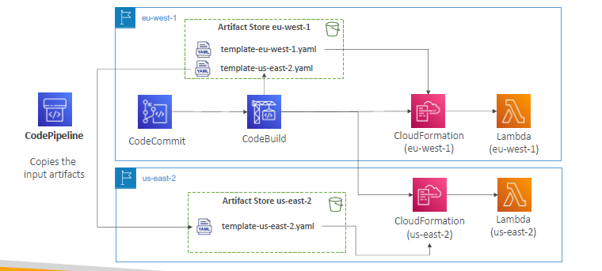
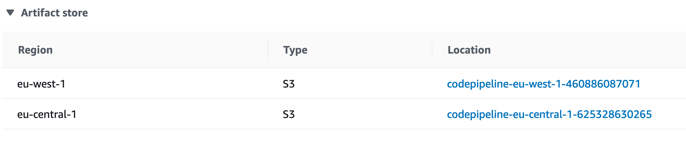

---
tags:
  - aws
  - aws/service
  - aws/domain/developer-tools
  - aws/topic/code-pipeline
aliases:
  - "AWS CodePipeline Multi-Region Deployments with CloudFormation"
  - "Multi Region"
---

# 🌍 AWS CodePipeline – Multi-Region Deployments with CloudFormation

> **Problem**: You want to **deploy the same application (like Lambda)** into **multiple AWS regions** automatically using **CodePipeline** and **CloudFormation**. But CodePipeline lives in only one region!
>
> ❓So how does it copy templates, trigger deployments, and manage artifact storage across regions?

Let’s solve this step-by-step 👇

---

## 🧩 Problem Breakdown

| ❓ Challenge                                          | ✅ Solution                                                                 |
| ----------------------------------------------------- | --------------------------------------------------------------------------- |
| CodePipeline lives in a **single region**             | Add **cross-region actions** to deploy into other regions                   |
| CloudFormation in each region needs its **own input** | CodePipeline **automatically replicates artifacts** to regional S3 buckets  |
| Each region needs its **own S3 Artifact Store**       | You must create one **S3 bucket per region** and connect it to CodePipeline |

---

## 🧱 Architecture Overview

<div align="center">
  
</div>

---

This example:

- CodePipeline runs in **eu-west-1**
- Deploys **template-eu-west-1.yaml** to **CloudFormation in eu-west-1**
- Also deploys **template-us-east-2.yaml** to **CloudFormation in us-east-2**

---

<div align="center">
  
</div>

---

## 🪣 Artifact Store – One per Region

Each region where a deployment step runs **must have its own S3 bucket** registered with CodePipeline.

### 🔍 Example from your AWS Console

| Region         | Type | S3 Bucket Name                           |
| -------------- | ---- | ---------------------------------------- |
| `eu-west-1`    | S3   | `codepipeline-eu-west-1-460886087071`    |
| `eu-central-1` | S3   | `codepipeline-eu-central-1-625328630265` |

📌 These buckets are managed by CodePipeline for **artifact replication** between regions.

---

## 🛠️ Step-by-Step: Deploying Lambda to Multiple Regions via CloudFormation

### ✅ 1. Prepare Multi-Region CloudFormation Templates

In your repo (CodeCommit or GitHub):

```ini
repo/
├── template-eu-west-1.yaml
└── template-us-east-2.yaml
```

Each template deploys the same Lambda function but targets the respective region.

---

### ✅ 2. Configure Artifact Stores in Pipeline

CodePipeline needs S3 buckets registered per region:

```json
"artifactStores": {
  "eu-west-1": {
    "type": "S3",
    "location": "codepipeline-eu-west-1-460886087071"
  },
  "us-east-2": {
    "type": "S3",
    "location": "codepipeline-us-east-2-1234567890"
  }
}
```

If using the console, these are auto-created for you.

---

### ✅ 3. Define Cross-Region Actions in CodePipeline

```json
{
  "name": "DeployToUSEast2",
  "actionTypeId": {
    "category": "Deploy",
    "owner": "AWS",
    "provider": "CloudFormation",
    "version": "1"
  },
  "inputArtifacts": [
    {
      "name": "BuildOutput"
    }
  ],
  "configuration": {
    "ActionMode": "CREATE_UPDATE",
    "StackName": "MyLambdaStackUSEast2",
    "TemplatePath": "BuildOutput::template-us-east-2.yaml",
    "Capabilities": "CAPABILITY_IAM"
  },
  "region": "us-east-2",
  "runOrder": 2
}
```

🚀 **Notice the `region` field** — this tells CodePipeline to deploy in a different region than where the pipeline is hosted.

---

### ✅ 4. Enable Template Parameter Overrides (Optional)

If you're using parameters like Lambda name or stage (prod/dev), you can override them per region:

```json
"ParameterOverrides": {
  "FunctionName": "MyAppFunctionUSEast2",
  "Stage": "prod"
}
```

Use a JSON config file stored in your CodeBuild output.

---

## ⚙️ Common Action Modes in CloudFormation Deploy Action

| Mode                 | Description                            |
| -------------------- | -------------------------------------- |
| `CREATE_UPDATE`      | Create or update the stack             |
| `DELETE_ONLY`        | Just deletes the stack (used for test) |
| `REPLACE_ON_FAILURE` | Replaces stack if previous failed      |
| `CHANGE_SET_REPLACE` | Generate & approve changes manually    |

---

## 🔁 Artifact Replication Is Automatic

You don't need to copy anything between regions.

CodePipeline **automatically replicates artifacts** across regions behind the scenes.

| Source Region | Artifact File                     | Target Region       |
| ------------- | --------------------------------- | ------------------- |
| eu-west-1     | `template-us-east-2.yaml`         | us-east-2           |
| CodePipeline  | Automatically syncs via S3 bucket | ✅ No action needed |

---

## ✅ Summary: Multi-Region CodePipeline with CloudFormation

| Feature                   | ✅ Description                                                           |
| ------------------------- | ------------------------------------------------------------------------ |
| Cross-Region Actions      | Specify target region in CloudFormation deploy action                    |
| Artifact Store per Region | Required – S3 bucket per region registered in CodePipeline               |
| Auto Artifact Copy        | CodePipeline copies inputs automatically to S3 in each region            |
| Deploy Multiple Templates | Use different CFN templates for each region (or use parameter overrides) |
| Console & CLI Support     | Both AWS Console and CloudFormation JSON/YAML support this setup         |

---

## 📦 Real Use Case

> I want to deploy a **Lambda function** to both **`eu-west-1`** and **`us-east-2`**.

1. Write 2 templates: `template-eu-west-1.yaml`, `template-us-east-2.yaml`
2. Build them via CodeBuild
3. Output them as artifacts
4. Create 2 **CloudFormation actions**:

   - One in `eu-west-1`
   - One in `us-east-2`

5. Watch CodePipeline handle:

   - Build once
   - Deploy to both regions
   - Monitor via centralized UI

---

## 🧠 Pro Tip

💡 You can even integrate **approval gates** between regions — e.g., deploy to `eu-west-1` first, wait for approval, then deploy to `us-east-2`.

```yaml
- name: ManualApprovalForUSEast2
  actionTypeId:
    category: Approval
    provider: Manual
```
---

## Related Notes
- [[aws-services/10.developer/2.1.code-pipeline/|Index]] - folder map
- [[aws-services/10.developer/2.1.code-pipeline/4.2.demo|Full Real-Life Example AWS CodePipeline + CloudFormation CI/CD Pipeline]] - previous lesson
- [[aws-services/10.developer/2.1.code-pipeline/6.1.notification-rule-in-codepipeline|Notifications in CodePipeline]] - next lesson
- [[aws-services/10.developer/2.1.code-pipeline/1.1.what-is-aws-code-pipeline|AWS CodePipeline]] - mentions AWS CodePipeline
- [[aws-services/1.management-governance/1.cloudformation/1.1.cfn|AWS CloudFormation]] - mentions CloudFormation
- [[aws-services/10.developer/2.2.code-build/1.1.codebuild|How AWS CodeBuild Works Internally]] - mentions Codebuild
- [[aws-services/1.management-governance/4.3.config/x.config|AWS Config Track Manage and Secure Your AWS Resources]] - mentions Config

---
