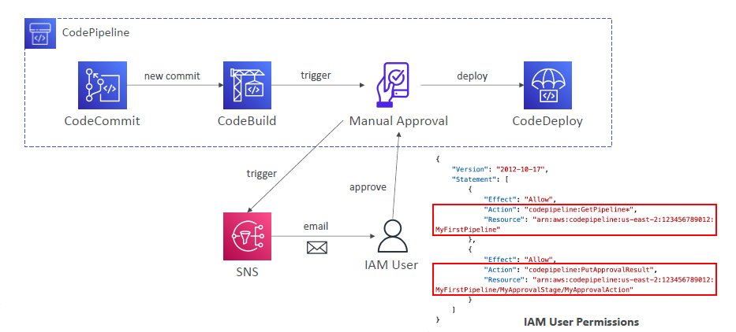

---
tags:
  - aws
  - aws/service
  - aws/domain/developer-tools
  - aws/topic/code-pipeline
aliases:
  - "Adding Manual Approval to AWS CodePipeline"
  - "Manual Approval Stage"
---

# ✋ Adding Manual Approval to AWS CodePipeline

> **Goal**: Pause your pipeline and wait for a human to review or approve before continuing to the next stage — useful before production deployments!

---

<div style="text-align: center;">
    
</div>

---

## ✅ When to Use

- Approve before deploying to **production**
- Pause before **destructive actions**
- Require approval from specific **IAM users/roles**

---

## 🧩 How It Works

- CodePipeline stops at the **Manual Approval** action
- A **reviewer** (user or role with access) must **approve or reject**
- After approval, the pipeline resumes

---

## 🛠️ Steps to Add Manual Approval

### 🔧 In the AWS Console

1. Go to **CodePipeline > Your Pipeline**
2. Click **Edit**
3. Add a new **Action** in the stage (usually after test, before deploy)
4. Choose:

   - **Category**: `Approval`
   - **Provider**: `Manual`
   - **Action Name**: `ManualApproval`
   - Optional: add a **Custom message** or **SNS topic**

---

### 🧪 Example in JSON (CloudFormation or CDK)

```json
{
  "name": "ManualApproval",
  "actionTypeId": {
    "category": "Approval",
    "owner": "AWS",
    "provider": "Manual",
    "version": "1"
  },
  "runOrder": 1,
  "configuration": {
    "CustomData": "Please approve deployment to production."
  },
  "outputArtifacts": [],
  "inputArtifacts": [],
  "region": "us-east-1"
}
```

---

## 🔔 Optional: Use SNS Notification

You can configure **SNS topic** to notify approvers:

```json
"configuration": {
  "NotificationArn": "arn:aws:sns:us-east-1:123456789012:MyApprovers",
  "CustomData": "Review required before prod release"
}
```

---

## 📍 Where It Appears

- Pipeline **pauses** at the approval action
- Status shows: `Approval required`
- Click “**Review**” to approve or reject

---

## 🧠 Tips

| 🔹 Feature                 | Description                                      |
| -------------------------- | ------------------------------------------------ |
| IAM required               | Users must have `codepipeline:PutApprovalResult` |
| Use with manual testing    | Add approval after test stage                    |
| Use with production deploy | Add approval before deploy to prod               |
---

## Related Notes
- [[aws-services/10.developer/2.1.code-pipeline/|Index]] - folder map
- [[aws-services/10.developer/2.1.code-pipeline/6.1.notification-rule-in-codepipeline|Notifications in CodePipeline]] - previous lesson
- [[aws-services/10.developer/2.1.code-pipeline/1.1.what-is-aws-code-pipeline|AWS CodePipeline]] - mentions AWS CodePipeline
- [[aws-services/1.management-governance/1.cloudformation/1.1.cfn|AWS CloudFormation]] - mentions CloudFormation
- [[aws-services/7.application-integration/sns/1.sns|Amazon SNS The Clouds Pub/Sub Notification Engine]] - mentions SNS
- [[aws-services/2.security/1.1.iam/1.fundmmentals/1.2.iam|AWS Identity and Access Management IAM]] - mentions IAM

---
