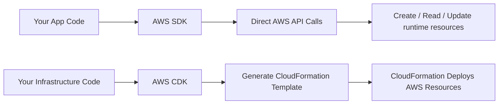
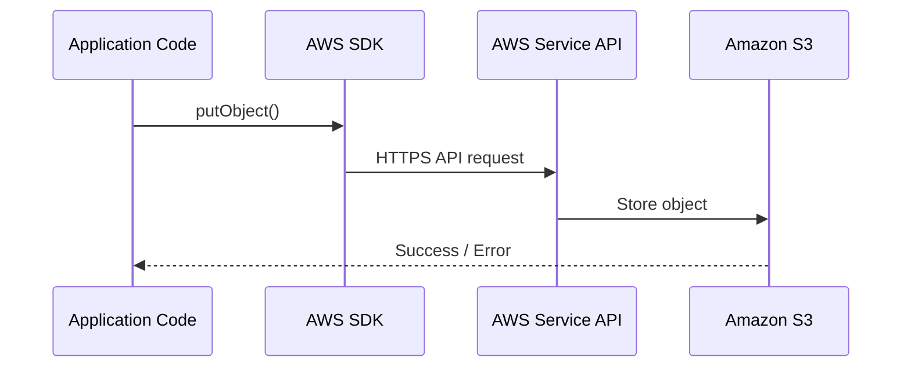
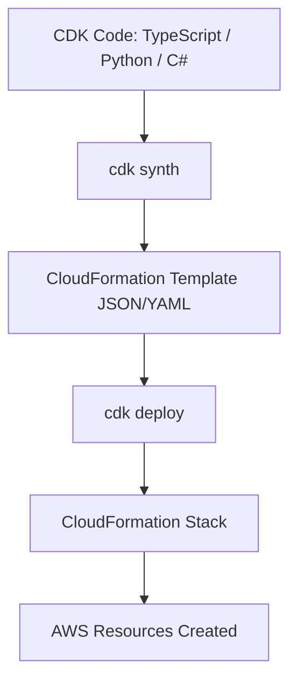
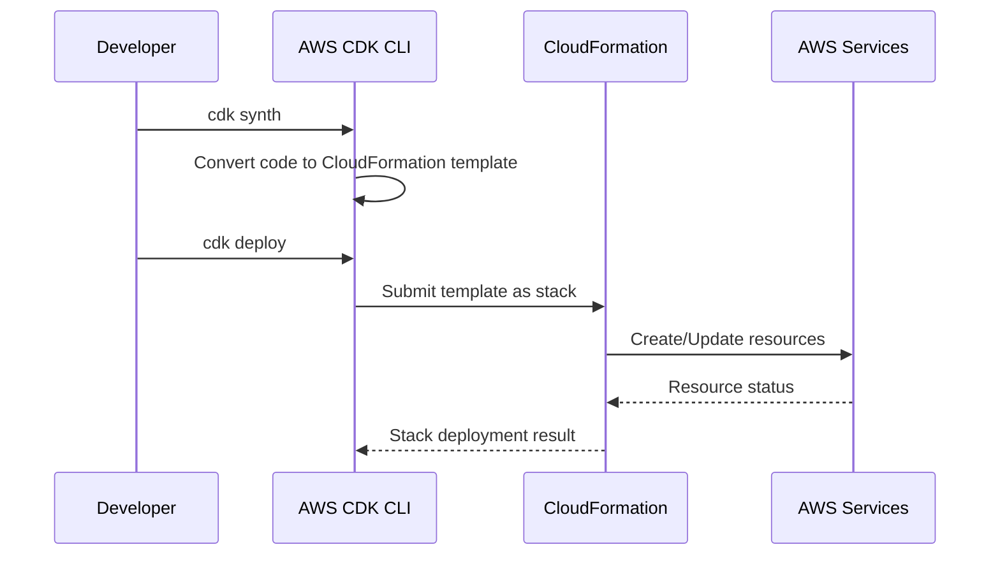

## AWS SDK vs AWS CDK — Simple Difference

Think like this:



---

# 1. AWS SDK

## What is it?

**AWS SDK** is used by your application to call AWS services directly.

Example: your backend wants to upload a file to S3, send a message to SQS, or read from DynamoDB.

```ts
import { S3Client, PutObjectCommand } from "@aws-sdk/client-s3";

const s3 = new S3Client({ region: "us-east-1" });

await s3.send(new PutObjectCommand({
  Bucket: "my-bucket",
  Key: "test.txt",
  Body: "Hello AWS"
}));
```

## What happens?

Your code sends a **direct API request** to AWS:



So yes, **AWS SDK directly talks to AWS service APIs**.

---

# 2. AWS CDK

## What is it?

**AWS CDK** is used to define infrastructure using programming languages like TypeScript, Python, Java, C#, or Go.

Example: create an S3 bucket, Lambda, API Gateway, VPC, ECS cluster, etc.

```ts
import * as cdk from "aws-cdk-lib";
import * as s3 from "aws-cdk-lib/aws-s3";

const app = new cdk.App();

const stack = new cdk.Stack(app, "MyStack");

new s3.Bucket(stack, "MyBucket", {
  versioned: true
});
```

---

# Does CDK send API requests directly to AWS resources?

**No, not directly for normal resource creation.**

AWS CDK does this:



CDK **renders/synthesizes your code into a CloudFormation template**.

Then **CloudFormation** creates/updates/deletes the AWS resources.

---

# CDK Deployment Flow



---

# Main Difference

|Point|AWS SDK|AWS CDK|
|---|---|---|
|Purpose|Use AWS services from application code|Define AWS infrastructure as code|
|Talks to AWS APIs directly?|Yes|Mostly no; it uses CloudFormation|
|Output|Real-time API action|CloudFormation template|
|Example use|Upload file to S3|Create S3 bucket|
|Used by|Application developers|DevOps / Cloud / Platform engineers|
|State management|Your code handles logic|CloudFormation manages stack state|
|Rollback|You implement it|CloudFormation supports rollback|
|Language|JavaScript, Python, C#, Java, Go, etc.|Same idea: TypeScript, Python, C#, Java, Go|

---

# Easy Example

## SDK: “Use the bucket”

```ts
await s3.send(new PutObjectCommand({
  Bucket: "my-bucket",
  Key: "file.txt",
  Body: "hello"
}));
```

Meaning:

> Put this file into an existing S3 bucket now.

---

## CDK: “Create the bucket”

```ts
new s3.Bucket(this, "MyBucket", {
  versioned: true
});
```

Meaning:

> Generate CloudFormation that creates this bucket.

---

# Important Point

CDK code is **not executed inside AWS to create resources directly**.

Your CDK code runs locally or in CI/CD, then produces a CloudFormation template.

Example:

```bash
cdk synth
```

Generates something like:

```yaml
Resources:
  MyBucketF68F3FF0:
    Type: AWS::S3::Bucket
    Properties:
      VersioningConfiguration:
        Status: Enabled
```

Then:

```bash
cdk deploy
```

Sends this template to **CloudFormation**.

---

# Final Mental Model

```text
AWS SDK = operate AWS services
AWS CDK = design AWS infrastructure
CloudFormation = deploy AWS infrastructure
```

Or even simpler:

```text
SDK  → "Do action now"
CDK  → "Create infrastructure definition"
CFN  → "Provision infrastructure safely"
```

So your assumption is correct:

**AWS CDK renders your code into a CloudFormation template, then CloudFormation provisions the resources. It does not normally create resources by calling each AWS service API directly like the SDK does.**