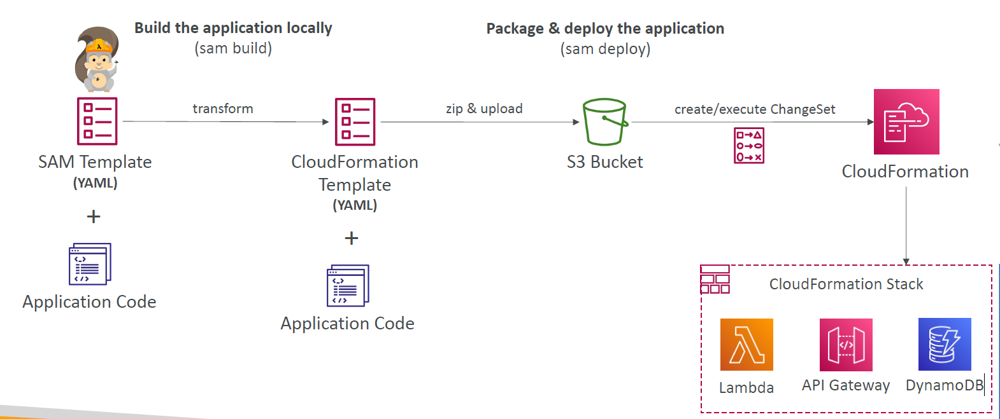
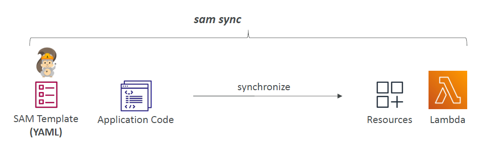
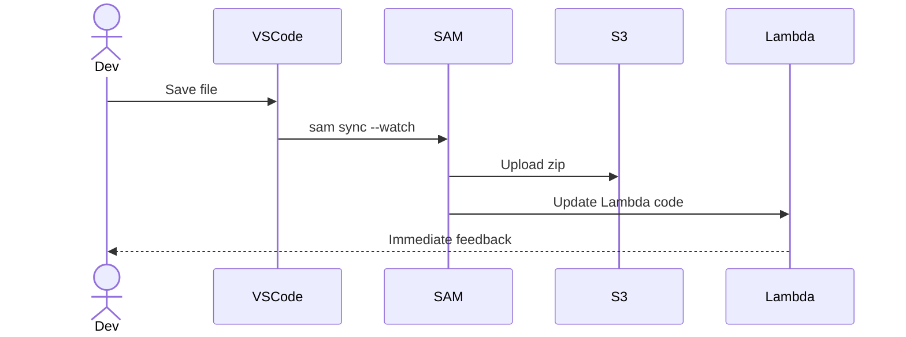

---
tags:
  - aws
  - aws/service
  - aws/domain/developer-tools
  - aws/topic/aws-sam
aliases:
  - "AWS SAM Deployment & SAM Accelerate"
  - "Sam Deployment"
---

# 🚀 **AWS SAM Deployment & SAM Accelerate**

> Learn how AWS SAM transforms your **serverless application code and templates** into live AWS infrastructure — and how to **speed things up** with `sam sync`.

---

  

---

## 🧠 Overview: How AWS SAM Deploys Serverless Apps

AWS SAM (Serverless Application Model) simplifies packaging and deploying serverless applications (Lambda, API Gateway, DynamoDB, etc.) through a **CloudFormation-backed workflow**.

### ⚙️ Full Deployment Lifecycle

1. **📝 SAM Template (YAML)** – Define your Lambda functions, APIs, roles, and DynamoDB tables.
2. **👨‍💻 Application Code** – Your business logic lives beside the template.
3. **🛠️ `sam build`** – Transforms SAM into raw CloudFormation, compiles code, prepares artifacts.
4. **📦 `sam deploy`** – Uploads artifacts (zipped code) to an S3 bucket, executes a CloudFormation ChangeSet.
5. **☁️ CloudFormation Stack** – Deploys your app resources like Lambda, API Gateway, and DynamoDB.

> 🧠 **Note:** CloudFormation acts as the infrastructure orchestrator — but it's not ideal for fast iterative development. That’s where **SAM Accelerate** comes in.

---

## ⚡ **SAM Accelerate with `sam sync` – Instant Deployments**

> **`sam sync`** pushes **only your code** to AWS — skipping CloudFormation for faster feedback loops. Ideal for dev & test environments.

---

    

---

### 🔧 `sam sync` Variants

| Command                                     | Behavior                                                                          |
| ------------------------------------------- | --------------------------------------------------------------------------------- |
| `sam sync`                                  | Sync both **code and infrastructure** (uses CloudFormation if needed)             |
| `sam sync --code`                           | Sync **only code changes** (bypasses CloudFormation)                              |
| `sam sync --code --resource <Type>`         | Sync only resources of a certain **type** (e.g., all `AWS::Serverless::Function`) |
| `sam sync --code --resource-id <LogicalId>` | Sync code for a specific resource using **logical ID** from the template          |
| `sam sync --watch`                          | Auto-sync changes in real time as you edit files                                  |

---

### ✅ Use Cases for Each Option

| Use Case                         | Recommended Command                                            |
| -------------------------------- | -------------------------------------------------------------- |
| Just updated a Lambda function   | `sam sync --code`                                              |
| Testing a single function only   | `sam sync --code --resource-id MyFunction`                     |
| Developing multiple Lambdas      | `sam sync --watch --code --resource AWS::Serverless::Function` |
| Infrastructure or env var change | `sam sync` (uses CloudFormation)                               |

---

## 🧪 Real-World Dev Workflow with `sam sync`

> 💡 This process is way faster than re-deploying through `sam deploy` every time you change a line of code.

---

## 🛠️ Best Practices with SAM Deployment

| Practice                                | Tip                                                      |
| --------------------------------------- | -------------------------------------------------------- |
| ⏱ Use `sam build` before deploying      | Ensures proper packaging of artifacts                    |
| 🪣 Store artifacts in S3                 | Needed for CloudFormation deployment                     |
| 🧪 Use `sam sync` for iterative testing | Pushes only code without waiting for stack updates       |
| 🔐 IAM permissions                      | Make sure your dev role can update Lambda or API Gateway |
| 🧼 Clean up unused stacks               | Use `sam delete` to avoid leftover resources and charges |

---

## 🧩 Summary

| Tool               | Purpose                                            |
| ------------------ | -------------------------------------------------- |
| `sam build`        | Prepare artifacts for deployment (template + code) |
| `sam deploy`       | Full CloudFormation deployment (infra + code)      |
| `sam sync`         | Fast sync of **code and/or infra** (ideal for dev) |
| `sam sync --watch` | Auto-sync code changes in real-time                |

---

> 🧠 Final Tip: Combine **`sam sync` for dev** with **`sam deploy` for staging/prod** for an efficient CI/CD pipeline.
---

## Related Notes
-[[3.5.sam-debugger-examples|Hands-on Tutorial Debugging AWS SAM Applications in VS Code]]] - previous lesson
-[[4.2.sam-and-codedeploy|AWS SAM + CodeDeploy Safe and Smart Lambda Deployments]]] - next lesson
-[[1.1.cfn|AWS CloudFormation]]] - mentions CloudFormation
- [[aws-services/3.network/4.api-gateway/x.api-gateway|Amazon API Gateway Streamlining API Management]] - mentions API Gateway
- [[aws-services/3.network/4.api-gateway/1.1.api-gateway|AWS API Gateway The Front Door for Your APIs]] - mentions API Gateway
- [[aws-daily/aws-architectures/3.1.serverless|Server-Based Architectures vs. Serverless Computing]] - mentions Serverless
-[[1.serverless|The Ultimate Guide to Serverless Computing & Tools]]] - mentions Serverless
- [[aws-services/8.database/dynamodb/ddb-in-depth/1.1.ddb|Deep Dive into AWS DynamoDB]] - mentions DynamoDB
- [[aws-services/8.database/dynamodb/1.1.dynamodb|AWS DynamoDB]] - mentions Dynamodb
-[[2.1.aws-sam|AWS SAM Serverless Application Model]]] - mentions AWS Sam
- [[aws-services/2.security/1.1.iam/1.fundmmentals/1.2.iam|AWS Identity and Access Management IAM]] - mentions IAM

---
