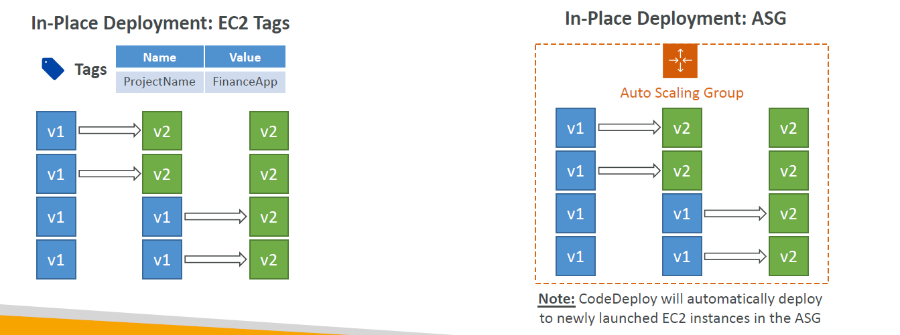
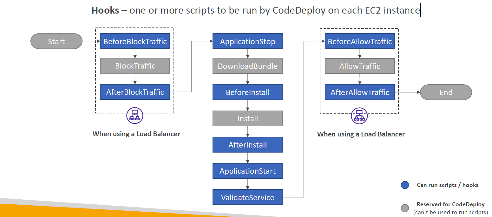
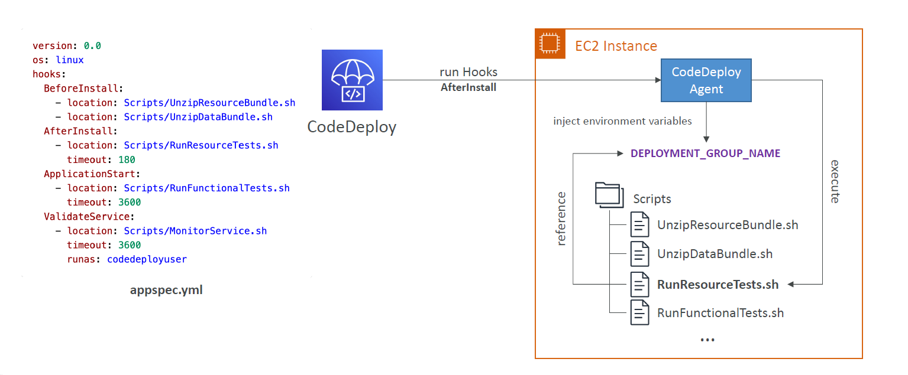
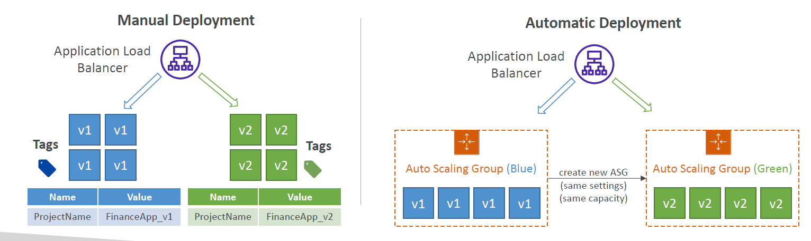
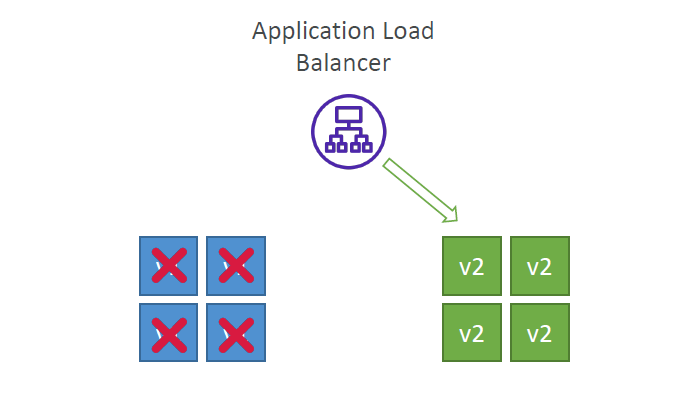
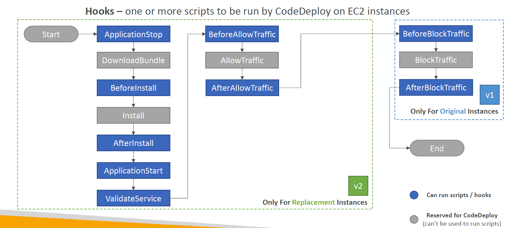
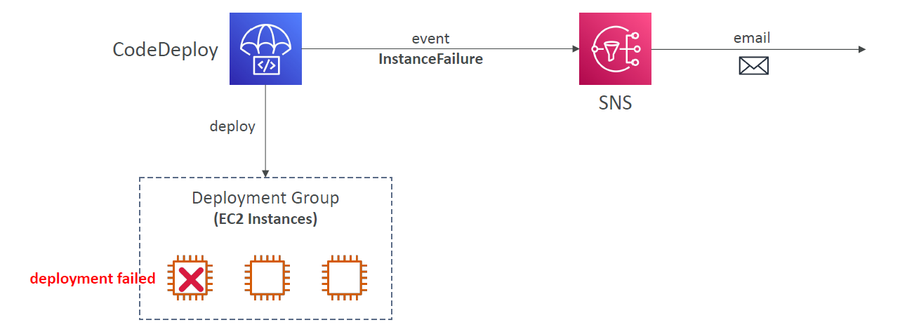

# 🚀 AWS CodeDeploy Deployment Strategies – EC2, Lambda, and ECS

CodeDeploy helps you **automate app deployments** across:

- EC2/on-premises
- Lambda
- ECS

It supports **safe rollbacks, hooks, gradual traffic shifting**, and multiple deployment modes.

---

## 🖥️ EC2 / On-Premises Deployment Strategies

### 🎯 Supported Modes

1. **In-place deployment**
2. **Blue/Green deployment**

---

### 🧩 In-Place Deployment

#### 🔧 How it works:

- Updates happen directly on the **existing EC2 instances**.
- Old app (v1) is stopped ➝ new app (v2) is installed.
- Requires **CodeDeploy agent** on each instance.
- Instances are identified using:

  - **EC2 tags** (e.g. `ProjectName = FinanceApp`)
  - or **Auto Scaling Group (ASG)**

#### 📦 How CodeDeploy works with ASG:

- If instances are replaced (due to scaling or health issues), **new ones get updated automatically**.

#### 💡 Deployment Configurations (Speed):

| Config        | Behavior                     | Downtime   |
| ------------- | ---------------------------- | ---------- |
| `AllAtOnce`   | Update all instances at once | 🔴 Highest |
| `HalfAtATime` | 50% batch update             | 🟡 Medium  |
| `OneAtATime`  | Update 1 instance at a time  | 🟢 Lowest  |
| `Custom`      | Your own percentages/timing  | As defined |

#### 🔁 In-Place Deployment Example (HalfAtATime):



---

### 🔄 In-Place Deployment Lifecycle Hooks (with Load Balancer)

CodeDeploy runs **scripts (hooks)** at different stages.

#### 📜 Hook Execution Order:

```text
(If using Load Balancer)
↓
BeforeBlockTraffic*
BlockTraffic (reserved)
AfterBlockTraffic*
↓
ApplicationStop*
DownloadBundle (reserved)
BeforeInstall*
Install (reserved)
AfterInstall*
ApplicationStart*
ValidateService*
↓
BeforeAllowTraffic*
AllowTraffic (reserved)
AfterAllowTraffic*
```

🎯 _Blue boxes = you can run scripts_

📘 Examples:

- `BeforeInstall`: decrypt files, back up v1
- `AfterInstall`: update config, change permissions
- `ApplicationStart`: restart services
- `ValidateService`: run health checks before re-allowing traffic



---

## 🔵🟢 Blue/Green Deployment (EC2)

### 💡 Key Idea:

Instead of updating **current EC2s**, launch a **new fleet (v2)** and switch traffic from **v1 to v2** using a Load Balancer.

### 🧰 Deployment Modes:

| Mode      | v1/v2 Provisioning    | Notes                                        |
| --------- | --------------------- | -------------------------------------------- |
| Manual    | You tag v1 & v2       | You manage provisioning                      |
| Automatic | CodeDeploy clones ASG | Simpler, CodeDeploy handles scaling, tagging |



### 📤 Blue Instance Termination

After a successful deployment, you have two options:

- **Terminate** blue (v1) instances (default: 1 hr delay, max: 2 days)
- **Keep Alive** (safest, costlier)



---

### 🧩 Blue/Green Deployment Hooks

🟩 v2 instances: Full deployment flow
🟦 v1 instances: Only block traffic



| Hook               | Run On | Description                                      |
| ------------------ | ------ | ------------------------------------------------ |
| ApplicationStop    | v2     | Stop placeholder or default apps                 |
| BeforeInstall      | v2     | Prepare for install (set perms, clear old files) |
| Install            | v2     | Deploy new version (auto by agent)               |
| AfterInstall       | v2     | Final prep (e.g. chmod, config update)           |
| ApplicationStart   | v2     | Start new version                                |
| ValidateService    | v2     | Ensure app is healthy                            |
| BeforeAllowTraffic | v2     | Optional extra health check                      |
| AllowTraffic       | v2     | ELB sends traffic (reserved)                     |
| AfterAllowTraffic  | v2     | Monitor after switch                             |
| BeforeBlockTraffic | v1     | Pre-block logic (e.g. report stats)              |
| BlockTraffic       | v1     | Reserved - LB stops traffic to v1                |
| AfterBlockTraffic  | v1     | Final cleanup                                    |

---

### 📣 CodeDeploy Failure Notifications

Use **SNS triggers** for:

- `DeploymentFailure`
- `InstanceFailure`
- `DeploymentSuccess`

CodeDeploy ➝ SNS ➝ Email/SMS/Slack/etc



---

## 🧬 Lambda Deployment Strategies

CodeDeploy supports **automated traffic shifting for Lambda versions** using aliases (like `PROD`).

### 🎛️ Traffic Shifting Strategies:

| Strategy                   | Description                   |
| -------------------------- | ----------------------------- |
| `AllAtOnce`                | Shift 100% to v2 immediately  |
| `Linear10PercentEvery1Min` | 10% more traffic every minute |
| `Canary10Percent5Minutes`  | 10% for 5 min, then 100%      |

🎯 Fully integrated with **SAM CLI**!



---

## 🚢 ECS Deployment Strategies (Blue/Green)

Only **Blue/Green** is supported for ECS with CodeDeploy.

### ⚙️ How it works:

1. New ECS task definition (v2) is created
2. CodeDeploy launches new tasks in a **green target group**
3. ALB shifts traffic from blue ➝ green
4. Traffic shifting strategy same as Lambda

| Strategy  | Behavior                   |
| --------- | -------------------------- |
| Linear    | Gradual ramp-up over time  |
| Canary    | Small traffic chunk ➝ full |
| AllAtOnce | Immediate switch to v2     |


---

## 📘 Summary

| Platform | Strategies Supported      | Load Balancer Required | Supports Hooks? | Notes           |
| -------- | ------------------------- | ---------------------- | --------------- | --------------- |
| EC2      | In-place, Blue/Green      | Only for LB features   | ✅ Yes          | Most flexible   |
| Lambda   | AllAtOnce, Linear, Canary | ✅ Yes (alias)         | ❌ No           | Alias-based     |
| ECS      | Blue/Green only           | ✅ Yes                 | ✅ Yes          | For Fargate/EC2 |
