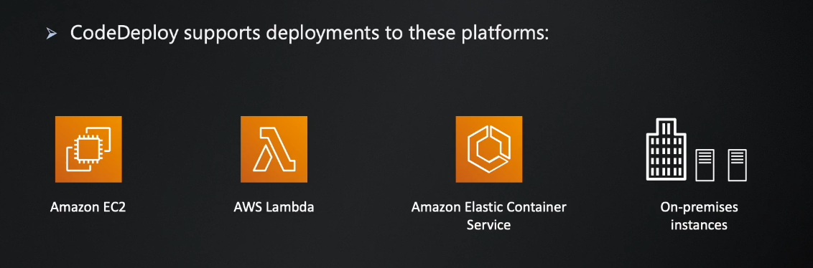
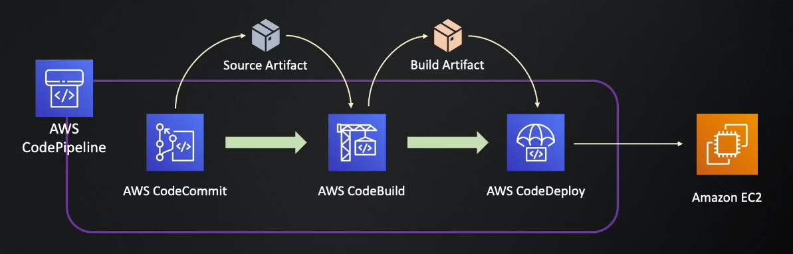
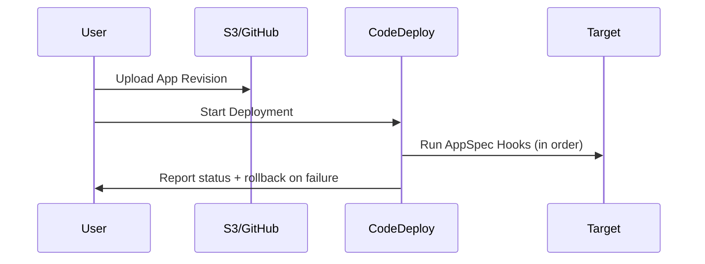

---
tags:
  - aws
  - aws/service
  - aws/domain/developer-tools
  - aws/topic/code-deploy
aliases:
  - "Introduction to AWS CodeDeploy"
  - "Codedeploy"
---

# 🚀 Introduction to AWS CodeDeploy

**AWS CodeDeploy** is a fully managed deployment service that automates software deployments to various compute services such as:

<div style="display: flex; justify-content: center; align-items: center; flex-direction: column;">

<div>

1. 🖥️ EC2 & On-Premises Servers
2. 🧠 AWS Lambda
3. 📦 Amazon ECS (Fargate or EC2 launch type)

</div>


</div>

> 👉 You can create deployments manually using AWS CLI  
> 👉 You can integrate CodeDeploy with AWS CodePipeline

---

## 📦 Why Use CodeDeploy?

| Benefit          | Description                                 |
| ---------------- | ------------------------------------------- |
| ✅ Automation    | Removes manual deployment steps             |
| ⏱️ Zero Downtime | Supports blue/green and rolling updates     |
| 💥 Rollbacks     | Automatic rollback if deployment fails      |
| 💡 Visibility    | Real-time status, logs, and lifecycle hooks |

---

## 📁 CodeDeploy Concepts

A CodeDeploy app includes:

<div align="center">

| Component          | Description                                                                                                                |
| ------------------ | -------------------------------------------------------------------------------------------------------------------------- |
| `Application`      | Main component of CodeDeploy. It represents your CodeDeploy application                                                    |
| `Compute Platform` | The platform CodeDeploy application deploys. E.g., EC2/On-premises, Lambda, ECS.                                           |
| `Deployment Group` | A set of tagged EC2 instances, Lambda aliases, etc.                                                                        |
| `Revision`         | The version of your app containing your source code, deployment scripts and deployment specific file (e.g., `appspec.yml`) |
| `Deployment`       | Execution of the deployment to the deployment group for a specific revision and deployment configuration.                  |

</div>

---

## 📜 What Is AppSpec File?

The `appspec.yml` file defines **how CodeDeploy deploys your application**.

- it has to be in the **root directory** of your source bundle (e.g., `.zip` uploaded to S3)
- For EC2 deployments, it must be `appspec.yml` or `appspec.json`
- For ECS and Lambda deployments, it must be `appspec.yaml` or `appspec.json`

### Sample `appspec.yml` (EC2)

```yaml
version: 0.0
os: linux
files:
  - source: /
    destination: /home/ec2-user/app
hooks:
  BeforeInstall:
    - location: scripts/clean.sh
  AfterInstall:
    - location: scripts/install.sh
  ApplicationStart:
    - location: scripts/start.sh
  ValidateService:
    - location: scripts/verify.sh
```

### AppSpec Hooks Main Phases

<div align="center">

| Hook             | When It Runs                           |
| ---------------- | -------------------------------------- |
| BeforeInstall    | Before file copying begins             |
| AfterInstall     | After files are copied to destination  |
| ApplicationStart | Start application or service           |
| ValidateService  | Final validation (e.g., health checks) |

</div>

---

## 🔄 CodeDeploy Lifecycle

<div align="center">

<div style="text-align: center;">
    
</div>

---



</div>

---

## ✅ Best Practices

| Practice                     | Why It Helps                          |
| ---------------------------- | ------------------------------------- |
| Use AppSpec hooks            | Automate install/start/validate steps |
| Monitor with CloudWatch      | Alert and log failed deployments      |
| Use blue/green when possible | Avoid downtime and simplify rollback  |
| Use CodePipeline             | Simplify orchestration and visibility |

---

## 📌 Summary

- AWS CodeDeploy helps automate reliable deployments to `EC2`, `Lambda`, `ECS`, and `on-prem`
- It uses a YAML file (`appspec.yml`) to define your deployment lifecycle
- Works well with CodePipeline, CodeBuild, S3, and GitHub
- Supports `rollback`, `blue/green deployments`, and `lifecycle hooks`
---

## Related Notes
- [[aws-services/10.developer/2.3.code-deploy/|AWS CodeDeploy Deployment Strategies EC2 Lambda and ECS]] - folder map
- [[aws-services/10.developer/2.3.code-deploy/1.2.code-deploy-deployments-strategies|AWS CodeDeploy Deployment Strategies Per Platform]] - next lesson
- [[aws-services/10.developer/2.1.code-pipeline/1.1.what-is-aws-code-pipeline|AWS CodePipeline]] - mentions AWS CodePipeline
- [[aws-services/10.developer/2.3.code-deploy/4.1.1.ec2-deployments|AWS CodeDeploy with EC2 Deployments]] - mentions EC2 Deployments
- [[aws-services/5.compute/1.3.ec2-auto-scaling/4.1.lifecycle-hooks|EC2 Auto Scaling Lifecycle Hooks Pause Prepare Proceed]] - mentions Lifecycle Hooks
- [[aws-services/10.developer/2.2.code-build/1.1.codebuild|How AWS CodeBuild Works Internally]] - mentions Codebuild
- [[aws-services/10.developer/2.3.code-deploy/x.2.1.appspec|AWS CodeDeploy appspec.yml Full Syntax & Usage Guide]] - mentions Appspec
- [[aws-services/10.developer/1.1.aws-cli/aws-cli|AWS Cli]] - mentions AWS Cli
- [[aws-services/6.containers/2.ecs/1.1.ecs|Amazon ECS Elastic Container Service]] - mentions ECS

---
