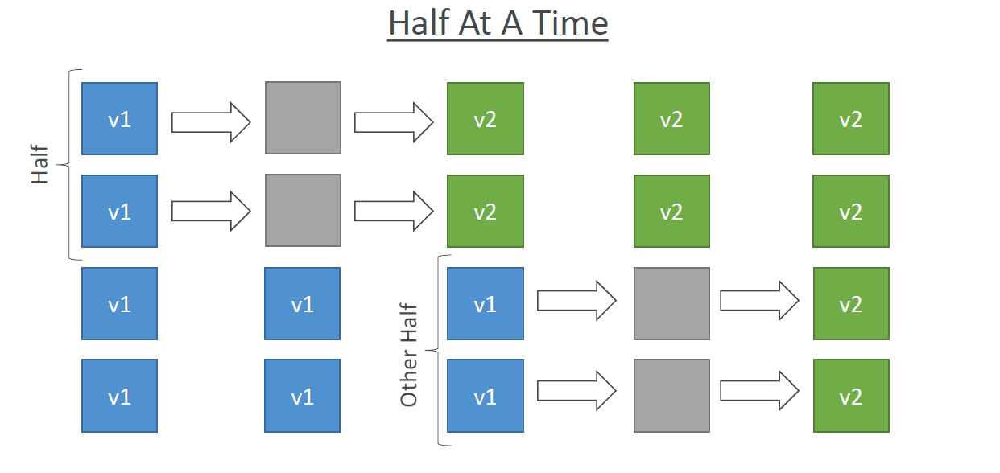
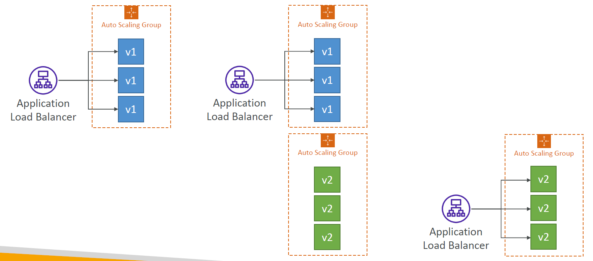
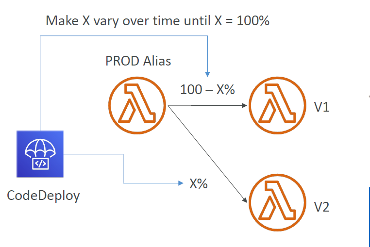
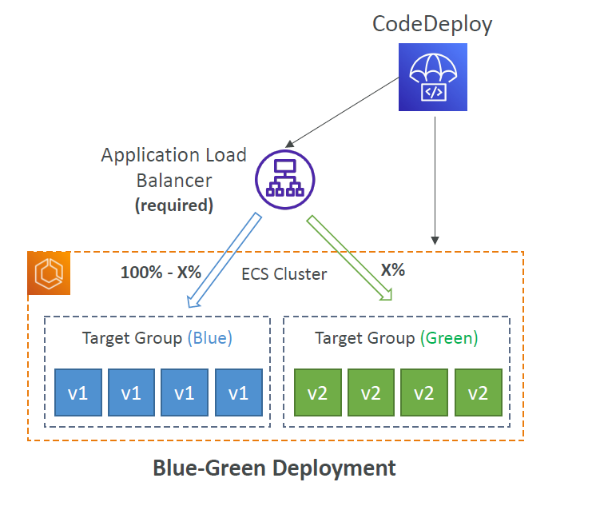

---
tags:
  - aws
  - aws/service
  - aws/domain/developer-tools
  - aws/topic/code-deploy
aliases:
  - "AWS CodeDeploy Deployment Strategies Per Platform"
  - "Code Deploy Deployments Strategies"
---

# 🚀 AWS CodeDeploy Deployment Strategies (Per Platform)

CodeDeploy helps you upgrade your application from version `v1` to `v2` — safely and automatically — across various compute platforms.

## 🤔 The Problem

You have `v1` of your app deployed on some compute platform (EC2, Lambda, ECS), and you want to:

- Upgrade to `v2`
- Avoid downtime
- Rollback if something breaks
- Control **how fast** and **where** traffic switches

## 🧩 Supported Deployment Targets

<div style="display: flex; justify-content: center; align-items: center; flex-direction: column;">

<div>

1. 🖥️ EC2 & On-Premises Servers
2. 🧠 AWS Lambda
3. 📦 Amazon ECS (Fargate or EC2 launch type)

</div>


</div>

---

## 🖥️ 1. EC2 / On-Premises Deployments

### ✅ Use Case:

You run a traditional web app on EC2 (or hybrid/on-prem servers) and want to push version updates safely.

### ⚙️ Requirements:

- Install **CodeDeploy Agent** on EC2/servers
- Grant **IAM role** with S3 and CodeDeploy permissions
- Store application revision in S3

### 📦 Deployment Types:

#### 1. **`In-Place Deployment`** (aka Rolling):

<div style="text-align: left;">
    
</div>

Reuses same EC2s. CodeDeploy agent:

- Stops app
- Installs v2
- Restarts app

💥 App is temporarily **unavailable** on that instance.

**Strategies**:

| Strategy      | Description           | Impact            |
| ------------- | --------------------- | ----------------- |
| `AllAtOnce`   | All instances at once | Fast but risky    |
| `HalfAtATime` | 50% → then next 50%   | Balanced          |
| `OneAtATime`  | Serial, 1-by-1        | Slow, safest      |
| `Custom`      | Your own % splits     | Highly controlled |

#### 🔄 Example (HalfAtATime):

```text
v1 running on 4 EC2s
→ Take 2 down → upgrade to v2 → bring up
→ Take other 2 → upgrade → done
```

#### 2. **`Blue/Green Deployment`**:

<div style="text-align: left;">
    
</div>

Creates **new EC2s (Auto Scaling Group)** with v2, then switches **ALB** to point to the new group.

**Pros**:

- No impact on existing infra
- Fast rollback (just re-point to v1 group)

---

## 🧠 2. Lambda Deployments

<div style="text-align: left;">
    
</div>

### ✅ Use Case:

Deploying Lambda versions using aliases like `PROD`, and safely shifting traffic from v1 to v2.

### 📦 Deployment Type: **Traffic Shifting**

AWS uses **Lambda aliases** and controls where the alias routes traffic:

- v1 ← current PROD
- v2 ← new version

CodeDeploy slowly shifts alias `PROD` from v1 → v2

### 🚦 Deployment Strategies:

| Strategy                        | Behavior                           |
| ------------------------------- | ---------------------------------- |
| `AllAtOnce`                     | Instant switch to v2               |
| `Linear10PercentEvery1Minute`   | 10% more every minute until 100%   |
| `Linear10PercentEvery10Minutes` | Slower gradual shift               |
| `Canary10Percent5Minutes`       | 10% for 5 mins → 100% if no issues |
| `Canary10Percent30Minutes`      | Same but slower                    |

🎯 Ideal when:

- You want to **test a new Lambda** in PROD gradually
- **Roll back** automatically if errors spike

---

## 📦 3. Amazon ECS Deployments (Blue/Green Only)

### ✅ Use Case:

<div style="text-align: left;">
    
</div>

---

You’re running ECS services and want safe, zero-downtime updates to new task definitions.

### 🧱 Requirements:

- ALB setup
- Service must use a **load balancer**
- ECS task definitions ready (v1, v2)

### 🌀 How It Works:

1. Existing ECS tasks (v1) in a target group
2. New ECS task definition deployed as **v2**
3. ALB switches traffic **from v1 → v2**
4. CodeDeploy manages traffic routing and rollback

### 🚦 Deployment Strategies (Same as Lambda):

| Strategy    | Behavior                           |
| ----------- | ---------------------------------- |
| `AllAtOnce` | ALB moves all traffic instantly    |
| `Canary`    | 10% traffic first, then full       |
| `Linear`    | Gradual % increase every N minutes |

🎯 Ideal when:

- Updating microservices in ECS
- Need minimal downtime & rollback

---

## 🧪 Summary Table

| Platform      | Deployment Types     | Deployment Strategies                      |
| ------------- | -------------------- | ------------------------------------------ |
| EC2 / On-Prem | In-Place, Blue/Green | AllAtOnce, HalfAtATime, OneAtATime, Custom |
| Lambda        | Traffic Shifting     | Canary, Linear, AllAtOnce                  |
| ECS           | Blue/Green only      | Canary, Linear, AllAtOnce                  |

---

## 🧠 Bonus: Rollbacks, Monitoring, and Hooks

- ✅ CodeDeploy auto-rollbacks on:

  - Deployment failure
  - CloudWatch Alarms
  - Manual cancel

- 🪝 Customize with `appspec.yml` lifecycle hooks
- 🔎 Monitor via CodeDeploy console, CloudWatch, or SNS

---

## 📌 Real Use Case

You deploy Angular on EC2 behind ALB → use **HalfAtATime** to ensure one AZ is always up.

Or for Lambda-based APIs → use **Canary10Percent30Minutes** to validate error rates before full shift.

Or for containerized apps → use **ECS Blue/Green** to safely roll out a new container image version via ALB target groups.
---

## Related Notes
- [[aws-services/10.developer/2.3.code-deploy/|AWS CodeDeploy Deployment Strategies EC2 Lambda and ECS]] - folder map
- [[aws-services/10.developer/2.3.code-deploy/1.1.codedeploy|Introduction to AWS CodeDeploy]] - previous lesson
- [[aws-services/10.developer/2.3.code-deploy/1.3.ec2-deployment-hooks|EC2 Deployment Hooks]] - next lesson
- [[aws-services/10.developer/2.3.code-deploy/6.ecs-deployments|ECS Deployments]] - mentions ECS Deployments
- [[aws-services/5.compute/1.3.ec2-auto-scaling/4.1.lifecycle-hooks|EC2 Auto Scaling Lifecycle Hooks Pause Prepare Proceed]] - mentions Lifecycle Hooks
- [[aws-services/10.developer/2.3.code-deploy/x.2.1.appspec|AWS CodeDeploy appspec.yml Full Syntax & Usage Guide]] - mentions Appspec
- [[aws-services/7.application-integration/sns/1.sns|Amazon SNS The Clouds Pub/Sub Notification Engine]] - mentions SNS
- [[aws-services/2.security/1.1.iam/1.fundmmentals/1.2.iam|AWS Identity and Access Management IAM]] - mentions IAM
- [[aws-services/6.containers/2.ecs/1.1.ecs|Amazon ECS Elastic Container Service]] - mentions ECS

---
