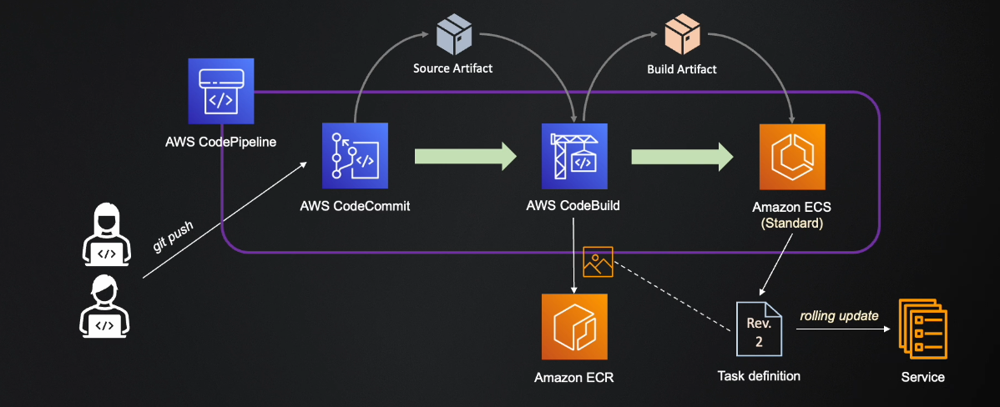

---
tags:
  - aws
  - aws/service
  - aws/domain/developer-tools
  - aws/topic/code-deploy
aliases:
  - "ECS Deployments"
---

<!--  -->
<!--  -->
---

## Related Notes
- [[aws-services/10.developer/2.3.code-deploy/|AWS CodeDeploy Deployment Strategies EC2 Lambda and ECS]] - folder map
- [[aws-services/10.developer/2.3.code-deploy/5.lambda-deployment|Lambda Deployment]] - previous lesson
- [[aws-services/10.developer/2.3.code-deploy/7.integration-with-cfn|Using CloudFormation in CodePipeline to Create & Destroy Staging Environments]] - next lesson

---
