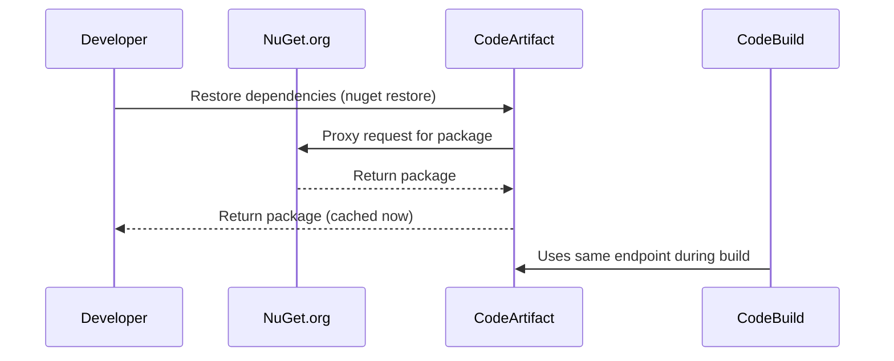

# 📦 AWS CodeArtifact – What, Why, When, How (for Real Projects)

> **AWS CodeArtifact** is a **fully managed private artifact repository** — similar to **Nexus** or **JFrog Artifactory** — used to store **software packages** (like NuGet, npm, pip, Maven, etc.) that your apps depend on.

Think of it as your **internal version of NuGet.org**, **npmjs.com**, or **PyPI**, where:

- You can **store, share, and retrieve** packages for your team or organization.
- You can **proxy public repositories** to fetch external packages (like from NuGet.org) and **cache** them.
- You can **store internal packages** like shared libraries you’ve written across teams.

---

## ❓ **Why Do You Need It?**

Here’s why you'd want to use it instead of relying only on public repositories:

| Reason                            | Explanation                                                                                                    |
| --------------------------------- | -------------------------------------------------------------------------------------------------------------- |
| ✅ **Private packages**           | You want to **create and reuse internal libraries** across services and teams securely.                        |
| 🌐 **Caching of public packages** | Speeds up builds by **caching dependencies** from NuGet/npm/PyPI. Protects you if the public repo is down.     |
| 🔒 **Security**                   | You want to **control what gets installed**, prevent malicious packages, or enforce **license compliance**.    |
| 🧾 **Auditing**                   | Track **who published what**, **when**, and from where.                                                        |
| 🧪 **Consistency**                | Avoid “it worked yesterday” bugs due to new versions in public repos. Lock or mirror only what’s approved.     |
| 📁 **Multi-account repo sharing** | You have multiple AWS accounts or environments (dev, staging, prod) and want to **share dependencies easily**. |

> 💡 Even if you're using **only public NuGet packages**, CodeArtifact can act as a **proxy cache**, giving you **faster, more secure, and more reliable builds**.

---

## 📆 **When Should You Use CodeArtifact?**

Use CodeArtifact **if any of these are true**:

| Situation                                             | Use CodeArtifact?                                       |
| ----------------------------------------------------- | ------------------------------------------------------- |
| 🧪 You have internal shared libraries                 | ✅ Yes, use it to publish/reuse across teams            |
| 🌐 You want to cache public packages                  | ✅ Yes, configure CodeArtifact to proxy NuGet/npm       |
| 🧑‍💻 You're using CodeBuild / CI/CD in AWS           | ✅ Yes, it integrates natively                          |
| 🧾 You need audit logs of published packages          | ✅ Yes, logs everything                                 |
| 💡 You're a solo developer using only public packages | ❌ Not needed unless caching or security matters to you |

---

## ⚙️ **How Does It Work?** (Simple Flow)

Here’s how CodeArtifact typically works with .NET / NuGet:

> ✅ Once a package is cached, all future builds use the cached version — reducing build time and ensuring availability.

---

## 🔄 CodeArtifact vs Nexus / Artifactory

| Feature                         | AWS CodeArtifact               | Nexus / JFrog Artifactory       |
| ------------------------------- | ------------------------------ | ------------------------------- |
| Fully managed                   | ✅ Yes                         | ❌ No (you must host/manage it) |
| AWS-native integration          | ✅ IAM, CodeBuild, EventBridge | ❌ Needs custom config          |
| Supports public repo proxying   | ✅ Yes                         | ✅ Yes                          |
| Supports multiple package types | ✅ npm, Maven, NuGet, pip      | ✅ Even more (like Docker)      |
| Cost                            | Pay-as-you-go                  | May be free or licensed         |
| CI/CD integration               | ✅ Native with CodePipeline    | ✅ With setup                   |

---

## 📦 Real Example – NuGet with CodeArtifact

Let’s say you build 3 .NET apps that all use a shared `CommonUtils.dll`.

You can:

1. Build and publish `CommonUtils` to CodeArtifact.
2. In your other apps, reference `CommonUtils` from CodeArtifact instead of building it every time.
3. Lock the version so everyone uses the same tested version.
4. Use EventBridge to notify teams when new versions are published.

> 🔄 This avoids “dependency hell” and keeps your development clean and fast.

---

## 🧠 Summary – When to Use CodeArtifact

| Use Case                                        | Use CodeArtifact?                                |
| ----------------------------------------------- | ------------------------------------------------ |
| You publish or share private packages           | ✅ Yes                                           |
| You want faster, safer builds via caching       | ✅ Yes                                           |
| You want audit/security for dependencies        | ✅ Yes                                           |
| You are fine relying on public repos directly   | ❌ Maybe skip it                                 |
| You already use Nexus and don’t want to migrate | ❌ Keep using Nexus unless you move fully to AWS |
