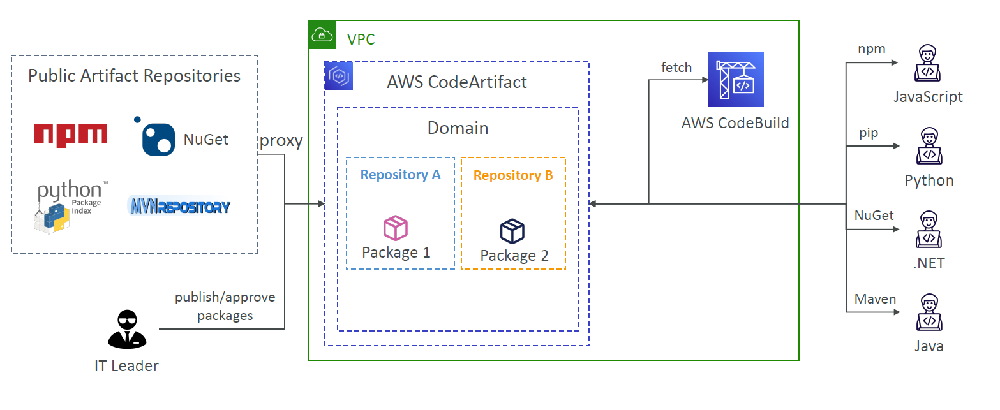
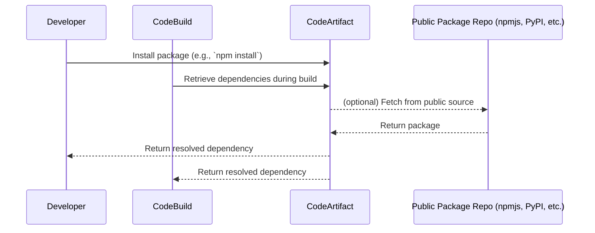
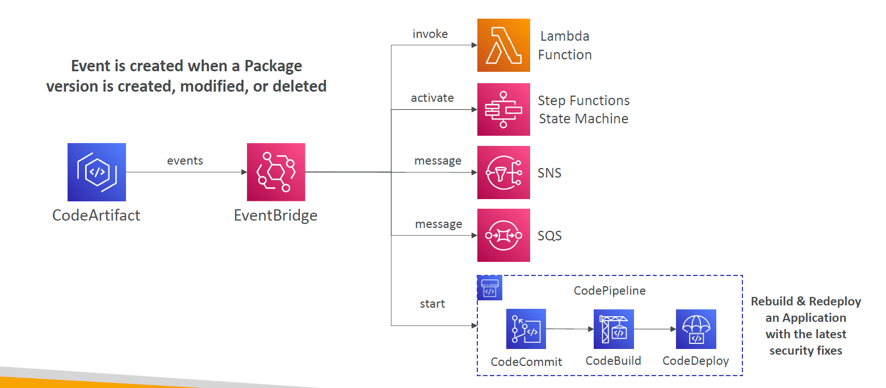
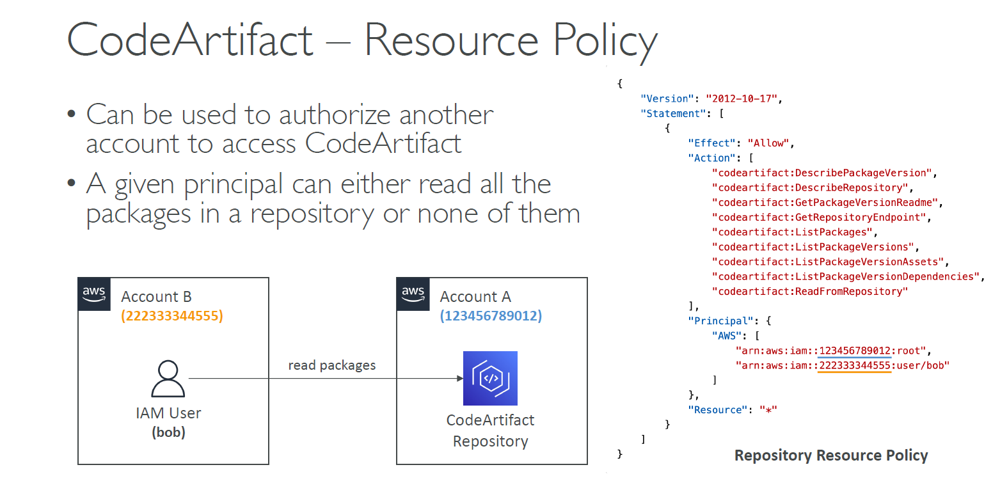

# 📦 **AWS CodeArtifact**

## 🧠 What Is AWS CodeArtifact?

> **AWS CodeArtifact** is a fully managed **artifact repository service** that makes it easy to store, share, and retrieve **software packages** used in your applications.

<div style="text-align: center;">
    
</div>

---

In modern software development, your code often depends on third-party libraries or internal modules. These are known as **artifacts** or **dependencies**.

Traditionally, you needed to host and manage your own artifact server (e.g., Nexus, Artifactory). But with **CodeArtifact**, AWS provides this for you — secure, serverless, and pay-as-you-go!

---

## 🔧 CodeArtifact Supports Popular Tools

| Ecosystem      | Package Managers Supported |
| -------------- | -------------------------- |
| **Java**       | `Maven`, `Gradle`          |
| **JavaScript** | `npm`, `yarn`              |
| **Python**     | `pip`, `twine`             |
| **.NET**       | `NuGet`                    |

> 🛠️ Your developers or CI/CD tools like **AWS CodeBuild** can fetch and publish packages using standard tooling.

---

## 🔄 How It Works – Simplified Flow

<div align="center">



</div>

---

## 🔁 Integration with AWS EventBridge

CodeArtifact can emit **events** to **Amazon EventBridge**, allowing you to automate workflows like:

| Event Type                | Use Case                                 |
| ------------------------- | ---------------------------------------- |
| `PackageVersionPublished` | Notify team when a new version is pushed |
| `PackageVersionDeleted`   | Audit or trigger cleanup                 |
| `RepositoryCreated`       | Trigger setup for new teams              |

---

```json
{
  "source": ["aws.codeartifact"],
  "detail-type": ["Package Version Published"],
  "detail": {
    "packageFormat": "npm",
    "packageNamespace": "mycompany",
    "packageName": "mylib"
  }
}
```

> 📩 Send the event to **SNS**, trigger a **Lambda**, or forward to **Slack/Teams** via a webhook.

---

<div style="text-align: center;">
    
</div>

---

## 🛡️ Access Control via Resource Policies

You can grant access to **other AWS accounts** using **CodeArtifact resource policies**.

| Use Case                                           | Action                                             |
| -------------------------------------------------- | -------------------------------------------------- |
| Allow another account to read from your repository | Use a **resource policy** targeting that account   |
| Limit access per principal                         | All-or-nothing per repository (read/write or deny) |

```json
{
  "Effect": "Allow",
  "Principal": {
    "AWS": "arn:aws:iam::123456789012:role/CI-BuildRole"
  },
  "Action": [
    "codeartifact:GetPackageVersionReadme",
    "codeartifact:GetRepositoryEndpoint",
    "codeartifact:ReadFromRepository"
  ],
  "Resource": "*"
}
```

---

<div style="text-align: center;">
    
</div>

---

## 🏗️ Use Case in CI/CD Pipeline

1. **Developer** commits code.
2. **CodeBuild** installs dependencies from CodeArtifact.
3. Build passes, **CodeBuild publishes new internal library** to CodeArtifact.
4. EventBridge detects publish → notifies teams or triggers next step.

---

## 💡 Benefits of CodeArtifact

✅ **No server maintenance** – fully managed
✅ **Secure** with IAM and resource policies
✅ **Pay-as-you-go** – pay only for storage & retrieval
✅ **Supports public + private dependencies**
✅ **Deep integration** with CodeBuild, EventBridge, and CLI

---

## 🔐 Authentication Options

- **AWS CLI login** using a temporary token
- **Configure your package manager** with endpoint and auth token
- Integrate with **IAM roles in CodeBuild or EC2**

```bash
aws codeartifact get-authorization-token \
  --domain my-domain \
  --domain-owner 123456789012 \
  --query authorizationToken \
  --output text
```

---

## 📚 Summary

| Feature               | CodeArtifact Supports             |
| --------------------- | --------------------------------- |
| Artifact management   | ✅ (npm, Maven, NuGet, pip, etc.) |
| CI/CD integration     | ✅ (CodeBuild, CLI, SDK)          |
| Multi-account sharing | ✅ (via resource policies)        |
| Automation            | ✅ (EventBridge triggers)         |
| Security              | ✅ IAM-based, SSE encryption      |

> 🚀 CodeArtifact is a great choice for **cloud-native teams** who want to streamline dependency management without managing external artifact servers.
