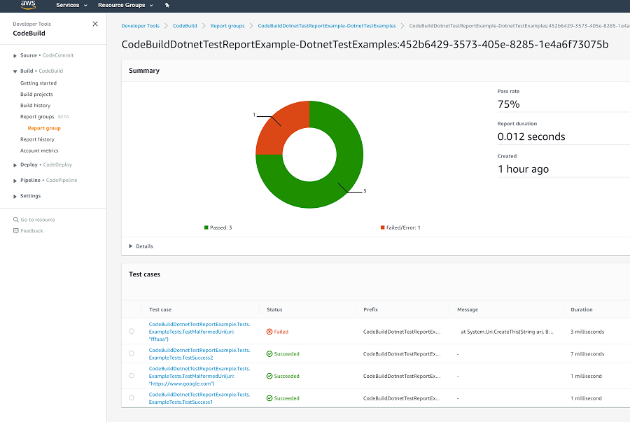

---
tags:
  - aws
  - aws/service
  - aws/domain/developer-tools
  - aws/topic/code-build
aliases:
  - "AWS CodeBuild buildspec.yml"
  - "Buildspec.Yml"
---

# 📘 **AWS CodeBuild `buildspec.yml`**

> A `buildspec.yml` is a YAML file that tells AWS CodeBuild what to do at every step of the build lifecycle: from setting env variables, to installing packages, running tests, generating artifacts, reports, and caching files.

---

## 🗂️ **File Name & Location**

### 🔹 Default

- File name: `buildspec.yml`
- Location: root of your source repo

### 🔹 Custom Location or Name

You can override it using:

| Method                | How                                                                     |
| --------------------- | ----------------------------------------------------------------------- |
| **AWS CLI / SDK**     | `--buildspec-override` or `buildspecOverride`                           |
| **CodeBuild Console** | Specify custom path during project creation                             |
| **CloudFormation**    | Use `Source.BuildSpec` relative to `CODEBUILD_SRC_DIR`                  |
| **S3 File**           | Must be in the same region, and use ARN like `arn:aws:s3:::bucket/path` |

---

## 🧠 **Syntax Basics**

```yaml
version: 0.2

run-as: Linux-user-name

env:
  shell: <shell-tag>
  variables:
    key1: "value1"
    key2: "value2"
  parameter-store:
    key1: "value1"
    key2: "value2"
  exported-variables:
    - variable
    - variable
  secrets-manager:
    key: secret-id:json-key:version-stage:version-id
  git-credential-helper: no | yes

proxy:
  upload-artifacts: no | yes
  logs: no | yes

batch:
  fast-fail: false | true
  # build-list:
  # build-matrix:
  # build-graph:
  # build-fanout:

phases:
  install:
    run-as: Linux-user-name
    on-failure: ABORT | CONTINUE | RETRY | RETRY-count | RETRY-regex | RETRY-count-regex
    runtime-versions:
      runtime: version
      runtime: version
    commands:
      - command
      - command
    finally:
      - command
      - command

  pre_build:
    run-as: Linux-user-name
    on-failure: ABORT | CONTINUE | RETRY | RETRY-count | RETRY-regex | RETRY-count-regex
    commands:
      - command
      - command
    finally:
      - command
      - command

  build:
    run-as: Linux-user-name
    on-failure: ABORT | CONTINUE | RETRY | RETRY-count | RETRY-regex | RETRY-count-regex
    commands:
      - command
      - command
    finally:
      - command
      - command

  post_build:
    run-as: Linux-user-name
    on-failure: ABORT | CONTINUE | RETRY | RETRY-count | RETRY-regex | RETRY-count-regex
    commands:
      - command
      - command
    finally:
      - command
      - command

reports:
  report-group-name-or-arn:
    files:
      - location
      - location
    base-directory: location
    discard-paths: no | yes
    file-format: report-format

artifacts:
  files:
    - location
    - location
  name: artifact-name
  discard-paths: no | yes
  base-directory: location
  exclude-paths: excluded paths
  enable-symlinks: no | yes
  s3-prefix: prefix
  secondary-artifacts:
    artifactIdentifier:
      files:
        - location
        - location
      name: secondary-artifact-name
      discard-paths: no | yes
      base-directory: location
    artifactIdentifier:
      files:
        - location
        - location
      discard-paths: no | yes
      base-directory: location

cache:
  key: key
  fallback-keys:
    - fallback-key
    - fallback-key
  action: restore | save
  paths:
    - path
    - path
```

---

## 🏃‍♂️‍➡️ **Section 1: Runtime Versions**

### 📌 version _(Required)_

| Version | Changes                                                                                                  |
| ------- | -------------------------------------------------------------------------------------------------------- |
| 0.1     | Each command runs in a separate shell session. Cannot share `cd`, `export`, etc.                         |
| 0.2     | All commands run in the **same shell session**, supports `finally`, `on-failure`, and exported variables |

> ✅ Always use `version: 0.2`

### 📌 run-as _(Optional)_

Available to `Linux users only`. Specifies a Linux user that runs commands in this buildspec file. **run-as** grants the specified user read and run permissions. When you specify **run-as** at the top of the buildspec file, it applies globally to all commands. If you don't want to specify a user for all buildspec file commands, you can specify one for commands in a phase by using **run-as** in one of the **phases** blocks. If **run-as** is not specified, then all commands run as the root user.

## 🌱 **Section 2: Environment Variables**

Represents information for one or more custom environment variables.

```yaml
env:
  shell: bash

  variables:
    NODE_ENV: "production"

  parameter-store:
    LOGIN_PASSWORD: "/myapp/dockerPassword"

  secrets-manager:
    DB_PASSWORD: "ProdSecrets:db_pass"

  exported-variables:
    - DOCKER_IMAGE_URI
```

> ⚠️ Secrets stored in SSM/Secrets Manager are masked in logs.  
> 🚨 Do NOT use `CODEBUILD_` prefix — it's reserved.

### 📌 1. Shell _(Optional)_

Optional sequence. Specifies the supported shell for Linux or Windows operating systems.

- For Linux operating systems, supported shell tags are:

  - **bash**
  - **/bin/sh**

- For Windows operating systems, supported shell tags are:

  - **powershell.exe**
  - **cmd.exe**

### 📌 2. variables _(Required if env is specified)_

Contains a mapping of **key/value** scalars, where each mapping represents a single custom environment variable in plain text

> ⚠️ Important:
>
> - Any environment variables you set replace existing environment variables. For example, if the Docker image already contains an environment variable named **MY_VAR** with a value of **my_value**, and you set an environment variable named **MY_VAR** with a value of **other_value**, then **my_value** is replaced by **other_value**.
> - Do NOT use `CODEBUILD_` prefix — it's reserved.
> - For sensitive values, we recommend that you use `parameter-store` or `secrets-manager` mapping instead
> - Secrets stored in SSM/Secrets Manager are masked in logs.

### 📌 3. parameter-store _(Required if env is specified)_

Contains a mapping of **key/value** scalars, where each mapping represents a single custom environment variable stored in **Amazon EC2 Systems Manager Parameter Store**.

### 📌 4. secrets-manager _(Required if env is specified)_

Specify a Secrets Manager reference-key using the following pattern:

- `<Key>` : `<secret-id>:<json-key>:<version-stage>:<version-id>`
- `<Key>` _(required)_ : The local environment variable name.
- `<secret-id>` _(required)_ : the **ARN** of the secret.
- `<json-key>` _(optional)_ : The json key for the secret. _(If you do not specify a json-key, CodeBuild retrieves the entire secret text.)_
- `<version-stage>` _(optional)_ : staging label attached to the version.

  - Staging labels are used to keep track of different versions during the rotation process.
  - If you use version-stage, don't specify version-id. If you don't specify a version stage or version ID, the default is to retrieve the version with the version stage value of AWSCURRENT. the default is to retrieve the version with the version stage value of .

- `<version-id>` _(optional)_ : the unique identifier of the version of the secret that you want to use.

```yaml
env:
  secrets-manager:
    LOCAL_SECRET_VAR: "TestSecret:MY_SECRET_VAR"
```

### 📌 4. exported-variables _(Optional)_

- Used to list environment variables you want to export.

- Exported environment variables are used in conjunction with AWS CodePipeline to export environment variables from the current build stage to subsequent stages in the pipeline. For more information, see [Working with variables in the AWS CodePipeline User Guide.](https://docs.aws.amazon.com/codepipeline/latest/userguide/actions-variables.html).

> ⚠️ The following cannot be exported:
>
> - Environment variables that start with **AWS\_**.
> - Amazon EC2 Systems Manager Parameter Store secrets specified in the build project.
> - Secrets Manager secrets specified in the build project

---

## 🔀 **Section 3: Proxy Settings**

Used to represent settings if you run your build in an explicit proxy server. For more information, see Run CodeBuild in an explicit proxy server.

### 📌 upload-artifacts _(Optional)_

Set to yes if you want your build in an explicit proxy server to upload artifacts. **The default is no**.

### 📌 logs _(optional)_

Set to yes for your build in a explicit proxy server to create CloudWatch logs. **The default is no**.

## 🏗️ **Section 4: Build Phases**

### 📌 Phases in Order

| Phase           | Description                     |
| --------------- | ------------------------------- |
| 1️⃣ `install`    | Install tools, dependencies     |
| 2️⃣ `pre_build`  | Setup auth, configs             |
| 3️⃣ `build`      | Compile, test, main logic       |
| 4️⃣ `post_build` | Notifications, uploads, cleanup |

Each phase supports:

- `run-as`
- `on-failure`: `ABORT`, `CONTINUE`, `RETRY`, `RETRY-3`, `RETRY-3-.*connection.*`
- `commands`: required if phase is used
- `finally`: always runs, even if `commands` fails

### ✍️ Example

```yaml
phases:
  install:
    runtime-versions:
      java: corretto11
      python: 3.10
    commands:
      - echo Installing tools
    finally:
      - echo Cleanup

  pre_build:
    commands:
      - echo Logging into Docker
      - docker login -u $USER -p $LOGIN_PASS

  build:
    commands:
      - mvn install

  post_build:
    commands:
      - aws s3 cp output.zip s3://my-bucket/
```

---

## 🧪 **Section 5: Reports**

The `reports` section is used to **collect, format, and publish test results or coverage reports** from your build to **AWS CodeBuild Report Groups**.

### ✅ It enables:

- ✅ Viewing test results in the **AWS Console**
- ✅ Storing raw test result files in **S3**
- ✅ Using **CodeBuild Report Groups** for CI feedback (pass/fail, coverage %, etc.)
- ✅ Integrating with **AWS DevOps tools** like CodePipeline or CodeGuru

---

### 🧠 Why Use It?

Let’s say you run **unit tests** or **integration tests** as part of your build (e.g., with JUnit or pytest). Normally, you’d just log the results to the console — but that doesn’t help:

- You can’t easily **track failed tests**
- No summary or history
- No test reports in GUI
sssssssssssssssss
With `reports`, you tell CodeBuild:

> "Hey AWS, here’s my test output — collect it, interpret it, and show me a nice test dashboard."

---

<div style="text-align: center;">
    
</div>

---

### 📌 report-group-name-or-arn _(Optional sequence)_

- Specifies the report group that the reports are sent to
- A project can have a maximum of five report groups.

#### 👉 files _(Required sequence)_

- Represents the locations that contain the raw data of test results generated by the report.

#### 👉 base-directory _(Optional)_

Represents one or more top-level directories, relative to the original build location, that CodeBuild uses to determine where to find the raw test files.

#### 👉 discard-paths _(Optional)_

- `yes` = flatten structure

#### 👉 file-format _(Optional)_

- **Test Reports**: `JUNITXML`, `CUCUMBERJSON`, `NUNITXML`, `TESTNGXML`
- **Coverage Reports**: `COBERTURAXML`, `CLOVERXML`, `JACOCOXML`, `SIMPLECOV`

---

### ✍️ **Example**

```yaml
reports:
  reportGroupJunit: # ⬅️ logical name (must match a report group)
    files:
      - "**/*.xml" # ⬅️ where to find test result files (e.g., JUnit XMLs)
    base-directory: test-reports # ⬅️ optional: directory where the above files live
    discard-paths: no # ⬅️ whether to flatten the folder structure in S3
    file-format: JUNITXML # ⬅️ tells AWS how to parse the results
```

---

### 📊 What Does It Look Like in the Console?

Once it’s working, you’ll see this in the **CodeBuild console**:

- A **"Reports" tab** per build
- ✅ Test summaries: total passed/failed/skipped
- 📈 Graphs for code coverage (if supported)
- 🗂️ Access to raw test files in S3 (managed by CodeBuild)

---

## 📦 **Section 6: Artifacts** _(Optional sequence)_

Represents information about where CodeBuild can find the build output and how CodeBuild prepares it for uploading to the S3 output bucket.

### 🔹 Basic Usage

```ini
.
├── my-build-1
│   └── my-file-1.txt
└── my-build-2
    ├── my-file-2.txt
    └── my-subdirectory
        └── my-file-3.txt
```

- Example 1

  ```yaml
  artifacts:
    files:
      - "*/my-file-3.txt"
    base-directory: my-build-2
  ```

  ```ini
  # Output
  .
  └── my-subdirectory
      └── my-file-3.txt
  ```

- Example 2

  ```yaml
  artifacts:
    files:
      - "**/*"
    base-directory: "my-build*"
    discard-paths: yes
  ```

  ```ini
  # Output
  .
  ├── my-file-1.txt
  ├── my-file-2.txt
  └── my-file-3.txt
  ```

### 🔹 Options

| Field             | Description                                                         |
| ----------------- | ------------------------------------------------------------------- |
| `files`           | Required. List of files or glob patterns                            |
| `name`            | Optional. Supports dynamic naming (e.g., `build-$(date +%Y-%m-%d)`) |
| `base-directory`  | Include files only from a specific directory                        |
| `discard-paths`   | `yes` = flatten structure                                           |
| `exclude-paths`   | Paths to skip                                                       |
| `enable-symlinks` | Preserve symbolic links                                             |
| `s3-prefix`       | Subfolder in S3 output path                                         |

---

### 🔹 Secondary Artifacts

Use if project has multiple outputs:

```yaml
artifacts:
  files:
    - "**/*"
  secondary-artifacts:
    report1:
      files:
        - "target/log1.json"
      name: build-log
    report2:
      files:
        - "target/test.xml"
```

```yml
artifacts:
  files:
    - "**/*"
  secondary-artifacts:
    artifact1:
      files:
        - directory/file1
      name: secondary-artifact-name-1
    artifact2:
      files:
        - directory/file2
      name: secondary-artifact-name-2
```

---

## 🚀 **Section 7: Cache Configuration** _(Optional sequence)_

```yaml
cache:
  key: npm-$(codebuild-hash-files package-lock.json)
  fallback-keys:
    - npm-
    - base-
  action: restore | save
  paths:
    - "node_modules/**/*"
```

- `restore`: only use cache
- `save`: only write cache
- default: do both
- paths are relative to source dir

---

## 📄 **Full Example**

```yaml
version: 0.2

env:
  variables:
    STAGE: "dev"
  parameter-store:
    LOGIN_PASS: "/myapp/dockerPassword"

phases:
  install:
    runtime-versions:
      nodejs: 18
    commands:
      - npm ci
  pre_build:
    commands:
      - docker login -u user -p $LOGIN_PASS
  build:
    commands:
      - npm run build
  post_build:
    commands:
      - aws s3 cp dist/ s3://my-bucket/$STAGE --recursive

artifacts:
  files:
    - dist/**/*

cache:
  key: node-modules-$(codebuild-hash-files package-lock.json)
  paths:
    - node_modules/
```

```yml
version: 0.2

env:
  variables:
    JAVA_HOME: "/usr/lib/jvm/java-8-openjdk-amd64"
  parameter-store:
    LOGIN_PASSWORD: /CodeBuild/dockerLoginPassword

phases:
  install:
    commands:
      - echo Entered the install phase...
      - apt-get update -y
      - apt-get install -y maven
    finally:
      - echo This always runs even if the update or install command fails
  pre_build:
    commands:
      - echo Entered the pre_build phase...
      - docker login -u User -p $LOGIN_PASSWORD
    finally:
      - echo This always runs even if the login command fails
  build:
    commands:
      - echo Entered the build phase...
      - echo Build started on `date`
      - mvn install
    finally:
      - echo This always runs even if the install command fails
  post_build:
    commands:
      - echo Entered the post_build phase...
      - echo Build completed on `date`

reports:
  arn:aws:codebuild:your-region:your-aws-account-id:report-group/report-group-name-1:
    files:
      - "**/*"
    base-directory: "target/tests/reports"
    discard-paths: no
  reportGroupCucumberJson:
    files:
      - "cucumber/target/cucumber-tests.xml"
    discard-paths: yes
    file-format: CUCUMBERJSON # default is JUNITXML
artifacts:
  files:
    - target/messageUtil-1.0.jar
  discard-paths: yes
  secondary-artifacts:
    artifact1:
      files:
        - target/artifact-1.0.jar
      discard-paths: yes
    artifact2:
      files:
        - target/artifact-2.0.jar
      discard-paths: yes
cache:
  paths:
    - "/root/.m2/**/*"
```

---

## 💡 **Best Practices**

| Tip 🧠                                                        | Why                           |
| ------------------------------------------------------------- | ----------------------------- |
| Use `parameter-store` or `secrets-manager` for sensitive data | Avoid leaks in logs           |
| Use `exported-variables` with CodePipeline                    | Share values across stages    |
| Define runtime versions                                       | Guarantee compatible builds   |
| Validate YAML indentation                                     | Invalid spacing = build fails |
| Flatten artifacts with `discard-paths: yes`                   | Simpler S3 structure          |

---

## 📌 **Common Gotchas**

| Problem                      | Cause                                                                          |
| ---------------------------- | ------------------------------------------------------------------------------ |
| `codebuild-hash-files` fails | File doesn’t exist or typo                                                     |
| SSM/Secrets access denied    | Missing IAM permissions (`ssm:GetParameters`, `secretsmanager:GetSecretValue`) |
| Artifact empty               | Missing `files` or wrong `base-directory`                                      |

---

## 📚 **AWS CodeBuild References**

- [AWS CodeBuild User Guide](https://docs.aws.amazon.com/codebuild/latest/userguide/build-spec-ref.html)
---

## Related Notes
- [[aws-services/10.developer/2.2.code-build/|Index]] - folder map
-[[1.2.build-project|How AWS CodeBuild Works Internally with Full Build Project Setup]]] - previous lesson
-[[2.2.build-stage-demo|Mastering the Build Stage in CI/CD]]] - next lesson
- [[aws-services/3.network/3.cloud-front/3.1.cache-configuration|Amazon CloudFront Cache Configuration Step-by-Step Workflow]] - mentions Cache Configuration
-[[1.1.what-is-aws-code-pipeline|AWS CodePipeline]]] - mentions AWS CodePipeline
- [[aws-services/1.management-governance/3.1.cloud-watch/3.1.cw-logs|Amazon CloudWatch Logs]] - mentions CloudWatch Logs
- [[aws-services/1.management-governance/4.1.system-manager/3.3.parameter_store|AWS SSM Parameter Store]] - mentions Parameter Store
-[[1.1.cfn|AWS CloudFormation]]] - mentions CloudFormation
-[[1.1.codebuild|How AWS CodeBuild Works Internally]]] - mentions Codebuild
-[[codeGuru|Amazon CodeGuru]]] - mentions Codeguru
- [[aws-services/10.developer/1.1.aws-cli/aws-cli|Aws Cli]] - mentions Aws Cli
- [[aws-services/1.management-governance/1.cloudformation/.docs|CND Useful References]] - mentions Docs

---
