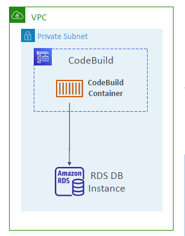

---
tags:
  - aws
  - aws/service
  - aws/domain/developer-tools
  - aws/topic/code-build
aliases:
  - "CodeBuild Inside VPC"
  - "Run Code Build In Your Vpc"
---

# CodeBuild – Inside VPC

- By default, your CodeBuild containers are launched outside your VPC
  - It cannot access resources in a VPC
- You can specify a VPC configuration:
  - VPC ID
  - Subnet IDs
  - Security Group IDs
- Then your build can access resources in your VPC (e.g., RDS, ElastiCache, EC2, ALB...)
- Use cases: integration tests, data query, internal load balancers...etc.

---

    

---

## Related Notes
- [[aws-services/10.developer/2.2.code-build/|Index]] - folder map
-[[4.1.run-code-build-locally|Run Code Deploy Locally]]] - previous lesson
-[[5.ai-agent-as-pull-request-reviewer|CodePipeline + AI Agent for Pull Request Review Smart PR Checks]]] - next lesson
-[[1.1.codebuild|How AWS CodeBuild Works Internally]]] - mentions Codebuild

---
